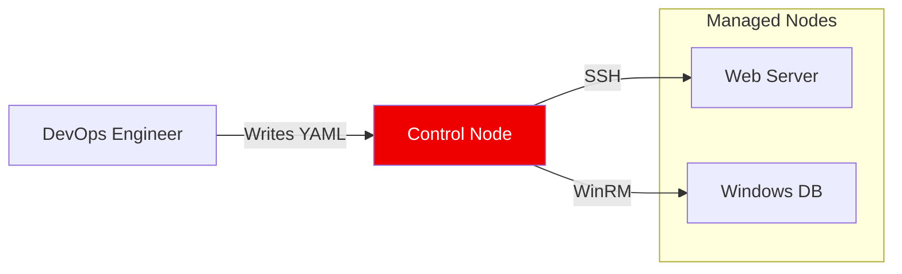

# Ansible Automation Mastery

Welcome to the **Ansible Automation Course**. This series takes you from foundational concepts to enterprise-grade, agentless orchestration. Ansible's "Radical Simplicity" allows you to manage thousands of nodes using the tools you already have: **SSH** and **Python**.

---

## 🏗️ Architecture at a Glance

Ansible is **Agentless**. It pushes configuration to your infrastructure without requiring software installation on the managed nodes.

---

## 🎯 Learning Objectives
- **Agentless Orchestration**: Master SSH-based configuration push.
- **Idempotency**: Build "Declarative" playbooks that ensure consistency.
- **Modularity**: Organize code with Roles and include/import patterns.
- **Security**: Manage sensitive data using Ansible Vault.
- **Extension**: Develop custom modules using Python.

---

## 📚 Module Roadmap

| # | Module | Description |
| :--- | :--- | :--- |
| **01** | [**Fundamentals**](./01-Fundamentals/README.md) | Agentless design, Lab Setup (Vagrant/Docker), and Control vs Managed nodes. |
| **02** | [**Inventory Management**](./02-Inventory-Management/README.md) | Static vs Dynamic Inventory, Grouping, and Sourcing Truth. |
| **03** | [**Basic Playbooks**](./03-Basic-Playbooks/README.md) | Anatomy of a Play, YAML rules, and Multi-tier Orchestration. |
| **04** | [**Core Modules**](./04-Core-Modules/README.md) | Package, File, Service, and Command execution modules. |
| **05** | [**Variables & Facts**](./05-Variables-and-Facts/README.md) | Fact gathering, Variable Precedence, and Data handling. |
| **06** | [**Templates & Files**](./06-Templates-and-Files/README.md) | Dynamic configuration using Jinja2 and file deployment strategies. |
| **07** | [**Ansible Roles**](./07-Ansible-Roles/README.md) | Reusable code structure, Galaxy integration, and Molecule testing. |
| **08** | [**Conditionals & Loops**](./08-Conditionals-and-Loops/README.md) | Logic gates (`when`), Looping Mechanics, and Advanced Logic. |
| **09** | [**Error Handling**](./09-Error-Handling/README.md) | Fail-fast strategies, Debugging, and Rollback Blocks (`rescue`). |
| **10** | [**Ansible Vault**](./10-Ansible-Vault/README.md) | Securing passwords, keys, and integrated secret management. |
| **11** | [**Custom Modules**](./11-Custom-Modules/README.md) | Extending the engine with Python-based module development. |

---

## 🚀 How to Succeed
1.  **Iterative Learning**: Every module includes **Architecture Diagrams** and **Real-Life Scenarios**.
2.  **Hands-On**: Use the [Lab Setup (Module 01)](./01-Fundamentals/README.md#lab-environment-setup) to practice locally.
3.  **Validate**: Each section concludes with **10 Interview Questions** and a **20-Question Quiz**.

---
*Automation is the force multiplier of the modern platform engineer. Script once, deploy everywhere.*