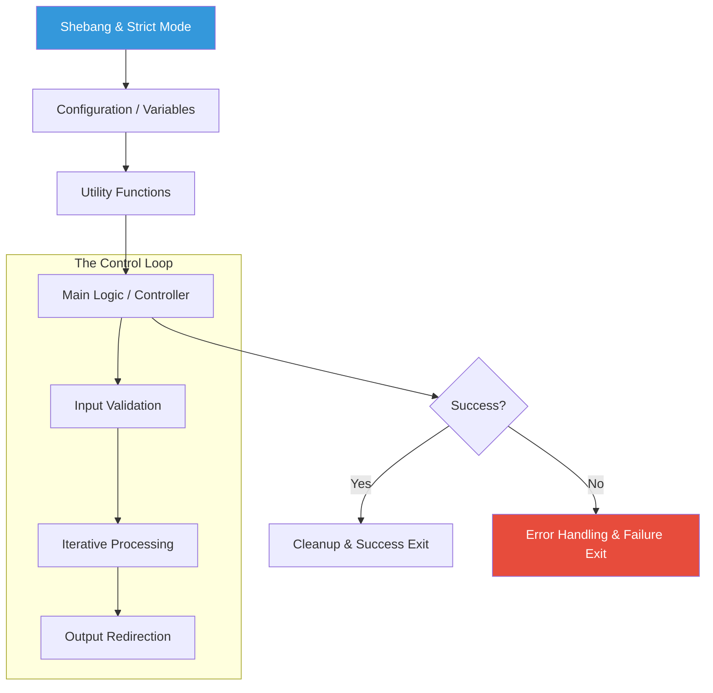

# 🐚 Intermediate Shell Scripting
*Building Robust, Scalable Automation with Bash*

Moving beyond simple command lists, intermediate shell scripting focuses on logic, modularity via functions, and defensive programming. This level is where you start building "tools" rather than just "scripts."

---

## 🎯 Learning Objectives
- Implement **Bash Strict Mode** for defensive scripting.
- Create modular code using **Functions** and local variables.
- Master **Complex Logic** with Case statements and Nested loops.
- Handle **Command-Line Arguments** and arithmetic operations.
- Leverage **Intermediate I/O** (Here Documents and Process Substitution).

---

## 🏗️ Intermediate Script Architecture



---

## 🛡️ 1. The "Strict Mode" Foundation
Production scripts should fail fast and explicitly. The "Unofficial Bash Strict Mode" is the standard for intermediate-to-advanced scripting.

```bash
#!/bin/bash
set -euo pipefail
IFS=$'\n\t'
```

| Flag | Name | Description |
| :--- | :--- | :--- |
| `-e` | Exit on Error | Immediate exit if any command returns a non-zero exit code. |
| `-u` | Unset Variables | Error out if you try to use a variable that hasn't been defined. |
| `-o pipefail` | Pipe Fail | Ensures that `fail_cmd | success_cmd` returns a failure exit code. |

---

## 📦 2. Functions and Scope
Functions allow you to dry up your code (Don't Repeat Yourself) and encapsulate logic.

### **Pro-Pattern: Local Variables**
Always use the `local` keyword inside functions to prevent "pollution" of the global variable space.

```bash
#!/bin/bash

# Define a logging function
log_action() {
    local message="$1"
    local level="${2:-INFO}"
    echo "[$(date +'%Y-%m-%d %H:%M:%S')] [$level] $message"
}

# Usage
log_action "Backup started" "DEBUG"
log_action "Database synced"
```

---

## 🔄 3. Iteration and Data Processing
DevOps engineers rarely process one thing; they process lists of servers, files, or containers.

### **The Intelligent For Loop**
```bash
#!/bin/bash
SERVERS=("web-01" "web-02" "db-01")

for SERVER in "${SERVERS[@]}"; do
    if ping -c 1 "$SERVER" &> /dev/null; then
        echo "✅ $SERVER is online"
    else
        echo "❌ $SERVER is offline" >&2
    fi
done
```

### **The While Read Loop (File Processing)**
This is the most efficient way to read large files line by line without memory overhead.
```bash
while IFS= read -r line; do
    # Process each line
    echo "Config: $line"
done < "config.txt"
```

---

## ⌨️ 4. Handling Input and Arithmetic

### **Command Line Arguments**
- `$#`: Number of arguments passed.
- `$@`: All arguments as a list.
- `$1, $2, ...`: Specific positional arguments.

### **Arithmetic with `(( ))`**
Bash doesn't handle decimals natively (use `bc` for that), but it's great for integer math.
```bash
REPLICAS=3
((REPLICAS++)) # Increment to 4
TOTAL_HOSTS=$(( REPLICAS * 2 ))
```

---

## � 5. Advanced I/O: Here Documents
Perfect for generating config files or passing multi-line blocks into other tools (like SSH or SQL).

```bash
cat <<EOF > /etc/nginx/sites-available/app.conf
server {
    listen 80;
    server_name myapp.local;
    root /var/www/html;
}
EOF
```

---

## 🛠️ Hands-On Exercises

### Exercise 1: Robust Backup Script
Build a script that:
1.  Takes a source and destination as arguments.
2.  Uses `set -e` to ensure it stops if the copy fails.
3.  Calculates the total size of files copied using a function.
4.  Logs the start and end time.

### Exercise 2: Server Inventory Validator
Read a file `servers.txt` containing IP addresses. Use a loop to check if they respond on port 22 (SSH) and output a summary table.

---

## 📖 Real-World Story: The Unset Variable Disaster
**Scenario**: A script was designed to clean up a temporary build directory: `rm -rf $BUILD_DIR/*`.
**Problem**: The script missed its error checking. Due to a config change, `$BUILD_DIR` became an unset variable.
**Crisis**: Bash interpreted the command as `rm -rf /*`. It began deleting the entire root filesystem of the production server.
**Outcome**: The server was destroyed within seconds.
**Solution**: Implementing `set -u` in the script header would have caught the unset variable and exited safely before the destructive command ran.

---

## ❓ Interview Questions
1.  **What is the difference between `$*` and `$@`?**
    - *Answer*: Both represent all arguments. However, in double quotes, `"$*"` expands to a single string (joined by the first character of IFS), while `"$@"` expands to separate strings (preserving spaces in arguments).
2.  **How do you capture both the output and the error of a command into a single variable?**
    - *Answer*: `RESULT=$(command 2>&1)`
3.  **Explain the result of `[[ -z "$VAR" ]]`.**
    - *Answer*: It checks if the length of the string in `$VAR` is zero (i.e., it is empty).
4.  **How do you check if the previous command failed?**
    - *Answer*: Check the `$?` variable. If `$?` is not equal to 0, it failed.
5.  **What is a "Subshell" and how do you trigger one?**
    - *Answer*: A subshell is a separate instance of the shell launched by the parent. It is triggered by using parentheses `( command )`. Changes inside (like `cd` or variable exported) don't affect the parent shell.

---

## 🧠 Quiz

1.  Which command activates "Fail on Error" mode?
    - a) `set -f`
    - b) `set -e` ✅
    - c) `bash --exit`

2.  How do you define a local variable inside a function?
    - a) `var x=10`
    - b) `static x=10`
    - c) `local x=10` ✅

3.  What does `2>/dev/null` do?
    - a) Deletes the file descriptor 2
    - b) Hides all error messages ✅
    - c) Redirects input from null

4.  Which operator is used for integer arithmetic?
    - a) `(( ))` ✅
    - b) `[[ ]]`
    - c) `{{ }}`

5.  How do you get the number of elements in an array `${ENV[@]}`?
    - a) `${ENV[count]}`
    - b) `${#ENV[@]}` ✅
    - c) `${ENV[#]}`

---
## 🎯 Learning Path: Practical Scripts
In this directory, you will find:
1.  **[inventory_check.sh](./inventory_check.sh)**: Comprehensive example of functions, arrays, and error handling.
2.  **[hello.sh](./hello.sh)**: Demonstrating the Shebang and basic `echo`.
3.  **[hellouser.sh](./hellouser.sh)**: Interactive script using variables and `read`.

---

[⬅️ Back to Automation Overview](../README.md) | [Next: Advanced Bash ➡️](../02-Advanced-Bash-Automation/README.md)
