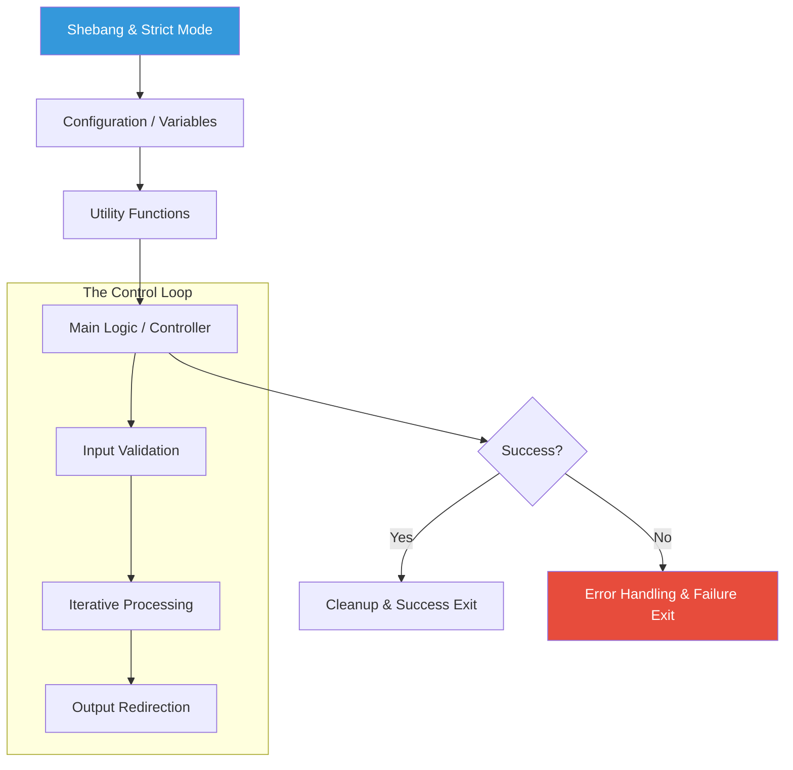

# 🐚 Intermediate Shell Scripting Master Guide
*Building Robust, Scalable Automation with Bash*

Moving beyond simple command lists, intermediate shell scripting focuses on logic, modularity via functions, and defensive programming. This level is where you start building "tools" rather than just "scripts."

---

## 📂 Curriculum Structure

This module is organized into the "Shell-Scripting Gold Standard" hierarchy. Explore each section for deep dives and boilerplates.

- **[01-Strict-Mode](./01-Strict-Mode/README.md)**: The foundation of defensive scripting (`set -euo pipefail`).
- **[02-Functions-Scope](./02-Functions-Scope/README.md)**: Modular logic, return values, and local variable scoping.
- **[03-Loops-Processing](./03-Loops-Processing/README.md)**: Advanced iteration and Associative Arrays (Bash 4+).
- **[04-Input-Arithmetic](./04-Input-Arithmetic/README.md)**: Handling arguments and Floating Point Math (`bc`).
- **[05-Advanced-IO](./05-Advanced-IO/README.md)**: Here Docs, Process Substitution, and File Descriptors.

---

## 🏗️ Intermediate Script Architecture



---

## 🛡️ Critical Skills: Safety & Debugging

### 1. Trap Handling (Cleanup)
Professional scripts always clean up after themselves, even if they crash. Use `trap` to catch exit signals.

```bash
# Define cleanup function
cleanup() {
    echo "🧹 Cleaning up temp files..."
    rm -f "$TEMP_FILE"
}

# Trap EXIT signal (runs on success or failure)
trap cleanup EXIT

TEMP_FILE=$(mktemp)
echo "Working..."
# Even if the script errors out here, cleanup runs!
```

### 2. Signal Handling (Graceful Shutdown)
Handle `SIGINT` (Ctrl+C) to prevent leaving orphan processes or corrupted states.

```bash
trap "echo ' Caught SIGINT! Exiting safely...'; exit 1" SIGINT

echo "Running long process (Press Ctrl+C)..."
sleep 10
```

### 3. Debugging Mode
Don't guess—trace.
- **Trace Mode**: Add `set -x` to print commands before they execute.
- **Linting**: Use `shellcheck script.sh` to find logic errors and bad practices before running.

---

## 📖 Real-World Story: The Unset Variable Disaster

**Scenario**: A script was designed to clean up a temporary build directory: `rm -rf $BUILD_DIR/*`.
**Problem**: The script missed its error checking. Due to a config change, `$BUILD_DIR` became an unset variable.
**Crisis**: Bash interpreted the command as `rm -rf /*`. It began deleting the entire root filesystem of the production server.
**Outcome**: The server was destroyed within seconds.
**Solution**: Implementing `set -u` in the script header would have caught the unset variable and exited safely before the destructive command ran.

---

## ❓ Interview Questions

### Core Competency
1.  **What is the difference between `$*` and `$@`?**
    - *Answer*: Both represent all arguments. However, in double quotes, `"$*"` expands to a single string (joined by the first character of IFS), while `"$@"` expands to separate strings (preserving spaces in arguments).
2.  **How do you capture both the output and the error of a command into a single variable?**
    - *Answer*: `RESULT=$(command 2>&1)`
3.  **Explain the result of `[[ -z "$VAR" ]]`.**
    - *Answer*: It checks if the length of the string in `$VAR` is zero (i.e., it is empty).
4.  **How do you check if the previous command failed?**
    - *Answer*: Check the `$?` variable. If `$?` is not equal to 0, it failed.
5.  **What is a "Subshell" and how do you trigger one?**
    - *Answer*: A subshell is a separate instance of the shell launched by the parent. It is triggered by using parentheses `( command )`. Changes inside (like `cd` or variable exported) don't affect the parent shell.

### Advanced Proficiency
6.  **What is Process Substitution `<(command)` and when would you use it?**
    - *Answer*: It allows the output of a command to be treated as a temporary file. Useful for commands that expect file arguments, e.g., `diff <(sort file1) <(sort file2)`.
7.  **How do you define and use an Associative Array in Bash?**
    - *Answer*: Declare with `declare -A my_array`. Access with `echo "${my_array[key]}"`. Note: Requires Bash 4.0+.
8.  **Why is `printf` preferred over `echo` for robust scripts?**
    - *Answer*: `printf` allows for formatted output and behaves consistently across different shells (POSIX compliance), whereas `echo` implementations can vary regarding flags (like `-e` or `-n`).
9.  **What is the purpose of `trap` in a shell script?**
    - *Answer*: `trap` allows you to execute code when a script receives a specific signal (like EXIT, SIGINT, or SIGTERM), ensuring cleanup of resources or graceful shutdown.
10. **Explain the difference between `(( ))` and `[[ ]]`.**
    - *Answer*: `(( ))` is for arithmetic evaluation and C-style logic manipulation. `[[ ]]` is an extended test command for string, file, and logical comparisons.

---

## 🧠 Quiz

1.  Which command activates "Fail on Error" mode?
    - a) `set -f`
    - b) `set -e` ✅
    - c) `bash --exit`

2.  How do you define a local variable inside a function?
    - a) `var x=10`
    - b) `static x=10`
    - c) `local x=10` ✅

3.  What does `2>/dev/null` do?
    - a) Deletes the file descriptor 2
    - b) Hides all error messages ✅
    - c) Redirects input from null

4.  Which operator is used for integer arithmetic?
    - a) `(( ))` ✅
    - b) `[[ ]]`
    - c) `{{ }}`

5.  How do you get the number of elements in an array `${ENV[@]}`?
    - a) `${ENV[count]}`
    - b) `${#ENV[@]}` ✅
    - c) `${ENV[#]}`

---

[⬅️ Back to Automation Overview](../README.md) | [Next: Advanced Bash ➡️](../02-Advanced-Bash-Automation/README.md)
