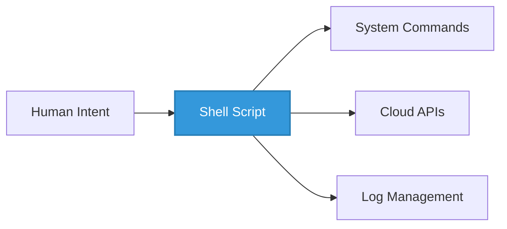
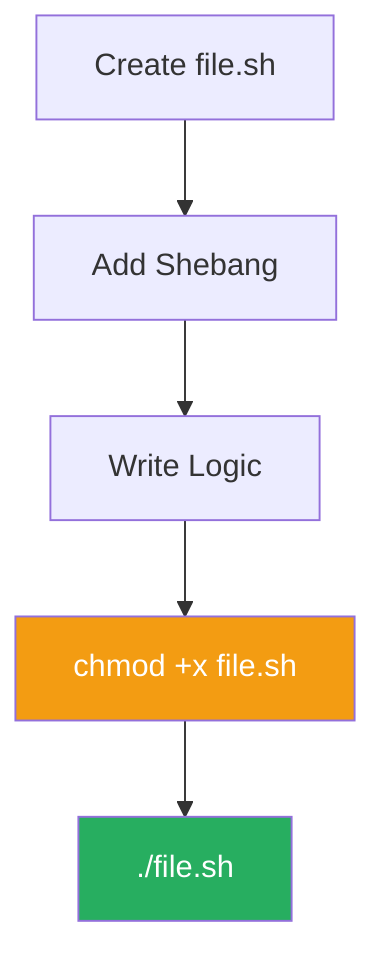
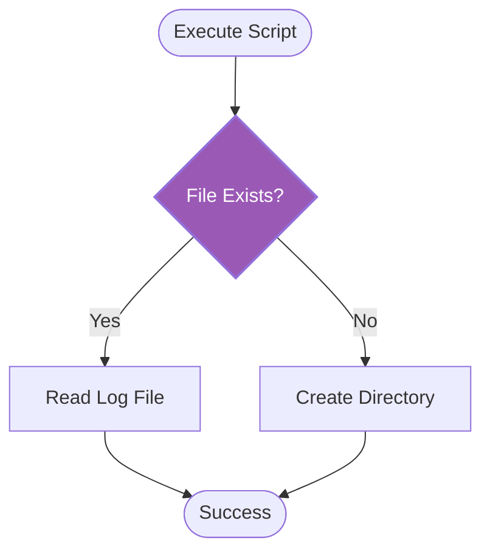

# 🐚 The Foundation of Automation
Shell scripting is the first and most vital tool in a DevOps engineer's arsenal. It allows you to package standard Linux/Unix commands into reusable, logical, and automated workflows.
## 🚀 Why Shell Scripting?
Shell scripts act as the "glue" that connects different tools, automates repetitive system tasks, and manages infrastructure components.



---
## 🏗️ The Anatomy of a Shell Script
Every professional shell script follows a standard structural pattern to ensure compatibility and readability.
### 1. The Shebang (`#!`)
The first line of any script must be the **Shebang**. It tells the kernel which interpreter to use to execute the script.
- `#!/bin/bash` (Bash - The standard for modern automation)
- `#!/bin/sh` (Sh - Lightweight, POSIX compliant)
### 2. Permissions & Execution
Scripts are just text files until they are given **executable permissions**.



| Command | Action |
| :--- | :--- |
| `touch myscript.sh` | Creates a new empty script file. |
| `chmod +x myscript.sh` | Grants "Execute" permissions. |
| `./myscript.sh` | Runs the script in the current terminal. |

---
## 🛠️ Variables and User Interaction
Variables allow your scripts to be dynamic and reusable across different environments.
### 📝 Example: Hello User Script
```bash
#!/bin/bash

# Definition of variables
PROJECT_NAME="Phoenix-Alpha"
USER_NAME=$(whoami)

echo "System User: $USER_NAME"
echo "Initializing Project: $PROJECT_NAME"

# Taking User Input
read -p "Enter Deployment Zone [us-east-1]: " ZONE
ZONE=${ZONE:-"us-east-1"} # Default to us-east-1 if input is empty

echo "Deploying to $ZONE..."
```
---
## 🚦 Logic and Control Flow
Scripts are not just lists of commands; they use logic to make decisions based on the system's state.



### Basic `if` Statement
```bash
if [ -d "/etc/config" ]; then
    echo "Config directory exists."
else
    echo "Directory not found. Creating..."
    mkdir -p "/etc/config"
fi
```

---

## 📈 Standard Streams (I/O Redirection)
Mastering I/O redirection is crucial for managing logs and debugging errors in automation.

| Stream | Name | File Descriptor | Description |
| :--- | :--- | :--- | :--- |
| **stdin** | Standard Input | 0 | Input provided to the script (Keyboard/Pipe). |
| **stdout** | Standard Output | 1 | The regular output of the command. |
| **stderr** | Standard Error | 2 | Error messages generated by commands. |

### Redirection Examples:
- `ls > file.txt` (Overwrite stdout to file)
- `ls >> file.txt` (Append stdout to file)
- `command 2> error.log` (Redirect only errors)
- `command > output.log 2>&1` (Combine stdout and stderr)
---
## 🎯 Learning Path: Fundamental Scripts
In this directory, you will find:
1.  **[hello.sh](./hello.sh)**: Demonstrating the Shebang and basic `echo`.
2.  **[hellouser.sh](./hellouser.sh)**: Interactive script using variables and `read`.
---

[⬅️ Back to Automation Overview](../README.md)
