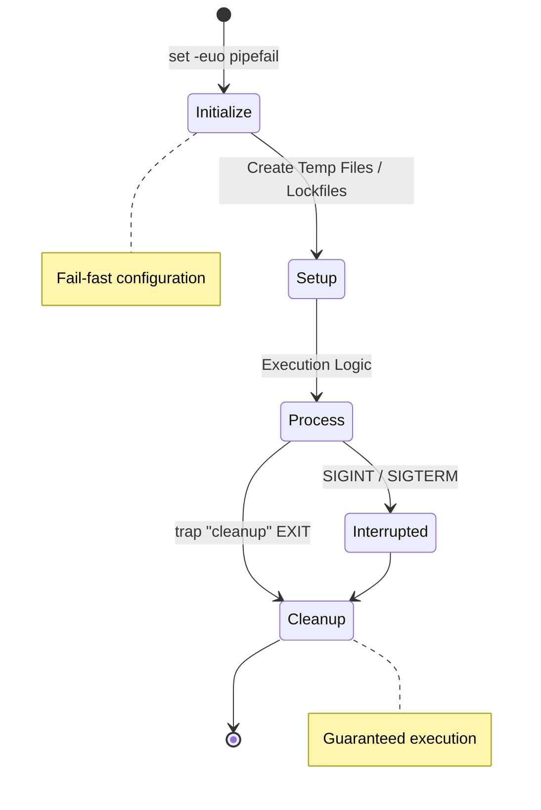
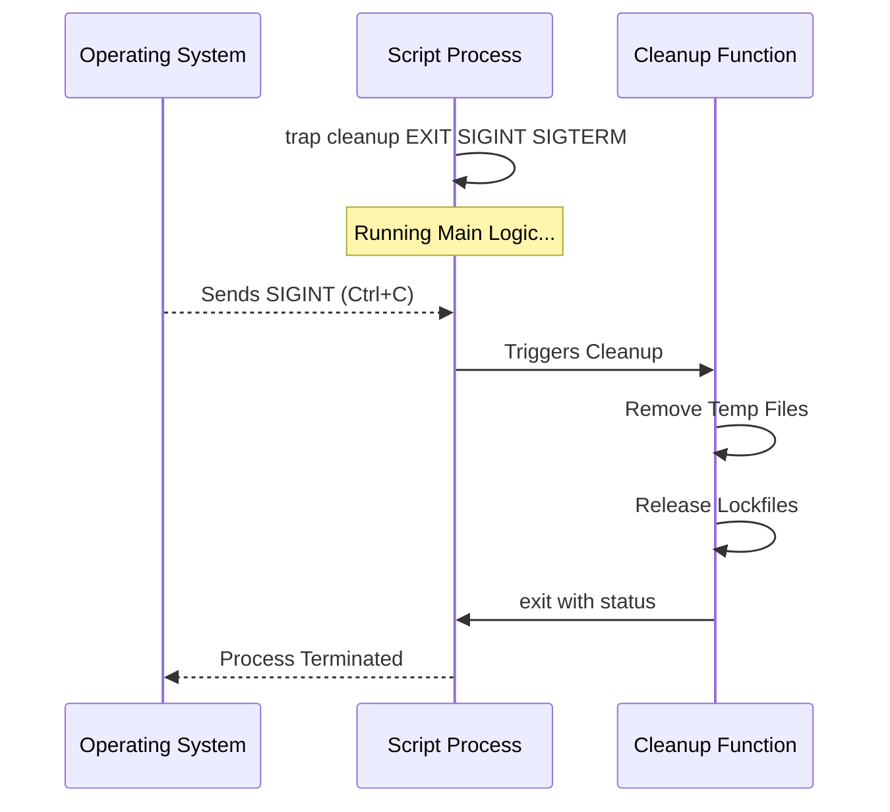

# 🛡️ Robust Execution & Signal Management
Production-grade scripts must handle errors silently, clean up after themselves, and prevent parallel execution of critical tasks. This module focuses on the "<font color="#ff0000">Defensive Programming</font>" techniques required for resilient Bash automation.
## 🚀 The Resilient Script Lifecycle
Advanced automation handles unexpected interruptions and system signals to maintain system integrity. A robust script follows a strict lifecycle: Initialize, Setup, Process, and Cleanup.



---

## 🛠️ The "Strict Mode" Settings
Fail-fast behavior is essential to stop a script before it does damage with undefined variables or failed pipe segments.
```bash
#!/bin/bash
set -euo pipefail
```

| Flag | Meaning | DevOps Impact |
| :--- | :--- | :--- |
| `-e` | `errexit` | Immediately stops the script if a command returns a non-zero exit code. Prevents "runaway" scripts. |
| `-u` | `nounset` | Treats unset variables as an error. Prevents accidental deletion of root directories (e.g., `rm -rf $UNSET_VAR/*`). |
| `-o pipefail` | `pipefail` | Ensures the exit code of a pipeline is the value of the last command to fail. Vital for logging and CI/CD status. |

---
## 🪤 Signal Management (Traps)
The `trap` command ensures that a cleanup function runs regardless of how the script ends (success, failure, or interruption).


### Implementation Example:
```bash
# Define a cleanup function
cleanup() {
    local status=$?
    echo "[$(date +'%Y-%m-%d %H:%M:%S')] Cleaning up..."
    # Perform cleanup actions
    [[ -f "$LOCKFILE" ]] && rm -f "$LOCKFILE"
    [[ -d "$TEMP_DIR" ]] && rm -rf "$TEMP_DIR"
    exit $status
}

# Attach function to EXIT and common interruption signals
trap cleanup EXIT SIGINT SIGTERM
```
---
## 🔒 Atomicity and Lockfiles
To prevent two instances of a script from running simultaneously—which could lead to data corruption or race conditions—you must implement an atomic locking mechanism.
### The `mkdir` Method (Atomic in Linux)
```bash
LOCKFILE="/tmp/service_deploy.lock"

# Attempt to create the lock directory
if ! mkdir "$LOCKFILE" 2>/dev/null; then
    echo "Error: Another deployment is already in progress." >&2
    exit 1
fi
```
### The `flock` Method (Kernel Level)
`flock` is often preferred because the kernel automatically releases the lock if the script crashes, preventing "stale" locks.
```bash
exec 200>/var/lock/.myscript.excl
flock -n 200 || exit 1
```
---
## 📖 Stories from the Field: The Memory Hog
**Scenario**: A nightly backup script was using a temporary directory to compress 500GB of logs.
**Problem**: The script was killed by the **OOM (Out of Memory) killer** or interrupted by a sysadmin.
**Outcome**: Because no `trap` was used, the temporary directory (filled with 500GB of old logs) remained on the disk. After 3 nights, the disk was 100% full, crashing the production database.
**Resolution**: Added a `trap` to remove the temporary directory on `EXIT`.
**Prevention**: Never create temporary files without a corresponding `trap` cleanup.

---
## ❓ Professional Interview Prep
1. **What is the difference between `trap "cmd" EXIT` and `trap "cmd" ERR`?**
   <details>
   <summary>Show Answer</summary>
   `EXIT` triggers whenever the script finishes (success or failure). `ERR` only triggers when a command fails (non-zero exit).
   </details>

2. **How do you handle a command that is EXPECTED to fail occasionally within `set -e`?**
   <details>
   <summary>Show Answer</summary>
   Append `|| true` to the command, or wrap it in an `if` block. Example: `[ -f config.yml ] || true`.
   </details>

3. **What is `flock` and why is it better than `mkdir` for locking?**
   <details>
   <summary>Show Answer</summary>
   `flock` handles "stale locks" automatically. If the process crashes, the kernel releases the lock on the file descriptor. `mkdir` requires manual deletion, which often fails during a crash.
   </details>

4. **How do you pass the script's original exit code through a trap function?**
   <details>
   <summary>Show Answer</summary>
   Capture it using `local status=$?` at the very start of the trap function and thereafter use `exit $status`.
   </details>
---
## 🧠 Knowledge Check
1.  Which flag ensures a script fails if a variable is used but not defined? **(`set -u`)**
2.  What signal is sent by the `kill <pid>` command by default? **(`SIGTERM - 15`)**
3.  True/False: A trap on `EXIT` will run even if the script finishes successfully. **(`True`)**
4.  What is the result of `false | true` if `pipefail` is enabled? **(`Failure / Non-zero`)**
5.  Which command is used to catch and handle system signals? **(`trap`)**
---
## 📖 Continue Learning
- **Next**: [Visual Architecture Diagrams](./02-Visual-Architecture-Diagrams.md)
- **Advanced**: [Advanced Patterns and Examples](./03-Advanced-Patterns-and-Examples.md)
- **Module Home**: [Robust Execution Module](./README.md)

[⬅️ Back to Advanced Bash](../README.md)