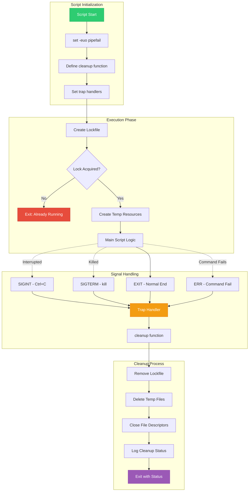
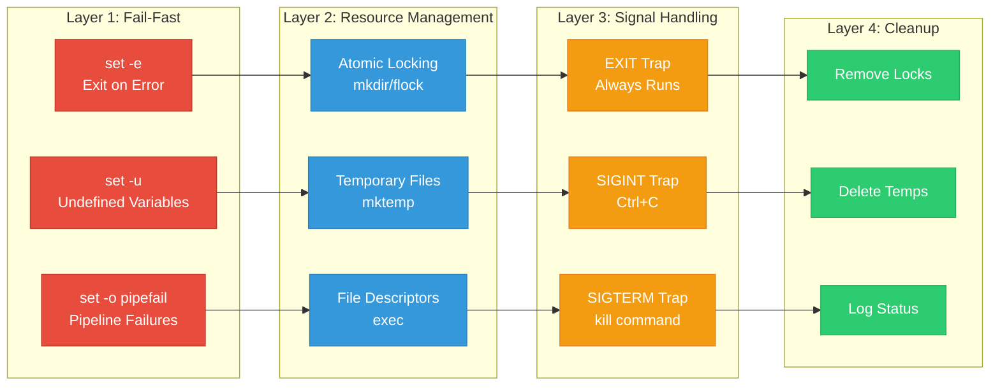
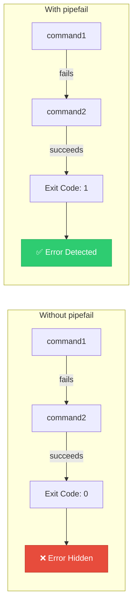
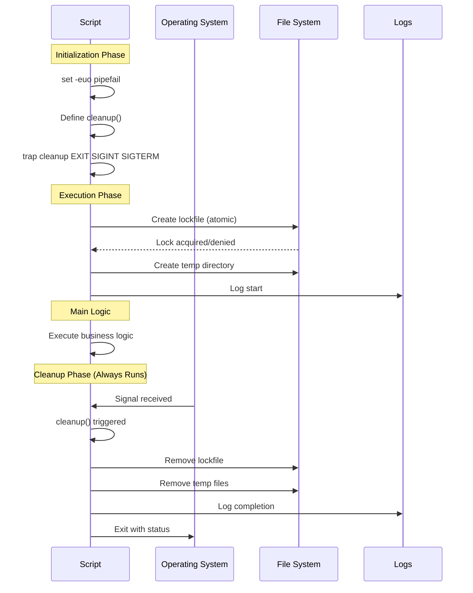

# 🛡️ Robust Bash Execution - Visual Architecture

## Complete Signal Management & Error Handling Flow

## Defensive Programming Layers

## Lock Mechanism Comparison

```mermaid
graph TB
    subgraph "mkdir Method (Atomic)"
        M1[mkdir /tmp/script.lock] --> M2{Success?}
        M2 -->|Yes| M3[Script Continues]
        M2 -->|No| M4[Exit: Already Running]
        M3 --> M5[Script Completes]
        M5 --> M6[rmdir /tmp/script.lock]
        M7[Process Crash] -.->|Manual Cleanup| M8[Stale Lock Remains]
    end
    
    subgraph "flock Method (Kernel)"
        F1[exec 200>/var/lock/script] --> F2[flock -n 200]
        F2 --> F3{Lock Acquired?}
        F3 -->|Yes| F4[Script Continues]
        F3 -->|No| F5[Exit: Already Running]
        F4 --> F6[Script Completes]
        F6 --> F7[FD Auto-Released]
        F8[Process Crash] -.->|Kernel Cleanup| F9[Lock Auto-Released]
    end
    
    style M4 fill:#e74c3c,stroke:#c0392b,color:#fff
    style M8 fill:#e74c3c,stroke:#c0392b,color:#fff
    style F5 fill:#e74c3c,stroke:#c0392b,color:#fff
    style F9 fill:#2ecc71,stroke:#27ae60,color:#fff
```

## Error Propagation with Pipefail

## Production Script Template

## 📖 Navigation

- **Previous**: [Core Concepts](./01-Robust-Execution-and-Traps.md)
- **Next**: [Advanced Patterns and Examples](./03-Advanced-Patterns-and-Examples.md)
- **Module Home**: [Robust Execution Module](./README.md)

[⬅️ Back to Advanced Bash](../README.md)