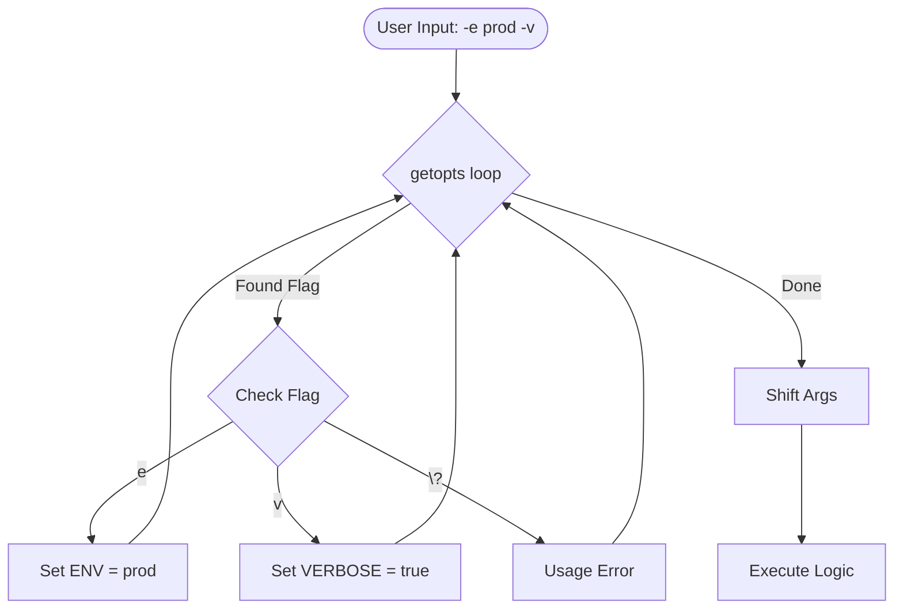

# Advanced Argument Parsing (getopts)

For complex scripts, positional parameters (`$1`, `$2`) are fragile and hard to document. `getopts` allows you to create professional, flag-based command-line interfaces.

## 🛠️ The `getopts` Built-in

`getopts` is a shell built-in that parses short options (e.g., `-v`, `-f filename`).

```bash
while getopts "e:v" opt; do
  case $opt in
    e) ENV="$OPTARG" ;;       # : means this flag requires a value
    v) VERBOSE=true ;;        # No : means it is a boolean flag
    *) usage ;;               # Handle unknown flags
  esac
done

# Shift off the parsed options to handle remaining arguments
shift $((OPTIND -1))
```

## 📊 Argument Parsing Logic



### Option String Explained
- `"ev"`: Only `-e` and `-v` are allowed. Neither takes a value.
- `"e:v"`: `-e` requires a value (stored in `$OPTARG`), `-v` does not.
- `":e:v"`: Start with `:` to enable "silent error reporting," allowing you to handle errors manually in your `case` statement.

## 📖 Professional CLI Patterns

### The `usage` Function
Every professional tool should provide a helpful help message.

```bash
usage() {
    cat <<EOF
Usage: $(basename "$0") [-v] -e ENVIRONMENT

Options:
  -e    Target environment (dev, staging, prod)
  -v    Enable verbose output
EOF
    exit 1
}
```

### Parsing Long Options
Bash's `getopts` does NOT support long options (like `--env`). To handle them, you can use a manual `case` loop or the external `getopt` command.

**Manual Pattern (Portable):**
```bash
while [[ $# -gt 0 ]]; do
  case $1 in
    -e|--env)
      ENV="$2"
      shift 2
      ;;
    -v|--verbose)
      VERBOSE=true
      shift
      ;;
    *)
      usage
      ;;
  esac
done
```

---

## 📖 Stories from the Field: The "Confused" Script

**Scenario**: A script took 3 arguments: `source`, `destination`, and `force` (true/false).
**Problem**: After 6 months, a developer forgot the order and ran `./deploy.sh true /path/to/dst /path/to/src`.
**Outcome**: Because the script relied on `$1`, `$2`, and `$3`, it interpreted `true` as the source directory, leading to a failed deployment and a mess of files in the wrong place.
**Resolution**: Refactored the script using `getopts`. The new command became `./deploy.sh -s /path/to/src -d /path/to/dst -f`.
**Prevention**: Once a script takes more than 2 parameters, switch to flag-based parsing. It is self-documenting and order-independent.

---

## 🛠️ Hands-On Exercise: The Universal Deploy Tool

**Objective**: Create a script named `deploy_tool.sh` that accepts an environment (`-e`), a version (`-v`), and a dry-run flag (`-d`).

**Step 1: Boilerplate**
Start with strict mode (`set -euo pipefail`) and a `usage` function.

**Step 2: The Loop**
Implement `getopts "e:v:d"`:
- `-e`: Required. Sets `$TARGET_ENV`.
- `-v`: Optional. Sets `$VERSION`. Default to "latest".
- `-d`: Boolean. Sets `$DRY_RUN` to "true".

**Step 3: Validation**
After the loop, check if `$TARGET_ENV` is empty. If so, call `usage`.

**Step 4: Execution Logic**
If `$DRY_RUN` is true, simple `echo "Would deploy..."`. Otherwise, `echo "Deploying..."`.

---

## ❓ Interview Questions

1. **What is the purpose of `shift $((OPTIND - 1))` after a `getopts` loop?**
   * *Answer*: `getopts` tracks the index of the next argument in `OPTIND`. Shifting by `OPTIND - 1` removes all the parsed flags from the positional parameters, leaving only the "remaining" arguments (like filenames at the end of the command).
2. **How does `getopts` handle a missing value for a flag that requires one?**
   * *Answer*: By default, it prints an error message. If silent mode is enabled (starting with `:`), it sets `opt` to `:` and `OPTARG` to the missing flag character.
3. **Difference between `getopts` and `getopt`?**
   * *Answer*: `getopts` is a shell built-in (portable, no long options). `getopt` is an external utility (supports long options, but syntax varies between GNU and BSD versions).
4. **How do you make a flag optional vs. mandatory with `getopts`?**
   * *Answer*: `getopts` itself doesn't enforce mandatory flags. You must check if the variable was set after the loop: `[[ -z "$ENV" ]] && usage`.
5. **How do you handle boolean flags (toggles) in `getopts`?**
   * *Answer*: Include the character in the option string without a colon. In the `case`, simply set a variable: `v) VERBOSE=true ;;`.

---

## 🧠 Quiz

1. **Which variable in `getopts` stores the value provided for a flag?** `($OPTARG)`
2. **What does a colon `:` after a character in the option string mean?** `(The flag requires an argument)`
3. **Which variable tracks the current index of the argument being parsed?** `($OPTIND)`
4. **True/False: `getopts` is an external Linux command.** `(False - it is a shell built-in)`
5. **How do you suppress default error messages in `getopts`?** `(Start the option string with a colon)`

---

[⬅️ Previous: Robust Execution](../01-Robust-Execution-and-Traps/README.md) | [Next: JSON with JQ](../03-JSON-Processing-with-JQ/README.md)
