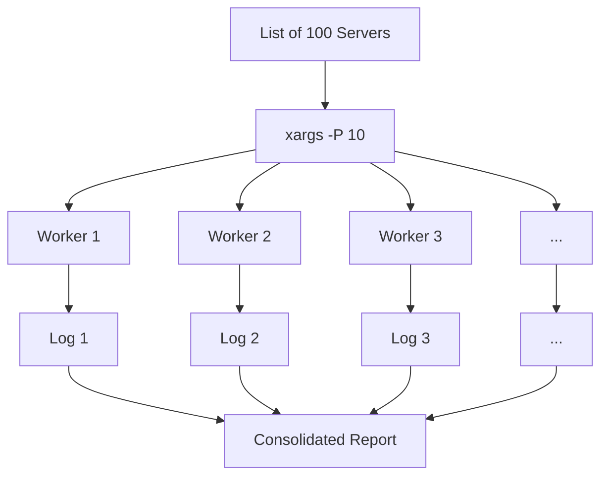

# Scaling Bash: Multiplexing and Parallelism

When managing hundreds or thousands of servers, sequential scripts are too slow. Scaling your automation requires mastering parallel execution and efficient resource management.

## ⚡ Parallel Execution with `xargs`

The `xargs` command can run multiple processes in parallel using the `-P` (max-procs) flag.

```bash
# Run 5 SSH connections in parallel
cat hosts.txt | xargs -P 5 -I {} ssh {} "uptime"
```

- `-P 5`: Limit to 5 concurrent processes.
- `-I {}`: Defines a placeholder `{}` that is replaced by each line from the input.

## 🧵 Job Control (`&` and `wait`)

For simpler parallelization inside a script, use the background operator `&`.

```bash
for SERVER in $(cat hosts.txt); do
    ssh "$SERVER" "yum update -y" &  # Run in background
done

wait  # Wait for ALL background jobs to finish before continuing
echo "All updates complete!"
```

## 🔌 SSH Multiplexing (Connection Sharing)

Establishing an SSH connection (the handshake) is slow. Multiplexing allows you to reuse an existing TCP connection for multiple SSH sessions.

### Implementation (~/.ssh/config)
```ssh
Host *
    ControlMaster auto
    ControlPath /tmp/ssh-%r@%h:%p
    ControlPersist 10m
```

- **ControlMaster**: Enables sharing multiple sessions over a single connection.
- **ControlPersist**: Keeps the master connection open in the background for 10 minutes after the last session closes.

## 📊 Parallel Execution Flow



---

## 📖 Stories from the Field: The 4-Hour deployment

**Scenario**: A company had a deployment script that ran sequentially across 200 servers.
**Problem**: Each server took 1 minute to update. The total deployment time was over 3 hours.
**Discovery**: The network and CPU on the control machine were mostly idle while waiting for the sequential SSH commands.
**Resolution**: Modified the script to use `xargs -P 20`.
**Outcome**: Deployment time dropped from 200 minutes to 10 minutes.
**Prevention**: Whenever a task is I/O bound (like waiting for a network response), look for opportunities to parallelize.

---

## 🛠️ Hands-On Challenge: Parallel Ping Sweeper

**Objective**: Use `xargs` to speed up a network scan by 5x.

**Step 1: Create a Dummy Hosts File**
```bash
# Generate 20 fake IPs (192.168.1.1 to 192.168.1.20)
for i in {1..20}; do echo "192.168.1.$i" >> hosts.txt; done
```

**Step 2: Sequential Scan (The Slow Way)**
Time how long it takes to check them one by one.
```bash
time for ip in $(cat hosts.txt); do
    # Simulate work with sleep
    sleep 1
    echo "Checked $ip"
done
```
*Expected Result*: Takes ~20 seconds.

**Step 3: Parallel Scan (The Fast Way)**
Use `xargs` to run 5 checks at a time.
```bash
time cat hosts.txt | xargs -P 5 -I {} bash -c 'sleep 1; echo "Checked {}"'
```
*Expected Result*: Takes ~4 seconds (20 tasks / 5 parallel threads = 4 rounds).

---

## ❓ Interview Questions

1. **What is the difference between `xargs -P` and GNU Parallel?**
   * *Answer*: `xargs` is standard on almost all Linux systems but has basic features. GNU Parallel is a separate tool that offers much better handling of output (no interlacing), progress bars, and remote execution management.
2. **What does the `wait` command do without arguments?**
   * *Answer*: It waits for all child processes of the current shell to finish.
3. **What is "Interlacing" in parallel execution?**
   * *Answer*: When multiple processes write to `stdout` at the same time, their lines can get mixed together (e.g., half a line from P1 followed by P2).
4. **How does SSH Multiplexing improve performance for Ansible or parallel scripts?**
   * *Answer*: It eliminates the overhead of the repeated TCP handshake and SSH key exchange for every command, reducing latency significantly.
5. **How do you limit the number of background jobs in a bash loop without `xargs`?**
   * *Answer*: Use a "semaphore" pattern or a counting variable with `wait -n`.

---

## 🧠 Quiz

1. **Which `xargs` flag controls the number of parallel processes?** `(-P)`
2. **True/False: The `wait` command only works for background processes (`&`).** `(True)`
3. **Where is the SSH Multiplexing configuration usually stored?** `(~/.ssh/config)`
4. **What does `wait -n` do?** `(Waits for ANY single background job to finish, then continues)`
5. **Which tool is more advanced than `xargs` for complex parallel logic?** `(GNU Parallel)`

---

[⬅️ Previous: Sed and Awk](../04-Data-Wrangling-with-Sed-and-Awk/README.md) | [Return to Index](../README.md)