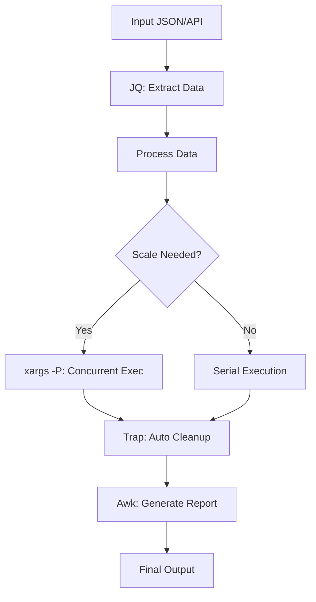

# Advanced Bash Automation

Move beyond "one-liners" to resilient, production-grade automation scripts.

## 📚 Module Index

| # | Topic | Description |
| :--- | :--- | :--- |
| **01** | [**Robust Execution**](./01-Robust-Execution-and-Traps/README.md) | `set -euo pipefail`, Traps, Lockfiles. |
| **02** | [**Argument Parsing**](./02-Advanced-Argument-Parsing-Getopts/README.md) | `getopts`, Long Flags, Usage Menus. |
| **03** | [**JSON with JQ**](./03-JSON-Processing-with-JQ/README.md) | Filtering, Selection, Mapping. |
| **04** | [**Sed and Awk**](./04-Data-Wrangling-with-Sed-and-Awk/README.md) | Stream editing, Column processing. |
| **05** | [**Parallelism**](./05-Scaling-Bash-Multiplexing-Parallelism/README.md) | `xargs -P`, GNU Parallel. |

---

## 🏗️ Workflow Architecture

---

## 📖 Real-Life Scenarios (Overview)

### 1. The "Clean Up" Disaster
A script ran `rm -rf $DIR/*` without strict mode. `$DIR` was empty. The server was wiped.
**Lesson**: Always use `set -u` (covered in Module 01).

### 2. The "Argument Soup"
A deployment script took 5 positional arguments. Users constantly mixed up the order (`./deploy prod v1` vs `./deploy v1 prod`), causing production outages.
**Lesson**: Use flag-based parsing (`-e prod -v v1`) (covered in Module 02).

### 3. The "Slow Crawl"
A log rotation script processed files one by one. It took 4 hours to finish, overlapping with the next run.
**Lesson**: Use `xargs -P` to process in parallel (covered in Module 05).

---

## ❓ Interview Questions (General)
*Specific coding questions are located in each sub-module.*

1. **What is the difference between a "Script" and a "Tool"?**
   - *Answer*: A script is often ad-hoc and brittle. A tool handles errors, inputs, prints help messages, and cleans up after itself.
2. **When should you switch from Bash to Python/Go?**
   - *Answer*: When you need complex data structures (objects), heavy JSON/API manipulation, or cross-platform compatibility beyond POSIX.

---

[⬅️ Back to Automation](../README.md)
