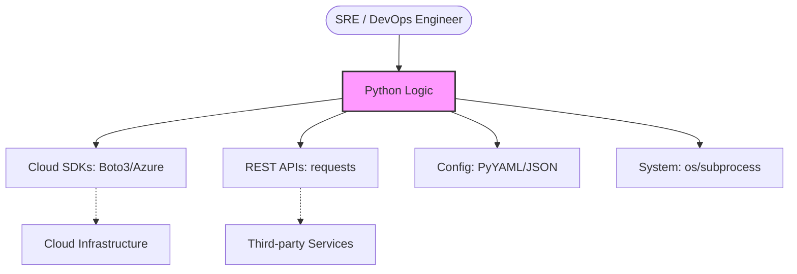

# Python Environment and Basics

Python is the "standard glue" for DevOps. This module covers the foundational skills needed to write production-grade automation.

## 📚 Module Structure
- **[Boilerplates](./Boilerplates/)**: `robust_template.py` (Main entry point, logging, args).
- **[CHALLENGES](./CHALLENGES.md)**: Config merging, signal handling, and security checks.

---

## 🏗️ Python's Role in DevOps

Python bridges the gap where Bash scripts become too complex or brittle.



---

## ❄️ Isolation: Virtual Environments

**Virtual Environments** (`venv`) allow you to create isolated Python installations for each project.

```bash
# Create a virtual environment
python -m venv .venv

# Activate it
source .venv/bin/activate  # Linux/Mac
# .venv\Scripts\activate   # Windows

# Install dependencies locally
pip install requests boto3
```

> [!TIP]
> Always include a `requirements.txt` file: `pip freeze > requirements.txt`

---

## 🛡️ Writing Robust DevOps Logic

### 1. Exception Handling
Never let your automation fail silently.

```python
try:
    with open("config.yaml", "r") as f:
        data = f.read()
except FileNotFoundError:
    print("❌ Critical Error: Configuration file missing!")
    exit(1)
```

### 2. Type Hinting
Documentation that the compiler can check.

```python
def check_cpu_threshold(current: float, limit: float = 90.0) -> bool:
    return current > limit
```

---

## 📖 Real-World Story: The Library Conflict

**Scenario**: A DevOps engineer installed a library globally for one script.
**Problem**: It overwrote the version required by a critical monitoring tool running on the same server.
**Outcome**: Monitoring failed silently.
**Solution**: Always use `venv`. NEVER `sudo pip install` on production.

---

## ❓ Interview Questions

1. **Why Python over Bash?**
   - *Answer*: Structured data handling (JSON/Dicts), better error handling, unit testing support.
2. **What is `requirements.txt`?**
   - *Answer*: A manifest of dependencies to ensure reproducibility (`pip install -r`).
3. **How do you handle secrets?**
   - *Answer*: Environment variables (`os.environ`) or Vault. Never hardcode.
4. **Different between `exit()` and `sys.exit()`?**
   - *Answer*: `sys.exit()` raises `SystemExit` (proper for scripts), `exit()` is for the interactive shell.

---

[Next: System Operations](../02-System-and-File-Operations/README.md)