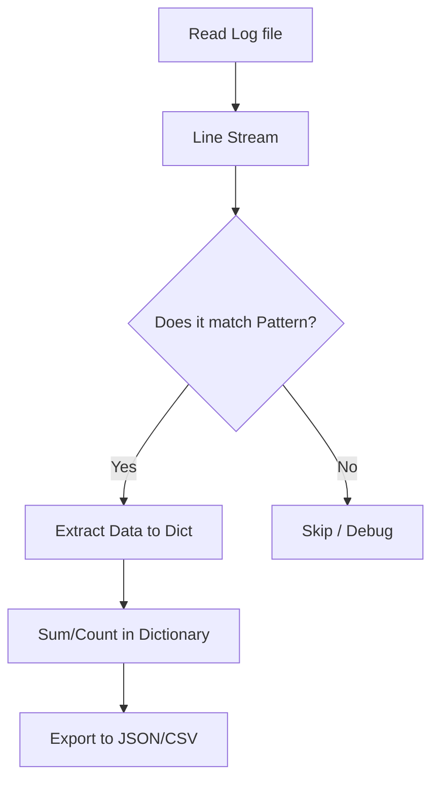

# Log Parsing and Regex Mastery
*Mining Insights from the Chaos*

Logs are the diary of your infrastructure. Knowing how to efficiently parse thousands of lines of logs using Python and Regular Expressions (Regex) is a superpower for any DevOps engineer or SRE.

---

## 🏗️ The Regex Toolset

Python's `re` module is the engine for pattern matching.

### Basic Patterns
- `\d+`: One or more digits (useful for PIDs, Ports).
- `\s+`: One or more whitespace characters.
- `\[(.*?)\]`: Matches text inside brackets (useful for timestamps).
- `(ERROR|WARN|INFO)`: Matches specific log levels.

### Example: Parsing a Syslog Entry
```python
import re

log_line = "Jan 13 12:00:01 node-01 sshd[1234]: Accepted password for root"
pattern = r"(\w{3}\s+\d+\s+[\d:]+)\s+(\S+)\s+(\w+)\[(\d+)\]:\s+(.*)"

match = re.search(pattern, log_line)
if match:
    timestamp, host, service, pid, message = match.groups()
    print(f"Service: {service} | MSG: {message}")
```

---

## 📊 Logic Flow: The Log Aggregator



---

## 🛠️ Hands-On Challenges

Master log analysis by building these parsing utilities.

| Challenge | Description | Starter Code | Solution |
| :--- | :--- | :--- | :--- |
| **01. IP Counter** | Parse an Nginx access log and find the top 5 IP addresses by request count. | [Link](./challenges/challenge_01_ip_counter.py) | [Link](./challenges/solutions/solution_01_ip_counter.py) |
| **02. Error Extractor** | Scan a multi-gigabyte log file for "ERROR" lines and save them to a summary file. | [Link](./challenges/challenge_02_error_extractor.py) | [Link](./challenges/solutions/solution_02_error_extractor.py) |
| **03. Slow Query Finder** | Parse a SQL slow query log to identify queries taking longer than 1 second. | [Link](./challenges/challenge_03_slow_query.py) | [Link](./challenges/solutions/solution_03_slow_query.py) |

---

## ❓ Interview Questions

1. **What is the difference between `re.match()` and `re.search()`?**
   * *Answer*: `match()` only checks the beginning of the string, while `search()` scans the entire string for a match.
2. **How do you handle very large log files in Python without crashing?**
   * *Answer*: Use a generator or iterate file line-by-line (`for line in open(...)`) instead of `read()` or `readlines()`.
3. **What is a "Capturing Group" in Regex?**
   * *Answer*: It's a way to extract specific parts of a match using parentheses `(...)`. You can access them via `.group(1)`, `.group(2)`, etc.

---

**Next Step**: [Remote Execution & SSH →](../09-Remote-Execution-and-SSH/README.md)
