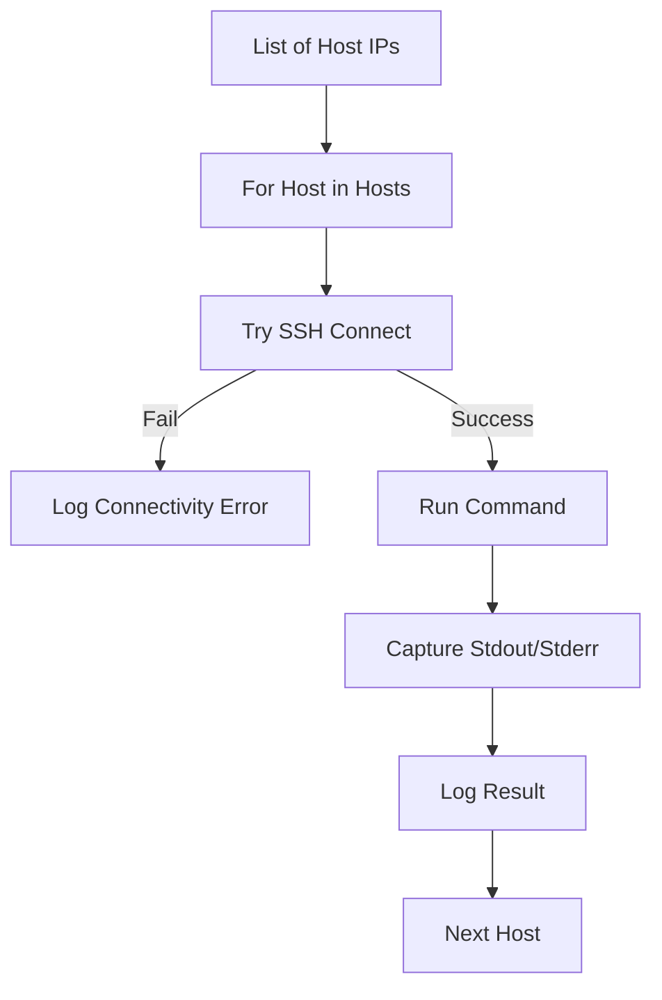

# Remote Execution & SSH with Paramiko
*Controlling the Fleet Programmatically*

While Ansible is great for declarative config, sometimes you need a raw Python script to reach out and touch a remote server via SSH. **Paramiko** is the primary library used for this, providing both SSH client and SFTP capabilities.

---

## 🏗️ The Paramiko Pattern

To execute a command remotely, you follow a simple "Connect -> Exec -> Close" lifecycle.

```python
import paramiko

# 1. Initialize Client
ssh = paramiko.SSHClient()
ssh.set_missing_host_key_policy(paramiko.AutoAddPolicy())

# 2. Connect
ssh.connect('10.0.0.5', username='admin', password='password123')

# 3. Execute
stdin, stdout, stderr = ssh.exec_command('uptime')
print(f"Output: {stdout.read().decode()}")

# 4. Close
ssh.close()
```

---

## 📊 Logic Flow: Sequential Batch Execution



---

## 🛠️ Hands-On Challenges

Master remote automation by building these orchestration tools.

| Challenge | Description | Starter Code | Solution |
| :--- | :--- | :--- | :--- |
| **01. System Health Checker** | Connect to a list of servers and capture their disk usage and memory stats. | [Link](./challenges/challenge_01_health_check.py) | [Link](./challenges/solutions/solution_01_health_check.py) |
| **02. Secure File Deployer** | Use Paramiko SFTP to upload a config file and restart a service on a remote node. | [Link](./challenges/challenge_02_config_deploy.py) | [Link](./challenges/solutions/solution_02_config_deploy.py) |
| **03. Batch Key Injector** | Automate the process of adding your SSH public key to a list of remote `authorized_keys`. | [Link](./challenges/challenge_03_key_injector.py) | [Link](./challenges/solutions/solution_03_key_injector.py) |

---

## ❓ Interview Questions

1. **Why do we use `ssh.set_missing_host_key_policy(paramiko.AutoAddPolicy())`?**
   * *Answer*: By default, Paramiko rejects connections to unknown hosts (not in `known_hosts`). This policy automatically adds the host key, which is common in automation but presents a security risk (Man-in-the-Middle).
2. **What are the three streams returned by `exec_command()`?**
   * *Answer*: `stdin` (for sending data to the command), `stdout` (for reading output), and `stderr` (for reading error messages).
3. **How do you transfer files using Paramiko?**
   * *Answer*: Use `ssh.open_sftp()` to create an SFTP client, which provides methods like `.put(local, remote)` and `.get(remote, local)`.

---

**Next Step**: [Database Operations for DevOps →](../10-Database-Operations/README.md)
