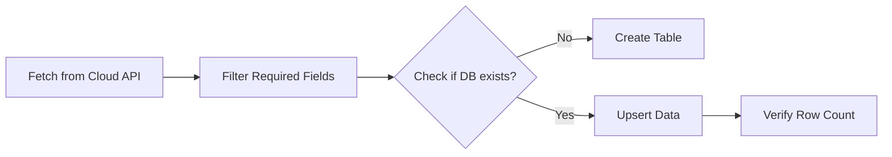

# Database Operations for DevOps
*Managing State and Inventory*

DevOps scripts often need to interact with databases to store inventory data, track deployment history, or audit configurations. While SQL can be complex, Python makes it accessible using libraries like `sqlite3` (built-in) and `psycopg2` (PostgreSQL).

---

## 🏗️ The SQLite Pattern

SQLite is perfect for local automation because it doesn't require a separate server.

```python
import sqlite3

# 1. Connect (creates file if missing)
conn = sqlite3.connect('inventory.db')
cursor = conn.cursor()

# 2. Create Table
cursor.execute('''CREATE TABLE IF NOT EXISTS servers 
                  (hostname TEXT, ip TEXT, status TEXT)''')

# 3. Insert Data
cursor.execute("INSERT INTO servers VALUES ('web-01', '10.0.0.1', 'up')")
conn.commit()

# 4. Query
cursor.execute("SELECT * FROM servers WHERE status='up'")
print(cursor.fetchall())

# 5. Close
conn.close()
```

---

## 📊 Logic Flow: Inventory Sync



---

## 🛠️ Hands-On Challenges

Master data persistence by building these database tools.

| Challenge | Description | Starter Code | Solution |
| :--- | :--- | :--- | :--- |
| **01. Inventory Tracker** | Build a tool that stores server metadata (hostname, IP, OS) in a SQLite database. | [Link](./challenges/challenge_01_inventory_db.py) | [Link](./challenges/solutions/solution_01_inventory_db.py) |
| **02. Deployment Auditor** | Create a script that logs the results of every deployment (timestamp, status, engineer) to a DB. | [Link](./challenges/challenge_02_deploy_log.py) | [Link](./challenges/solutions/solution_02_deploy_log.py) |
| **03. DB Backup Verifier** | Write a script that connects to a DB, counts rows in a critical table, and compares it to a baseline. | [Link](./challenges/challenge_03_db_verify.py) | [Link](./challenges/solutions/solution_03_db_verify.py) |

---

## ❓ Interview Questions

1. **Why use SQLite for small automation scripts instead of a full PostgreSQL server?**
   * *Answer*: SQLite is "zero-config" and serverless. The entire database is a single file on disk, making it extremely portable and easy to include in custom tools without setting up external infrastructure.
2. **What is the purpose of `conn.commit()`?**
   * *Answer*: SQL operations are transactional. `commit()` saves the changes permanently to the database. Without it, changes might be lost when the connection closes.
3. **How do you prevent SQL Injection in Python?**
   * *Answer*: Never use f-strings or string formatting to build queries. Use **parameterized queries**: `cursor.execute("SELECT * FROM table WHERE id=?", (val,))`.

---

**Next Step**: [Docker Python SDK →](../11-Docker-and-Kubernetes-SDKs/README.md)
