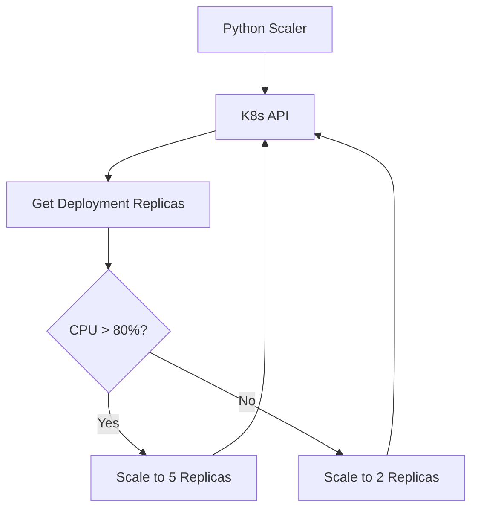

# Docker & Kubernetes SDKs
*Orchestrating Containers with Python*

DevOps today is container-centric. While `kubectl` and `docker cli` are essential, building custom automation for scaling, cleanup, or specialized deployments requires native Python clients.

---

## 🏗️ Docker SDK Patterns

The `docker` library allows you to manage containers, images, and volumes as Python objects.

```python
import docker

client = docker.from_env()

# 1. Run a container
container = client.containers.run("nginx", detach=True, ports={'80/tcp': 8080})

# 2. List running containers
for c in client.containers.list():
    print(f"ID: {c.short_id} | Image: {c.image.tags}")

# 3. Stop and Remove
container.stop()
container.remove()
```

---

## 🏗️ Kubernetes Client Patterns

The `kubernetes` library (official) provides access to the full K8s API. It uses `kubeconfig` for authentication.

```python
from kubernetes import client, config

# 1. Load context
config.load_kube_config()
v1 = client.CoreV1Api()

# 2. List Pods
print("Listing pods in 'default' namespace:")
ret = v1.list_namespaced_pod(namespace="default")
for i in ret.items:
    print(f"{i.status.pod_ip}\t{i.metadata.name}")
```

---

## 📊 Logic Flow: Auto-Scaling Utility



---

## 🛠️ Hands-On Challenges

Master container orchestration by building these automated utilities.

| Challenge | Description | Starter Code | Solution |
| :--- | :--- | :--- | :--- |
| **01. Container Janitor** | Build a script using Docker SDK to find and remove all "Exited" containers older than 24h. | [Link](./challenges/challenge_01_docker_janitor.py) | [Link](./challenges/solutions/solution_01_docker_janitor.py) |
| **02. K8s Pod Watcher** | Create a script that watches for new Pods in a namespace and logs their creation to a file. | [Link](./challenges/challenge_02_k8s_watcher.py) | [Link](./challenges/solutions/solution_02_k8s_watcher.py) |
| **03. Registry Auditor** | Use Docker SDK to list all local images and identify those larger than 1GB. | [Link](./challenges/challenge_03_image_auditor.py) | [Link](./challenges/solutions/solution_03_image_auditor.py) |

---

## ❓ Interview Questions

1. **How does `docker.from_env()` authenticate?**
   * *Answer*: It looks for environment variables like `DOCKER_HOST`, `DOCKER_CERT_PATH`, or defaults to the local unix socket (`/var/run/docker.sock`) on Linux/macOS.
2. **What is the difference between `CoreV1Api` and `AppsV1Api` in the K8s Python client?**
   * *Answer*: `CoreV1Api` is for foundational resources like Pods, Services, and Namespaces. `AppsV1Api` is for higher-level controllers like Deployments, StateSets, and DaemonSets.
3. **How do you handle authentication inside a Pod (In-Cluster)?**
   * *Answer*: Use `config.load_incluster_config()`. This uses the ServiceAccount token mounted automatically by Kubernetes.

---

**Next Step**: [Web Scraping for Monitoring →](../12-Web-Scraping-for-Monitoring/README.md)
