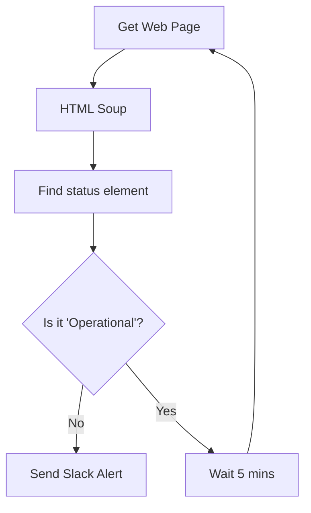

# Web Scraping for Monitoring
*Automating Legacy Console Interaction*

Not every tool has a REST API. Sometimes, you need to extract data from legacy web consoles, status pages, or internal dashboards. Python's `BeautifulSoup4` and `requests` libraries are the standard toolkit for this "scraping" approach.

---

## 🏗️ The Scraping Pattern

Web scraping involves fetching the HTML structure and searching for specific tags or attributes.

```python
import requests
from bs4 import BeautifulSoup

# 1. Fetch HTML
url = "https://status.cloud.com"
response = requests.get(url)

# 2. Parse HTML
soup = BeautifulSoup(response.text, 'html.parser')

# 3. Find Data (e.g., status in a span with class 'status-label')
status_label = soup.find('span', class_='status-label').text
print(f"Current Status: {status_label}")
```

---

## 📊 Logic Flow: The Site Monitor



---

## 🛠️ Hands-On Challenges

Master web interaction by building these monitoring scripts.

| Challenge | Description | Starter Code | Solution |
| :--- | :--- | :--- | :--- |
| **01. Status Page Checker** | Scrape a public status page and identify which services are currently "Down". | [Link](./challenges/challenge_01_status_checker.py) | [Link](./challenges/solutions/solution_01_status_checker.py) |
| **02. Link Auditor** | Extract all internal links from a web portal to check for broken URLs. | [Link](./challenges/challenge_02_link_auditor.py) | [Link](./challenges/solutions/solution_02_link_auditor.py) |
| **03. Version Tracker** | Scrape an open-source download page to find the latest available version string. | [Link](./challenges/challenge_03_version_tracker.py) | [Link](./challenges/solutions/solution_03_version_tracker.py) |

---

## ❓ Interview Questions

1. **What is 'BeautifulSoup' and why is it used?**
   * *Answer*: It's a library that parses HTML and XML documents into a navigable tree structure, making it easy to search for tags, IDs, and classes without complex regex.
2. **What are the legal/ethical considerations of web scraping?**
   * *Answer*: You should check the `robots.txt` file of the site, avoid overloading servers (aggressive polling), and ensure you are not violating the terms of service.
3. **How do you handle pages that require JavaScript to render?**
   * *Answer*: `BeautifulSoup` cannot execute JS. For dynamic pages, you must use tools like **Selenium** or **Playwright** which control a real browser.

---

**Next Step**: [Data Processing with Pandas →](../13-Data-Processing-with-Pandas/README.md)
