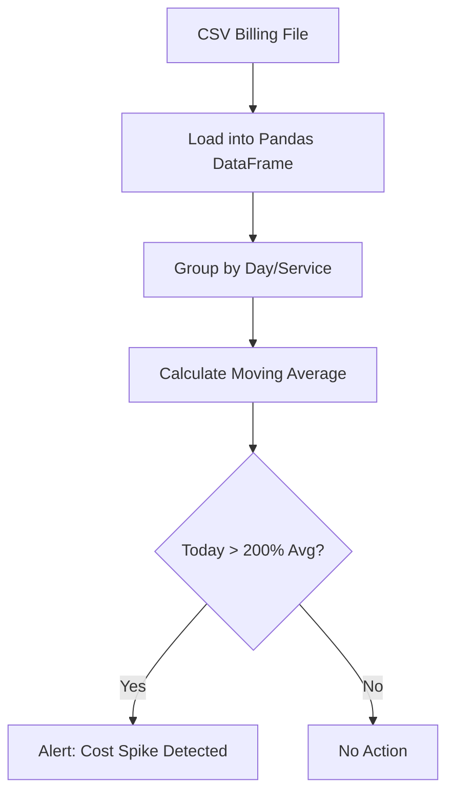

# Data Processing with Pandas
*Turn Bulk Data into Intelligent Reports*

DevOps isn't just about moving data—it's about analyzing it. Whether you're processing gigabytes of CSV logs, calculating AWS cost trends, or analyzing build performance, **Pandas** is the ultimate tool for handling tabular data (DataFrames) in Python.

---

## 🏗️ The Pandas Pattern

Pandas allows you to load data into a "DataFrame" (like an in-memory SQL table) and perform complex operations in one or two lines of code.

```python
import pandas as pd

# 1. Load Data
df = pd.read_csv('billing_data.csv')

# 2. Filter & Group
# Find total cost per AWS service
summary = df.groupby('Service')['Amount'].sum()

# 3. Export
summary.to_csv('monthly_summary.csv')
print(summary)
```

---

## 📊 Logic Flow: Cost Anomaly Detection



---

## 🛠️ Hands-On Challenges

Master large-scale data analysis by building these reporting tools.

| Challenge | Description | Starter Code | Solution |
| :--- | :--- | :--- | :--- |
| **01. Cost Report Generator** | Load a CSV of AWS costs, filter for "Production" account, and total costs by "Service". | [Link](./challenges/challenge_01_cost_analyzer.py) | [Link](./challenges/solutions/solution_01_cost_analyzer.py) |
| **02. Build Time Tracker** | Analyze a list of CI/CD build logs to find the 10% longest-running builds. | [Link](./challenges/challenge_02_build_stats.py) | [Link](./challenges/solutions/solution_02_build_stats.py) |
| **03. Log Anomaly Finder** | Parse a dataset of server response codes and identify days where error rates exceeded 5%. | [Link](./challenges/challenge_03_log_anomalies.py) | [Link](./challenges/solutions/solution_03_log_anomalies.py) |

---

## ❓ Interview Questions

1. **What is a DataFrame in Pandas?**
   * *Answer*: A DataFrame is a 2-dimensional, size-mutable, and potentially heterogeneous tabular data structure with labeled axes (rows and columns). Think of it as a super-powered Python version of an Excel spreadsheet.
2. **How does Pandas handle missing data (`NaN`)?**
   * *Answer*: Pandas provides functions like `.isnull()` to find missing values, `.fillna(value)` to replace them, and `.dropna()` to remove rows/columns containing them.
3. **Why use Pandas instead of a standard Python loop over a CSV?**
   * *Answer*: **Performance and Simplicity**. Pandas is built on top of NumPy (C-based), making it orders of magnitude faster for large datasets. It also provides high-level functions for grouping and joining that would require hundreds of lines of complex manual loop logic.

---

**Final Capstone Project**: [The S3 Guardian CLI →](../14-Capstone-Project-S3-Auditor/README.md)
