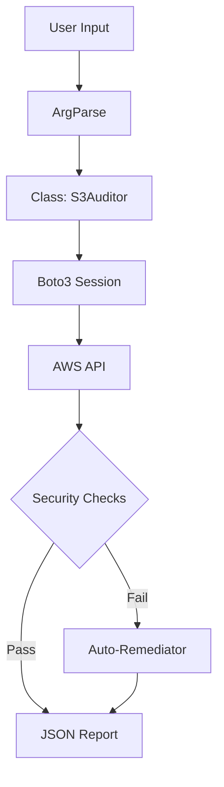

# Capstone Project: S3 Guardian CLI

Congratulations! You reached the end of the Python for DevOps module. This capstone project combines Boto3, CLI best practices, and Exception Handling into a real-world security tool.

## 📚 Module Structure
- **[Boilerplates](./Boilerplates/)**: `s3_auditor.py` (Skeleton code).
- **[CHALLENGES](./CHALLENGES.md)**: The Full Specification.

---

## 🎯 The Mission

Your generic checklist for "Production Ready" Python tools:
1.  **Arguments**: `argparse` or `click`.
2.  **Config**: `yaml` or `json` file support.
3.  **Logging**: No `print()` statements for status; use `logging`.
4.  **Formatting**: `black` or `flake8` compliant.
5.  **Type Hints**: For all function signatures.

---

## 🏗️ Architecture

---

## ❓ Final Review Questions

1.  **What differentiates a "Script" from an "Application"?**
    - *Answer*: A script is often linear and fragile. An application (tool) has modularity, error handling, logging, testing, and documentation.
2.  **Why use Classes (OOP) for this tool?**
    - *Answer*: To maintain state (like the Boto3 session and the growing Report list) across multiple methods without passing 10 arguments to every function.

---

[⬅️ Back to Index](../README.md)
