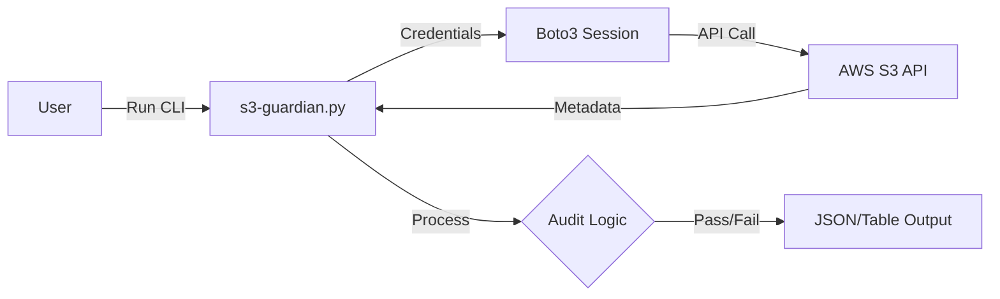

# 🏆 Capstone Project: The S3 Guardian CLI
*Build a Professional Cloud Security Tool*

This capstone project combines every skill you've learned in this module: Boto3, CLI creation, JSON handling, and Testing. You will build a real-world tool that many DevOps engineers commonly write.

---

## 📋 Project Specification

**Name**: `s3-guardian`
**Goal**: A Command-Line Interface (CLI) tool that scans AWS S3 buckets for common security misconfigurations.

### Requirements
1.  **Discovery**: List all S3 buckets in the account.
2.  **Audit**: Check each bucket for:
    *   ❌ **Public Access** (Is it open to the world?)
    *   ❌ **Encryption** (Is Server-Side Encryption enabled?)
    *   ❌ **Versioning** (Is versioning enabled for disaster recovery?)
3.  **Reporting**: Output the results as a colored table OR a JSON file.
4.  **Interface**: Must handle command-line arguments (e.g., `--region`, `--json`).
5.  **Quality**: Must include at least one test case using `moto`.

---

## 🏗️ Architecture



---

## 🛠️ Step-by-Step Implementation Guide

### Phase 1: The Core Logic
First, write the Python functions that interact with AWS. Don't worry about the CLI part yet.

```python
# auditor.py
import boto3
from botocore.exceptions import ClientError

def get_bucket_encryption(bucket_name, s3_client):
    try:
        s3_client.get_bucket_encryption(Bucket=bucket_name)
        return True
    except ClientError:
        return False

def check_bucket(bucket_name, s3_client):
    """Run all checks on a single bucket."""
    return {
        "name": bucket_name,
        "encrypted": get_bucket_encryption(bucket_name, s3_client),
        # Add versioning and public access checks here...
    }
```

### Phase 2: The CLI Wrapper
Use the built-in `argparse` library to handle user input.

```python
# main.py
import argparse
import boto3
from auditor import check_bucket

def main():
    parser = argparse.ArgumentParser(description="Audit S3 Buckets for Security")
    parser.add_argument("--region", default="us-east-1", help="AWS Region")
    parser.add_argument("--json", action="store_true", help="Output as JSON")
    args = parser.parse_args()

    s3 = boto3.client("s3", region_name=args.region)
    
    # Logic to list buckets and loop through them...
    pass

if __name__ == "__main__":
    main()
```

### Phase 3: Testing with Moto
Before running this against your real production account, test it safely.

```python
# test_auditor.py
import boto3
from moto import mock_s3
from auditor import check_bucket

@mock_s3
def test_audit_logic():
    # Setup Mock AWS
    s3 = boto3.client("s3", region_name="us-east-1")
    s3.create_bucket(Bucket="safe-bucket")
    
    # Run Audit
    result = check_bucket("safe-bucket", s3)
    
    # Assert (Encryption is off by default)
    assert result['encrypted'] == False
```

---

## 🚀 The Challenge

1.  Create a directory `s3-guardian`.
2.  Initialize a virtual environment (`python -m venv venv`).
3.  Install dependencies (`pip install boto3 pytablewriter moto pytest`).
4.  **Code the solution!**

---

## 📂 Source Code Solution

<details>
<summary>👀 Click to reveal the Full Auditor Script</summary>

```python
import boto3
import argparse
import json
import sys
from botocore.exceptions import ClientError

def audit_bucket(name, s3):
    """Audits a single bucket for Encryption and Versioning."""
    issues = []
    
    # 1. Check Encryption
    try:
        s3.get_bucket_encryption(Bucket=name)
        encrypted = True
    except ClientError:
        encrypted = False
        issues.append("Missing Encryption")

    # 2. Check Versioning
    ver = s3.get_bucket_versioning(Bucket=name)
    versioning = ver.get('Status') == 'Enabled'
    if not versioning:
        issues.append("Versioning Disabled")

    status = "⚠️ RISK" if issues else "✅ PASS"
    
    return {
        "Bucket": name,
        "Status": status,
        "Issues": ", ".join(issues) if issues else "None"
    }

def main():
    parser = argparse.ArgumentParser()
    parser.add_argument("--profile", help="AWS CLI Profile", default=None)
    parser.add_argument("--json", action="store_true", help="JSON Output")
    args = parser.parse_args()

    session = boto3.Session(profile_name=args.profile)
    s3 = session.client("s3")

    print(f"🔍 Scanning buckets using profile: {args.profile or 'default'}...")
    
    try:
        buckets = s3.list_buckets()['Buckets']
    except Exception as e:
        print(f"❌ Error listing buckets: {e}")
        sys.exit(1)

    results = []
    for b in buckets:
        res = audit_bucket(b['Name'], s3)
        results.append(res)
        # Simple progress indicator
        if not args.json:
            print(f"Checked {b['Name']}...")

    if args.json:
        print(json.dumps(results, indent=2))
    else:
        # Simple Table Output
        print("\n" + "="*60)
        print(f"{'BUCKET':<30} | {'STATUS':<10} | {'ISSUES'}")
        print("-" * 60)
        for r in results:
            print(f"{r['Bucket']:<30} | {r['Status']:<10} | {r['Issues']}")
        print("="*60)

if __name__ == "__main__":
    main()
```
</details>

<details>
<summary>👀 Click to reveal the Moto Test</summary>

```python
import boto3
from moto import mock_s3
from main import audit_bucket  # Assuming script is named main.py

@mock_s3
def test_audit_finds_unencrypted_bucket():
    # 1. Setup Mock
    s3 = boto3.client("s3", region_name="us-east-1")
    s3.create_bucket(Bucket="danger-bucket")
    
    # 2. Act
    report = audit_bucket("danger-bucket", s3)
    
    # 3. Assert
    assert report['Status'] == "⚠️ RISK"
    assert "Missing Encryption" in report['Issues']

@mock_s3
def test_audit_passes_secure_bucket():
    # 1. Setup Mock
    s3 = boto3.client("s3", region_name="us-east-1")
    s3.create_bucket(Bucket="safe-bucket")
    
    # Enable Encryption
    s3.put_bucket_encryption(
        Bucket="safe-bucket",
        ServerSideEncryptionConfiguration={
            'Rules': [{'ApplyServerSideEncryptionByDefault': {'SSEAlgorithm': 'AES256'}}]
        }
    )
    # Enable Versioning
    s3.put_bucket_versioning(
        Bucket="safe-bucket",
        VersioningConfiguration={'Status': 'Enabled'}
    )
    
    # 2. Act
    report = audit_bucket("safe-bucket", s3)
    
    # 3. Assert
    assert report['Status'] == "✅ PASS"
```
</details>

---

## 📂 Project Source Code

You can find the complete, professional-grade source code for this project in the `project/` directory of this module.

- **[Main CLI Interface](./project/main.py)**: Handles arguments and AWS sessions.
- **[Auditor Logic](./project/auditor.py)**: The reusable security check engine.
- **[Test Suite](./project/tests/test_s3_guardian.py)**: Automated tests using Moto.
- **[Requirements](./project/requirements.txt)**: Minimal dependencies for production use.

---

## 🎖️ Module Completed!

Congratulations! You've mastered the Intermediate Python for DevOps curriculum. You are now capable of:
1.  Writing complex, logic-heavy automation scripts.
2.  Manipulating Infrastructure-as-Code (YAML/JSON) programmatically.
3.  Managing massive cloud environments using Boto3 and Paginators.
4.  Deploying serverless event-driven automation in AWS Lambda.
5.  Protecting your infrastructure with professional unit tests and mocks.

**What's Next?**
- Head to the [**Advanced Python for DevOps**](../../../../3-Advanced/02-Phase-2/01-Automation/03-Python-Advanced/README.md) module to learn about Object Oriented (OOP) Automation, Context Managers, and Multi-threading.
- Or explore [**Ansible Automation**](../../02-Configuration-Tools/05-Ansible/README.md) to apply your Python skills to configuration management.

---

**Back to Main Hub**: [Python for DevOps Hub](../README.md)
