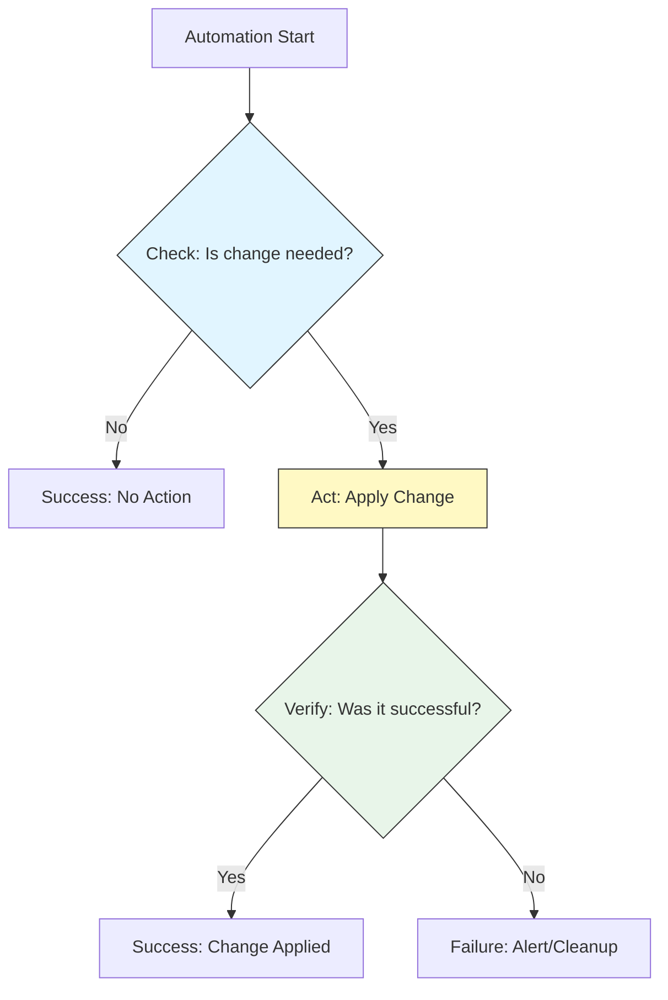

# Automation Best Practices: Production-Grade Reliability

Automation isn't just about "making it work"; it's about making it **reliable**, **safe**, and **reusable**. A poorly written script is more dangerous than manual execution because it scales mistakes at the speed of the CPU.

## 📚 Learning Path

| # | Topic | Description | Key Concepts |
| :--- | :--- | :--- | :--- |
| **01** | [**Maturity Model**](./01-The-Automation-Maturity-Model/README.md) | Scaling Reliability | Level 1-5, Self-Healing, SRE Standard |
| **02** | [**Idempotency**](./02-Idempotency-Patterns-Check-Act-Verify/README.md) | Safe Re-runs | Check-Act-Verify, Immutable state |
| **03** | [**Secrets & Parameters**](./03-Parameterization-and-Secrets-Management/README.md) | Security First | Hardcoding removal, ENV vars, Vault |
| **04** | [**Failure Handling**](./04-Failure-Handling-and-Atomicity/README.md) | Defensive Logic | Atomicity, Pre-flight checks, Rollbacks |
| **05** | [**Observability**](./05-Observability-and-Logging/README.md) | Visibility | Dry Run, Structured Logging, Auditing |

---

## 🏗️ The "Check-Act-Verify" Pattern

---

## 🏗️ Real-Life Scenarios

### Scenario 1: The "Hardcoded Credential" Leak
**Problem**: An automation engineer hardcoded a database password into a script to "get it working quickly."
**Crisis**: The script was committed to a public GitHub repository by accident during a routine code push.
**Outcome**: Within 15 minutes, attackers identified the password and encrypted the company's customer database using ransomware.
**Solution**: Implement strict **Secrets Management**. Use Environment Variables or a Secrets Manager (AWS Secrets Manager, HashiCorp Vault). The script should pull the secret at runtime.
**Result**: The team moved all 50+ scripts to a vault-based system, significantly improving their security posture.

### Scenario 2: The "Non-Idempotent" User Creation
**Problem**: A script was designed to create 50 system users. It ran `useradd $username` in a loop.
**Crisis**: The script crashed on the 25th user due to a connection error. When the engineer re-ran the script, it failed immediately because users 1-24 already existed, causing `useradd` to return an error.
**Outcome**: The remaining users (26-50) were never created, leading to a partial and broken environment setup.
**Solution**: Adopt the **Idempotency** pattern. Before running `useradd`, the script should check if the user already exists (`id $username`). If they do, skip the command and move to the next.
**Result**: All automation scripts are now "Safe to Re-run," reducing the stress of recovering from partial failures.

### Scenario 3: The "Silent Disk" Failure
**Problem**: A log-cleanup script was running as a background cron job. It used `rm -rf /tmp/data/*` without any logging.
**Crisis**: One day, the `/tmp` partition was accidentally unmounted. The script ran, but since the directory didn't exist, it did nothing.
**Outcome**: High-priority logs filled up the root partition instead, crashing the entire server. Because there were no logs from the script, it took 4 hours to find the root cause.
**Solution**: Implement **Pre-flight Checks** and **Structured Logging**. The script should verify that `/tmp` is mounted and write a log entry: "SUCCESS: Deleted 500 files" or "FAILURE: /tmp not found."
**Result**: Failure detection time dropped from 4 hours to 5 minutes using centralized log monitoring.

---

## ❓ Interview Questions

1.  **Define 'Idempotency' in the context of DevOps automation.**
    - *Answer*: Idempotency means that running a script multiple times with the same inputs results in the same final system state without unintended side effects. For example, a script that creates a folder is idempotent if it checks for the folder's existence before trying to create it again.
2.  **What is a 'Pre-flight Check' and why is it used?**
    - *Answer*: A pre-flight check is a series of tests performed at the very beginning of a script to ensure that the environment is ready (e.g., checking for root permissions, network connectivity, disk space, or required tools). It allows a script to "Fail Fast" before making any changes.
3.  **Explain the hierarchy of Inputs (Parameterization) for a script.**
    - *Answer*: 1. Hardcoded (Worst). 2. Inside script variables (Bad). 3. Command-line arguments (Good). 4. Environment Variables/Config files (Better). 5. External Secrets Manager (Best).
4.  **How do you implement a 'Dry Run' mode in a script?**
    - *Answer*: Use a flag (e.g., `--dry-run`). In the code, wrap any destructive commands (like `rm`, `mv`, or `apt install`) in a conditional that checks the flag. If enabled, the script just prints what it *would* have done instead of doing it.
5.  **What does it mean for an operation to be 'Atomic'?**
    - *Answer*: Atomic means the operation either completes fully or not at all; there is no "half-finished" state. For example, instead of editing a file line-by-line, you could write to a temporary file and use the `mv` command to overwrite the target file instantly.
6.  **Explain the 'Automation Maturity Model' levels.**
    - *Answer*: Level 1 is manual. Level 2 is "Scripted" (individual scripts). Level 3 is "Integrated" (pipelines). Level 4 is "Observed/Managed" (error handling and metrics). Level 5 is "Autonomous/Self-Healing" (AI or event-driven remediation).

---

## 🧠 Comprehensive Quiz (25 Questions)

<b>1. A script that can be run multiple times without causing errors is called:</b>

Show Answer

Answer: B

<b>2. True/False: You should always hardcode credentials for speed during a crisis.</b>

Show Answer

Answer: B

<b>3. Which pattern ensures you only apply a change if it's actually needed?</b>

Show Answer

Answer: B

<b>4. 'Fail Fast' is a philosophy that suggests:</b>

Show Answer

Answer: B

<b>5. Which flag is commonly used for a 'Dry Run'?</b>

Show Answer

Answer: B

<b>6. 'Secrets Management' is best handled by:</b>

Show Answer

Answer: B

<b>7. True/False: Logging to a file with timestamps is a best practice.</b>

Show Answer

Answer: A

<b>8. An 'Atomic' operation is one that:</b>

Show Answer

Answer: B

<b>9. 'Parameterization' means moving hardcoded values into:</b>

Show Answer

Answer: B

<b>10. What is a 'Pre-flight Check'?</b>

Show Answer

Answer: B

<b>11. Which level of Automation Maturity involves 'Self-Healing'?</b>

Show Answer

Answer: C

<b>12. 'Structured Logging' usually uses which format for easy machine parsing?</b>

Show Answer

Answer: B

<b>13. How do you handle a shared lock in high-concurrency automation?</b>

Show Answer

Answer: B

<b>14. True/False: Defensive programming assumes that things WILL go wrong.</b>

Show Answer

Answer: A

<b>15. Which command is safer for editing a file atomically?</b>

Show Answer

Answer: B

<b>16. 'Environment Drift' occurs when:</b>

Show Answer

Answer: B

<b>17. Why is 'SSH Loop' automation dangerous without checks?</b>

Show Answer

Answer: B

<b>18. What should a good 'Usage' message include?</b>

Show Answer

Answer: B

<b>19. 'Abort on Error' (set -e) is part of which philosophy?</b>

Show Answer

Answer: A

<b>20. True/False: Comments are a substitute for good naming conventions.</b>

Show Answer

Answer: B

<b>21. 'Indempotency' is most important for:</b>

Show Answer

Answer: B

<b>22. Which tool is commonly used to find 'Dead Code' or 'Vulnerabilities' in scripts?</b>

Show Answer

Answer: B

<b>23. 'Sanitizing Input' helps prevent:</b>

Show Answer

Answer: B

<b>24. Automation should be treated with the same rigor as _____ code.</b>

Show Answer

Answer: B

<b>25. Reliable automation is the _____ of SRE.</b>

Show Answer

Answer: B

