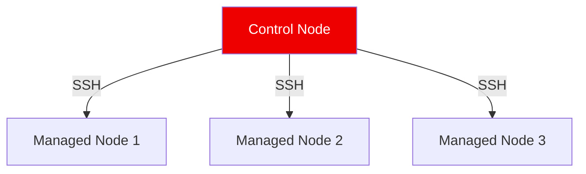

# Ansible Fundamentals

Ansible is an open-source automation tool used for configuration management, application deployment, and task automation.

## 📚 Module Structure
- **[Boilerplates](./Boilerplates/)**: `ansible.cfg` (Standard Configuration).
- **[CHALLENGES](./CHALLENGES.md)**: Ad-hoc commands and connectivity tests.

---

## 🔑 Key Concepts

| Concept | Description |
| :--- | :--- |
| **Control Node** | The machine where you run the `ansible` command. (Mac/Linux/WSL). |
| **Managed Node** | The target servers (Linux, Windows, Network Devices). |
| **Inventory** | A list of managed nodes. |
| **Ad-Hoc** | Single-line commands for quick tasks (`ansible all -m ping`). |

---

## 🏗️ Architecture

## 🛡️ Best Practices
- **Strict Host Checking**: only disable `host_key_checking` in Dev/Labs.
- **Python Specs**: Ensure target nodes have Python installed (Ansible needs it to run modules).

---

## ❓ Interview Questions

1.  **Does Ansible require an agent?**
    - *Answer*: No. It uses SSH (for Linux) or WinRM (for Windows) to communicate.
2.  **What is Idempotency?**
    - *Answer*: The property where performing an operation multiple times yields the same result as performing it once. (e.g., Installing a package that is already installed does nothing).
3.  **How does Ansible communicate with nodes?**
    - *Answer*: By pushing small Python programs (modules) to the nodes, executing them, and returning the JSON result.

---

[Next: Inventory Management](../02-Inventory-Management/README.md)