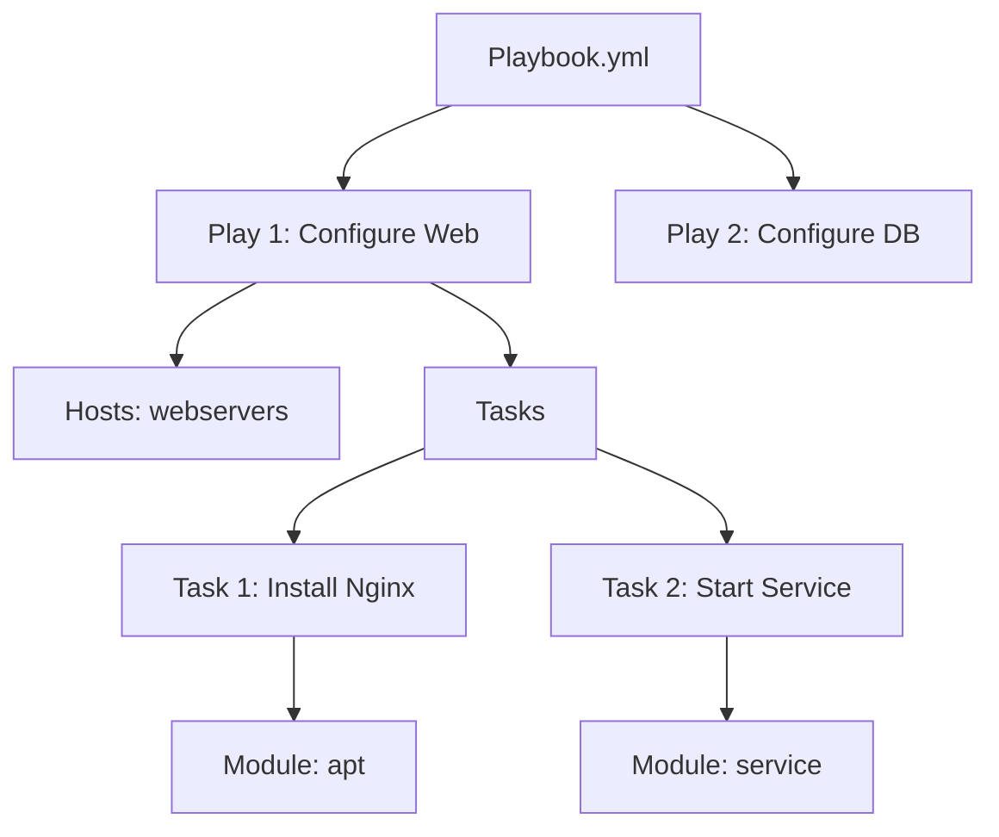

# Basic Playbooks

A Playbook is a YAML file containing a list of **Plays**. Each Play maps a group of **Hosts** to a list of **Tasks**.

## 1. Anatomy of a Playbook



### Syntax Example (`site.yml`)
```yaml
---
- name: Configure Webservers        # <--- The Play
  hosts: webservers
  become: true                      # <--- Run as root (sudo)

tasks:                            # <--- The Task List
    - name: Ensure Nginx is installed
      apt:                          # <--- The Module
        name: nginx
        state: present              # <--- Desired State

- name: Ensure Nginx is running
      service:
        name: nginx
        state: started
        enabled: true
```

---

## 2. YAML Syntax Rules

Ansible is strict about YAML.
1.  **Indentation**: Use **2 spaces**. Do not use Tabs.
2.  **Lists**: Start with `-`.
3.  **Dictionaries**: Key-Value pairs (`key: value`).
4.  **Booleans**: `true`/`false` or `yes`/`no`.

---

## 3. Idempotency (The Golden Rule)

Ansible is **Declarative**, not Imperative.
*   **Imperative (Bash)**: "Install Nginx". (If already installed, apt might complain or do extra work).
*   **Declarative (Ansible)**: "Ensure Nginx is `present`". (If installed, do nothing. If missing, install it.)

### State parameters
Most modules act based on the `state` parameter:
*   `present`: Ensure it exists.
*   `absent`: Ensure it is gone (Delete it).
*   `latest`: Update to the newest version.

---

## 4. Advanced Playbook Structures

As your infrastructure grows, a single YAML file becomes unmanageable. Ansible provides methods to split and organize your logic.

### Static vs. Dynamic Inclusions
- **`import_playbook` / `import_tasks`**: Static. Processed when the playbook is parsed. Best for fixed structures.
- **`include_tasks`**: Dynamic. Processed during execution. Best for conditional tasks or loops.

### Multi-Environment Orchestration (`site.yml`)
The "Master Playbook" pattern allows you to orchestrate the entire infrastructure.

```yaml
# site.yml
---
- import_playbook: playbooks/common.yml     # Basic security/users
- import_playbook: playbooks/db_tier.yml    # Database setup
- import_playbook: playbooks/web_tier.yml   # App and Web servers

# Usage
ansible-playbook -i inventories/production site.yml
```

---

## 5. Real-Life Scenarios

### Scenario 1: "The Script Converters"
**Problem**: A sysadmin wrote 200 lines of Bash scripts to setup servers. It used `if [ -f /etc/config ]; then ...` to check if it had already run. It was buggy.
**Solution**: Converted to Ansible. The logic `if file exists` is built into the `copy` module. The script shrank to 30 lines of YAML.

### Scenario 2: "The Drift Fixer"
**Problem**: A junior dev manually stopped Nginx on a production server to debug and forgot to start it.
**Solution**: The nightly Ansible run executed. It saw `state: started` in the playbook but `Status: stopped` on the server. It started the service. **Config Drift healed automatically.**

### Scenario 3: "Multi-Play Playbook"
**Problem**: deploying a 3-tier app (Web + App + DB).
**Solution**: One `site.yml` containing 3 plays:
1.  `hosts: db` (Install Postgres, create users).
2.  `hosts: app` (Install Java, connect to DB).
3.  `hosts: web` (Install Nginx, proxy to App).
Running one command configures the entire stack in the correct order.

---

## 6. ❓ Interview Questions

1.  **What is the difference between `name` in a Play and `name` in a Task?**
    *   **Answer**: In a Play, `name` is a description for the log output ("Configure Web"). In a Task, `name` describes the step ("Install Nginx"). Task names are optional but highly recommended for readability.

2.  **How do you run a syntax check?**
    *   **Answer**: `ansible-playbook site.yml --syntax-check`. This catches YAML indentation errors before execution.

3.  **What does `gather_facts: false` do?**
    *   **Answer**: It skips the setup phase where Ansible collects IP/OS info. Useful for speeding up runs if you don't need those variables.

4.  **What is a "Handler"?**
    *   **Answer**: A special task that only runs when notified by another task (e.g., "Restart Nginx" only if "Update Config" changed something).

5.  **How do you run only one specific task?**
    *   **Answer**: By using Tags (`--tags "nginx"`) or starting at a specific task (`--start-at-task "Install Nginx"`).

6.  **Can a Playbook include other Playbooks?**
    *   **Answer**: Yes, using `import_playbook: web.yml`. This allows splitting a massive `site.yml` into smaller files.

7.  **What happens if a task fails on one host?**
    *   **Answer**: That host is removed from the rotation for the rest of the playbook. The play continues on other successful hosts.

8.  **How do you debug a variable in a playbook?**
    *   **Answer**: Use the `debug` module:
        ```yaml
        - debug:
            var: my_variable
        ```

9.  **What is `ignore_errors: yes`?**
    *   **Answer**: It tells Ansible to continue executing the playbook on a host even if the specific task returned a failure code.

10. **Explain `connection: local`.**
    *   **Answer**: Tells Ansible to run the module on the Control Node itself, not via SSH. Useful for calling APIs (AWS/Azure) or file manipulation locally.

---

## 7. 🧠 Knowledge Check (Quiz)

### Structure
1.  **A Playbook starts with:**
    *   [x] `---`
    *   [ ] `#!/bin/bash`

2.  **To run a playbook:**
    *   [x] `ansible-playbook`
    *   [ ] `ansible`

3.  **To execute as root (sudo):**
    *   [x] `become: true`
    *   [ ] `user: root`

4.  **A List item in YAML starts with:**
    *   [x] `-` (Hyphen)
    *   [ ] `*` (Asterisk)

### Logic
5.  **If `state: present` and the package is already there:**
    *   [x] Result is "OK" (Green), nothing changes.
    *   [ ] Result is "Changed" (Yellow).

6.  **Ideally, you should execute a playbook:**
    *   [x] Many times (checking state).
    *   [ ] Only once.

7.  **To delete a file, set state to:**
    *   [x] `absent`
    *   [ ] `delete`

8.  **The default `gather_facts` setting is:**
    *   [x] `true`.
    *   [ ] `false`.

9.  **Which module prints text to the screen?**
    *   [x] `debug`.
    *   [ ] `print`.

10. **Indentation for a Task list:**
    *   [x] Must be consistent (standard 2 spaces).
    *   [ ] Can be anything.

### Scenarios
11. **Converting a Shell script to Ansible:**
    *   [x] Makes it idempotent and readable.
    *   [ ] Makes it faster (usually slower but safer).

12. **If a Playbook fails halfway:**
    *   [x] Fix error, run again (idempotency handles the rest).
    *   [ ] You must undo manual changes.

13. **Targeting multiple role groups (Web, DB):**
    *   [x] Use multiple Plays in one file.
    *   [ ] Use multiple files.

14. **To "dry run" a playbook:**
    *   [x] `ansible-playbook --check`.
    *   [ ] `ansible-playbook --test`.

15. **If you see "Changed: 0":**
    *   [x] The system was already in the desired state.
    *   [ ] The playbook failed.

### General
16. **Is `hosts` mandatory in a Play?**
    *   [x] Yes.
    *   [ ] No.

17. **Can you modify a file without rewriting it entirely?**
    *   [x] Yes, `lineinfile` or `blockinfile` modules.
    *   [ ] No.

18. **The file extension for a playbook is:**
    *   [x] `.yml` or `.yaml`.
    *   [ ] `.pb`.

19. **Playbooks are written in:**
    *   [x] YAML.
    *   [ ] JSON.

20. **Can you execute a shell command inside a playbook?**
    *   [x] Yes (`shell` or `command` module), but avoid if a native module exists.
    *   [ ] No.