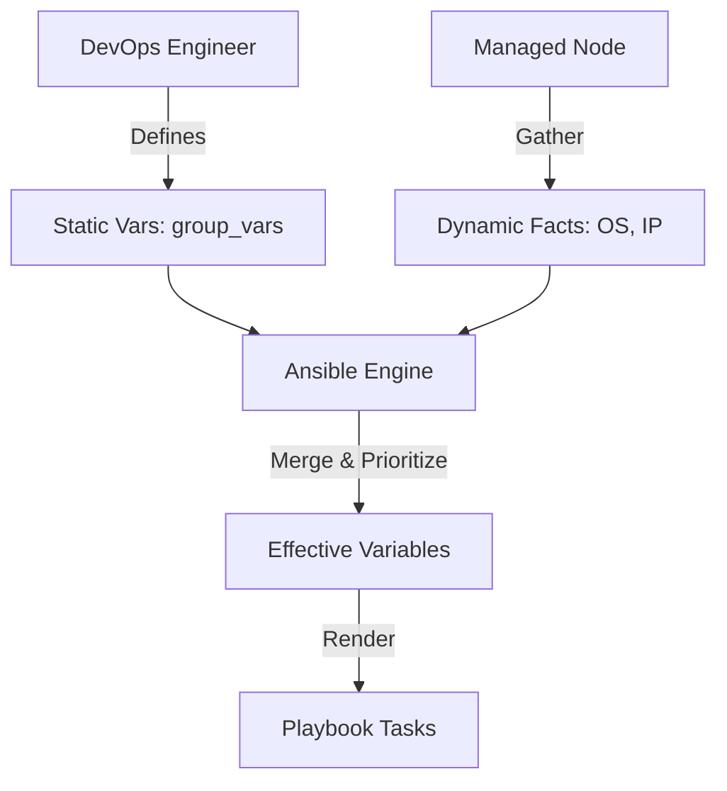

# Variables and Facts

Automation needs data. "Install Apache" is easy. "Install Apache version X on Port Y with Admin Email Z" requires **Variables**.

This module breaks down the complex world of Ansible data management into 4 functional areas.

## 📚 Learning Path

| # | Topic | Description | Key Concepts |
| :--- | :--- | :--- | :--- |
| **01** | [**Variable Hierarchy**](./01-Variable-Hierarchy/README.md) | The Rules of Precedence | Precedence (22 levels), Scoping, Defaults |
| **02** | [**Ansible Facts**](./02-Ansible-Facts/README.md) | System Discovery | `setup` module, Networking, Hardware, Caching |
| **03** | [**Magic Variables**](./03-Magic-Variables/README.md) | Inter-host Data | `hostvars`, `groups`, Accessing other nodes |
| **04** | [**Dynamic Data**](./04-Dynamic-Data/README.md) | Runtime Logic | `register`, `set_fact`, Task Output capture |

---

## 🏗️ Data Flow Architecture



## Quick Start

To see all variables currently available for a host, including its facts:

```bash
ansible <hostname> -m debug -a "var=hostvars[inventory_hostname]"
```

Please proceed to **[01-Variable-Hierarchy](./01-Variable-Hierarchy/README.md)** to begin.