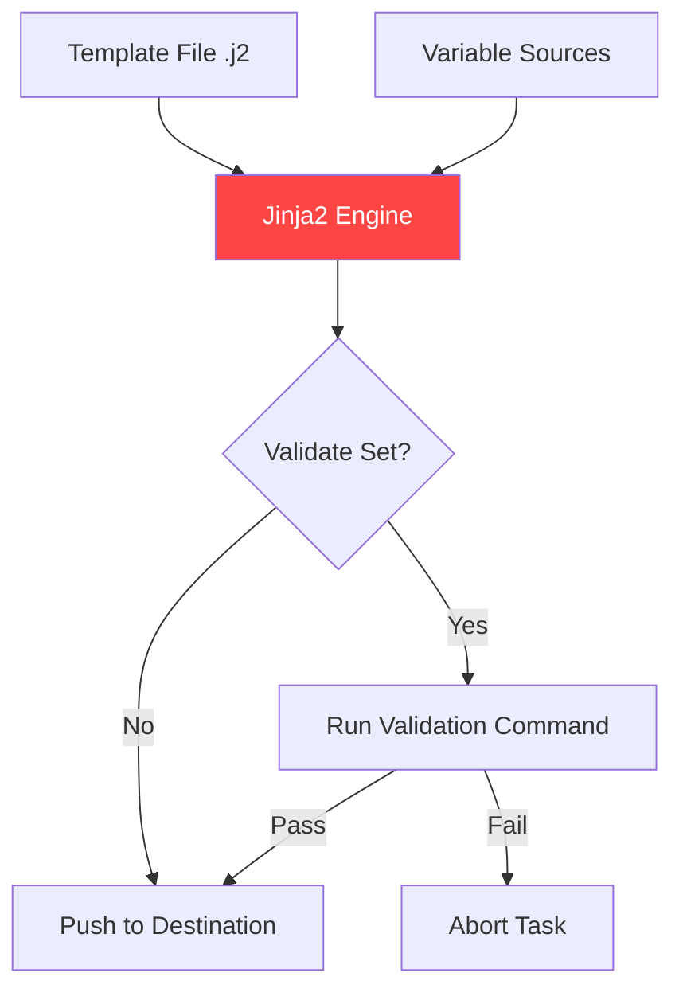

# Templates and Files

Static files (`copy` module) are boring. Dynamic files (`template` module) are where Ansible shines. This section breaks down the art of content delivery and Jinja2 templating.

## 📚 Learning Path

| # | Topic | Description | Key Modules |
| :--- | :--- | :--- | :--- |
| **01** | [**Jinja2 Basics**](./01-Jinja2-Basics/README.md) | The Core Syntax | Variables, Filters, Comments |
| **02** | [**Advanced Logic**](./02-Jinja2-Advanced-Logic/README.md) | Programming for Configs | Conditionals, Loops, Whitespace |
| **03** | [**Deployment Strategies**](./03-Deployment-Strategies/README.md) | Pushing Content | `copy` vs `template` vs `synchronize` |
| **04** | [**Safe Validation**](./04-Safe-Deploy-Validation/README.md) | Security & Integrity | `validate`, `mandatory`, `ansible_managed` |

---

## 🏗️ Template Rendering Flow

## Quick Reference (Filter List)

*   `{{ var | upper }}`: Convert to uppercase.
*   `{{ var | default('val') }}`: Safe fallback.
*   `{{ var | mandatory }}`: Fail if missing.
*   `{{ my_dict | to_nice_yaml }}`: Readable output.

Please proceed to **[01-Jinja2-Basics](./01-Jinja2-Basics/README.md)**.