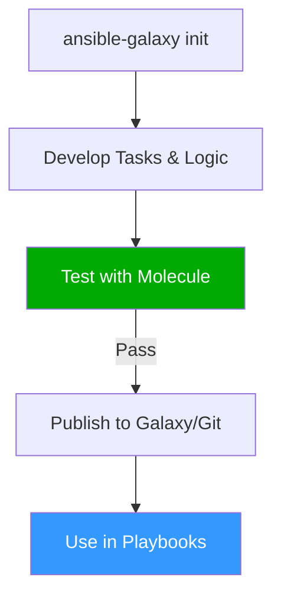

# Ansible Roles

Playbooks get messy. When your `site.yml` reaches 500 lines, it's time for **Roles**. Roles allow you to group related automation into reusable packages that can be shared across teams and projects.

## 📚 Learning Path

| # | Topic | Description | Key Areas |
| :--- | :--- | :--- | :--- |
| **01** | [**Standard Structure**](./01-Role-Standard-Structure/README.md) | The Anatomy of a Role | `tasks`, `vars`, `defaults`, `files` |
| **02** | [**Advanced Usage**](./02-Advanced-Role-Usage/README.md) | Complex Logic | Dependencies, `include_role`, Parameters |
| **03** | [**Galaxy & Collections**](./03-Galaxy-and-Collections/README.md) | Community & Sharing | `ansible-galaxy`, `requirements.yml`, FQCN |
| **04** | [**Testing with Molecule**](./04-Testing-with-Molecule/README.md) | Reliability & TDD | `molecule test`, Converge, Verify |

---

## 🏗️ Role Management Flow



## Quick Start

To create a new role with the standard structure:

```bash
ansible-galaxy init roles/my_new_role
```

Please proceed to **[01-Standard-Structure](./01-Role-Standard-Structure/README.md)**.