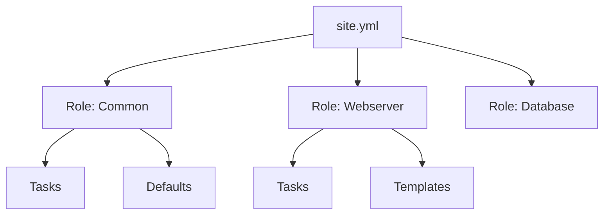

# Ansible Roles

Playbooks get messy. Roles are the standard way to organize tasks, variables, files, and templates into a reusable package. Think of them as "Libraries" or "Modules" in programming files.

## 📚 Module Structure
- **[Boilerplates](./Boilerplates/)**: `roles/common` (Standard folder structure).
- **[CHALLENGES](./CHALLENGES.md)**: Refactoring monolithic playbooks into roles.

---

## 🔑 Key Concepts

| Folder | Purpose |
| :--- | :--- |
| **tasks/** | The main list of steps (`main.yml`). |
| **handlers/** | Service restarters. |
| **defaults/** | Default variables (lowest priority). |
| **vars/** | Higher priority variables (rarely used). |
| **files/** | Static files for `copy`. |
| **templates/** | Jinja2 files for `template`. |
| **meta/** | Dependencies (e.g., this role needs `common` first). |

---

## 🏗️ Architecture

---

## 📖 Real-World Story: The "Mega-Playbook" Refactor

**Problem**: A startup had a single `deploy.yml` with 2,000 lines. It installed Nginx, Postgres, Redis, and the App.
**Crisis**: Developers were terrified to edit it. Scrolling took forever. Variables polluted the global namespace.
**Solution**: Refactored into 4 Roles: `nginx`, `postgres`, `redis`, `application`.
**Result**: The main playbook became 10 lines long. Teams could work on the `redis` role without breaking the `nginx` role.

---

## ❓ Interview Questions

1.  **What is Ansible Galaxy?**
    - *Answer*: A hub for finding, sharing, and reviewing Ansible roles. You can install roles using `ansible-galaxy install author.role`.
2.  **What is the precedence of `defaults/main.yml`?**
    - *Answer*: It has the *lowest* precedence. It is meant to be overridden by inventory or playbook variables.
3.  **How do you include one role inside another?**
    - *Answer*: Using `meta/main.yml` to define dependencies.

---

[Next: Conditionals & Loops](../08-Conditionals-and-Loops/README.md)