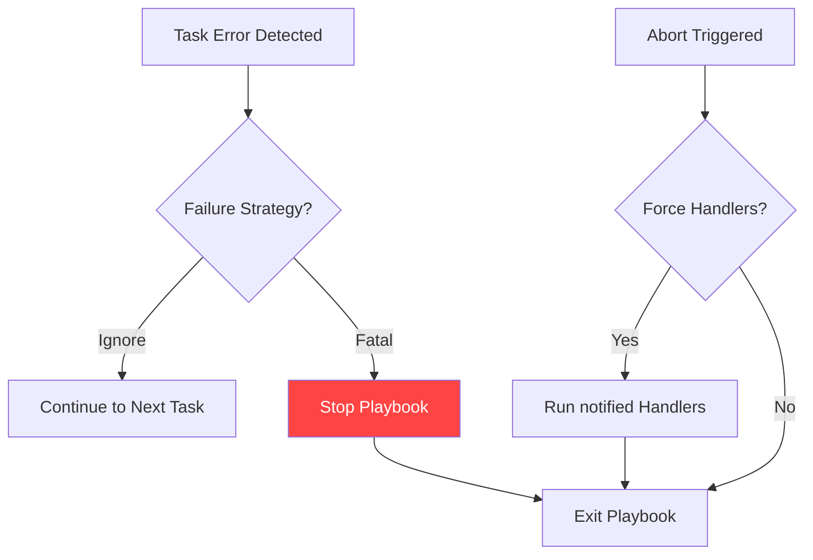

# Error Handling and Debugging

Things go wrong. Services crash, disks fill up, and typos happen. Ansible is programmed to **Fail Fast**, but it also provides a suite of tools to manage failures gracefully and find the root cause of issues quickly.

## 📚 Learning Path

| # | Topic | Description | Key Modules/Flags |
| :--- | :--- | :--- | :--- |
| **01** | [**Failure Strategies**](./01-Failure-Strategies/README.md) | Controlling Playbook Abortion | `ignore_errors`, `max_fail_percentage` |
| **02** | [**Debugging Tools**](./02-Debugging-Tools/README.md) | Inspecting State | `debug`, `-vvvv`, `--check`, `debugger` |
| **03** | [**Handler Management**](./03-Handler-Management/README.md) | Deferred Tasks | `notify`, `meta: flush_handlers`, `listen` |
| **04** | [**Validation & Abortion**](./04-Validation-and-Abortion/README.md) | Stopping Safely | `assert`, `fail`, `pause`, `wait_for` |

---

## 🏗️ Troubleshooting Flow



## Quick Start

To debug a task that keeps failing due to unknown reasons:

```bash
ansible-playbook site.yml --limit <hostname> -vvvv
```

To verify variable values during a run:

```yaml
- name: Debug my_var
  debug:
    var: my_var
```

---

## 🚀 Rollback and Backup Strategies

Production-grade automation must be able to restore the system to a known good state if a configuration change fails.

### The `block/rescue/always` Pattern
This is the equivalent of `try/except/finally` in Python and is the standard for robust error recovery.

```yaml
- name: Application deployment with rollback
  block:
    - name: Create deployment backup
      archive:
        path: "/var/www/my_app"
        dest: "/tmp/app_backup.tar.gz"
        format: gz
    
    - name: Deploy new version (Potentially Dangerous)
      unarchive:
        src: "new_ver.tar.gz"
        dest: "/var/www/my_app"

  rescue:
    - name: Log deployment failure
      debug:
        msg: "Deployment failed! Triggering rollback..."
    
    - name: Restore from backup
      unarchive:
        src: "/tmp/app_backup.tar.gz"
        dest: "/var/www/my_app"
        remote_src: yes
    
    - name: Fail deployment
      fail:
        msg: "Deployment failed and rollback completed."

  always:
    - name: Clean up temporary files
      file:
        path: "/tmp/app_backup.tar.gz"
        state: absent
```

Please proceed to **[01-Failure-Strategies](./01-Failure-Strategies/README.md)**.