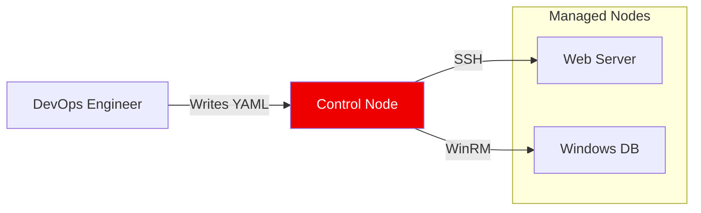

# Ansible Automation Mastery

Welcome to the **Ansible Automation Course**. This series takes you from foundational concepts to enterprise-grade, agentless orchestration. Ansible's "Radical Simplicity" allows you to manage thousands of nodes using the tools you already have: **SSH** and **Python**.

## 🏗️ Architecture at a Glance

Ansible is **Agentless**. It pushes configuration to your infrastructure without requiring software installation on the managed nodes.

## 🎯 Learning Objectives
- **Agentless Orchestration**: Master SSH-based configuration push.
- **Idempotency**: Build "Declarative" playbooks that ensure consistency.
- **Modularity**: Organize code with Roles and include/import patterns.
- **Security**: Manage sensitive data using Ansible Vault.
- **Extension**: Develop custom modules using Python.

---

## 📚 Module Roadmap

| # | Module | Description |
| :--- | :--- | :--- |
| **01** | [**Fundamentals**](./01-Fundamentals/README.md) | Agentless design, Lab Setup (Vagrant/Docker). |
| **02** | [**Inventory Management**](./02-Inventory-Management/README.md) | Static vs Dynamic Inventory, Grouping strategies. |
| **03** | [**Basic Playbooks**](./03-Basic-Playbooks/README.md) | Anatomy of a Play, YAML rules, Declarative state. |
| **04** | [**Core Modules**](./04-Core-Modules/README.md) | `apt`, `yum`, `file`, `service` - The building blocks. |
| **05** | [**Variables & Facts**](./05-Variables-and-Facts/README.md) | Fact gathering, Precedence, Magic Variables. |
| **06** | [**Templates & Files**](./06-Templates-and-Files/README.md) | Jinja2 templating for dynamic configs. |
| **07** | [**Ansible Roles**](./07-Ansible-Roles/README.md) | Reusable code structure, Galaxy integration. |
| **08** | [**Conditionals & Loops**](./08-Conditionals-and-Loops/README.md) | Logic gates (`when`) and Loops (`loop`). |
| **09** | [**Error Handling**](./09-Error-Handling/README.md) | Fail-fast strategies, `block/rescue`. |
| **10** | [**Ansible Vault**](./10-Ansible-Vault/README.md) | Encryption at rest for secrets. |
| **11** | [**Custom Modules**](./11-Custom-Modules/README.md) | Extending Ansible with Python. |

---

## 📖 Real-Life Scenarios

### Scenario 1: The "Snowflake Server" Crisis
**Problem**: A company had 50 web servers. Over 3 years, sysadmins manually tweaked configs (installing htop here, changing nginx timeouts there). No two servers were identical ("Snowflakes").
**Crisis**: A security patch broke the application on 12 random servers. No one knew why those specific servers failed.
**Solution**: Implemented Ansible. They defined the "Desired State" in a playbook and enforced it.
**Result**: All 50 servers became identical ("Cattle"). The patch was redeployed successfully in 10 minutes.

### Scenario 2: The Compliance Audit
**Problem**: An auditor required proof that "Telnet is disabled" and "Root login is off" on all 500 nodes.
**Crisis**: Checking manually would take weeks.
**Solution**: Wrote a simple Playbook using the `service` and `lineinfile` modules to verify state.
**Result**: Generated a compliance report (JSON output) for the auditor in 15 minutes.

---

## 🚀 How to Succeed
1.  **Iterative Learning**: Start with simple plays, then refactor into Roles.
2.  **Hands-On**: Use the provided `Boilerplates` and solve the `CHALLENGES.md` in each folder.
3.  **Validate**: Test your knowledge with the Interview Questions.

---
*Automation is the force multiplier of the modern platform engineer. Script once, deploy everywhere.*