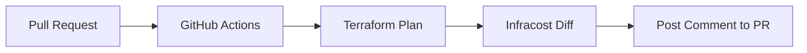

# GitHub Actions Integration

The most impactful way to use Infracost is to put the cost directly in front of the developer during the Code Review (Pull Request).

## 📚 Module Structure
- **[Boilerplates](./Boilerplates/)**: `infracost.yml` (Complete GHA Workflow).
- **[CHALLENGES](./CHALLENGES.md)**: Customizing PR comments.

---

## 🏗️ The "Shift-Left" Workflow

Instead of checking the bill at the end of the month, we check the code at the start.

---

## 🔑 Key Action Features

| Setting | Effect |
| :--- | :--- |
| **`behavior: update`** | Overwrites the previous Infracost comment (Keeps PR clean). |
| **`behavior: new`** | Posts a new comment for every commit (Can be noisy). |
| **`post-condition`** | Allows you to fail the build if cost increases too much. |

---

## 📖 Real-World Story: The "Typo" Alert
A developer meant to scale a dev database to `t3.small` but typed `t3.2xlarge`. 
**Automation**: GitHub Actions ran Infracost.
**Comment on PR**: ⚠️ "This change increases cost by **$250/month**."
**Result**: The developer saw the warning 5 minutes after pushing and fixed the typo immediately. Cost saved: $3,000 (before it hit production).

---

## ❓ Interview Questions
1. **How do you pass the Infracost API Key to GitHub Actions?**
   - *Answer*: Store it as a **GitHub Secret** (`INFRACOST_API_KEY`) and reference it in the `env:` section of the workflow file.
2. **Can Infracost estimate costs for Private Terraform Modules?**
   - *Answer*: Yes, as long as the GitHub Action has the necessary Git permissions (or a `GITHUB_TOKEN`) to clone those private repos.

---

[Next: Policy as Code Gatekeeping](../03-Policy-as-Code-Guardrails/README.md)
