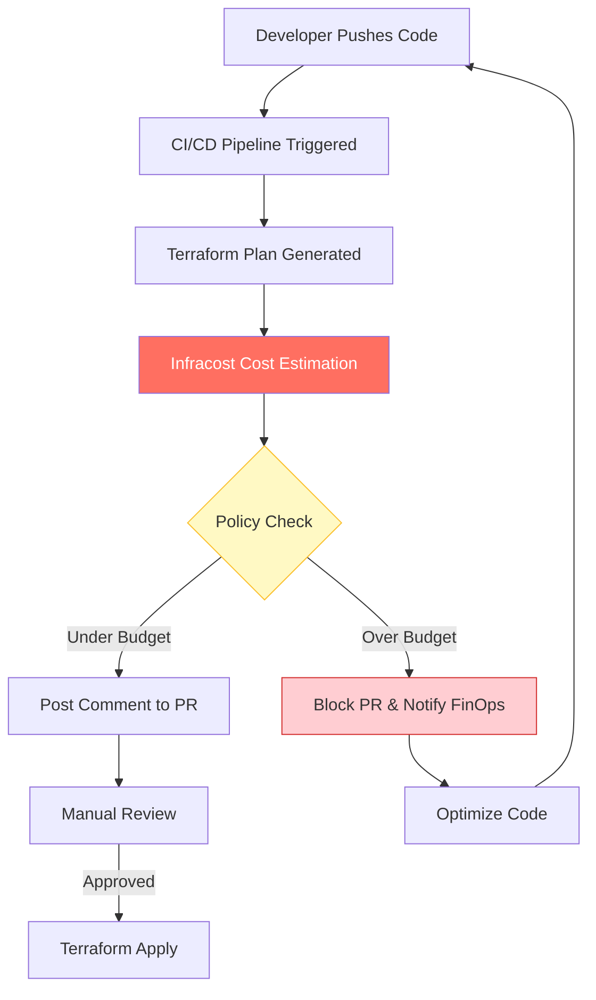

# 🤖 Infracost Automation: FinOps in CI/CD

Infracost automation is the practice of integrating cloud cost estimates directly into the developer workflow. By automating cost visibility, organizations can implement **"Shift Left" FinOps**, ensuring that cost is treated as a first-class citizen alongside performance and security.


## 🚀 The Automation Philosophy

Automation is not just about running a script; it's about changing the culture. Infracost automation ensures that:
1.  **Developers** see the cost impact of their code before merging.
2.  **Finance** teams get visibility into future spending.
3.  **SREs** can block deployments that exceed budget thresholds automatically.

---

## 🏗️ Automated Workflow Architecture

The following diagram illustrates how Infracost integrates into a modern GitOps/CI-CD pipeline.



---

## 🛠️ Implementation: GitHub Actions Automation

GitHub Actions is the most common platform for Infracost automation. Below is a production-ready workflow snippet.

```yaml
name: Infracost Cost Estimate
on: [pull_request]

jobs:
  infracost:
    runs-on: ubuntu-latest
    permissions:
      contents: read
      pull-requests: write

    steps:
      - name: Checkout base branch
        uses: actions/checkout@v3
        with:
          ref: ${{ github.event.pull_request.base.ref }}

      - name: Generate Infracost JSON for base
        run: |
          infracost breakdown --path . \
                            --format json \
                            --out-file /tmp/infracost-base.json

      - name: Checkout PR branch
        uses: actions/checkout@v3

      - name: Generate Infracost diff
        run: |
          infracost diff --path . \
                        --compare-to /tmp/infracost-base.json \
                        --format json \
                        --out-file /tmp/infracost.json

      - name: Post Infracost comment
        uses: infracost/actions/comment@v2
        with:
          path: /tmp/infracost.json
          behavior: update
```

---

## 🛡️ Automated Guardrails (Policy as Code)

Automation also allows you to enforce **Financial Governance** using technologies like Open Policy Agent (OPA).

### Example: The "$100/mo Increase" Limit
You can configure your automation to fail the CI build if a single PR increases the monthly spend by more than $100.

| Scenario | CI Status | Action |
| :--- | :--- | :--- |
| **Increase < $100** | <font color="#00b050">PASS</font> | Post informative comment. |
| **Increase > $100** | <font color="#f5a623">WARN</font> | Post warning; require SRE approval. |
| **Increase > $500** | <font color="#ff0000">FAIL</font> | Automatically block PR and alert Manager. |

---

## 📊 Benefits of Automated Cost Governance

1.  **Zero Manual Effort:** Once configured, every PR is automatically audited.
2.  **Immediate Feedback:** Developers fix "Expensive Typos" (e.g., `m5.metal` instead of `t3.micro`) within minutes.
3.  **Auditable History:** Every infrastructure change has an associated cost record in the Git history.

---

## 📈 Real-Life Scenario: The "Scaling Disaster" Averted
A SaaS company was automating their Kubernetes cluster expansion. A developer committed a change to double the node count from 20 to 40 `r5.4xlarge` instances across three regions.

**The Manual Result:** The change is merged. The next month's bill reveals a **$15,000** unexpected increase.

**The Automated Result:** 
1. Infracost automation detected a **+$500/day** increase.
2. The CI pipeline **failed** the build because it exceeded the $1,000/month project quota. 
3. The developer optimized the scaling logic to use **Spot Instances** instead.
4. **Total Savings:** **$12,000/month**.

---

[⬅️ Back to Automation Overview](../README.md)
