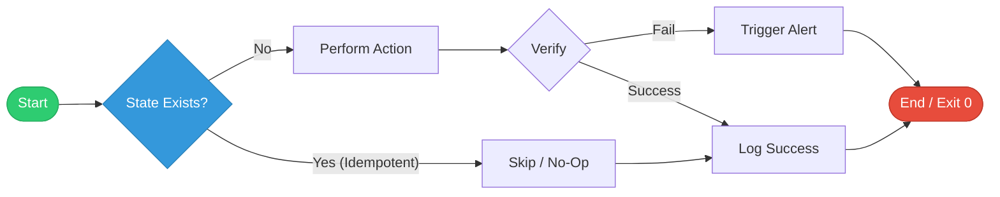

# Automation & Scripting for DevOps

Automation is the multiplier that allows one DevOps engineer to manage thousands of servers. This module focuses on using scripting languages to eliminate toil and build intelligent workflows.

## 📚 Learning Path

| # | Topic | Description | Key Tools |
| :--- | :--- | :--- | :--- |
| **01** | [**Shell Scripting**](Shell%20Scripting%20Basics.md) | Foundation | Bash, POSIX shell, Pipes |
| **02** | [**Advanced Bash**](./02-Advanced-Bash-Automation/README.md) | Scaling Logic | jq, sed, awk, xargs |
| **03** | [**Python for DevOps**](./03-Python-for-DevOps/README.md) | API & SDKs | Boto3, Requests, venv |
| **04** | [**Best Practices**](./04-Automation-Best-Practices/README.md) | Standards | Idempotency, Secrets |
| **05** | [**Ansible Mastery**](./05-Ansible/README.md) | Config Management | Playbooks, Roles, Vault |
| **08** | [**Infracost Automation**](./08-Infracost-Automation/README.md) | Cloud FinOps | CI/CD, OPA, Cost-as-Code |

---

## 🏗️ Module Features
- **[100+ Total Quiz Questions](./06-Interview-Questions-and-Quizzes/)**: Interactive mastery of Shell, Bash, and Python.
- **[24+ High-Stakes Interview Questions](./06-Interview-Questions-and-Quizzes/)**: Targeted prep for SRE and Platform roles.
- **[12+ Real-Life "War Stories"](./07-Real-Life-Scenarios/)**: Lessons learned from production-scale automation failures and successes.
*   **Visual Workflows**: Mermaid diagrams for script lifecycles, data flows, and idempotency patterns.

---

## 🏗️ The Automation-First Mindset
If you have to do a task more than twice, automate it.
- **Toil Reduction**: Freeing up time from repetitive manual tasks.
- **Consistency**: Code doesn't make typos or forget steps.
- **Speed**: Automations run at CPU speed, not human speed.

---

## 🎯 Learning Objectives
By the end of this module, you will be able to:
1.  **Script**: Write robust, production-grade Shell and Bash scripts with full error handling.
2.  **Integrate**: Use Python and JQ to bridge the gap between legacy systems and modern cloud APIs.
3.  **Scale**: Parallelize tasks to manage massive fleets and high-volume data processing.
4.  **Protect**: Implement Idempotency and Secrets Management as core tenets of your automation logic.

---

## ✅ Knowledge Check
- [x] Understand exit codes and "Strict Mode" (`set -euo pipefail`)
- [x] Implement Idempotency in both Bash and Python
- [x] Parse complex API data using `jq` and `requests`
- [x] Automate AWS resource lifecycles using Boto3
- [x] Design professional, flag-based CLI tools with `getopts`

---
*Automation is the force multiplier of the DevOps engineer. Script once, deploy everywhere.*