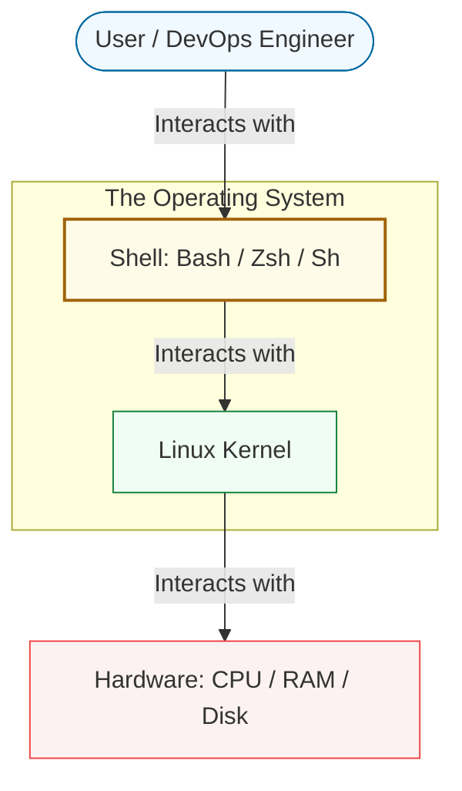

# 🐚 01: Introduction to Intermediate Shell Scripting

> **"The shell is the glue that binds independent tools into a unified automation platform."**

---

## 🌟 Overview

Welcome to the Intermediate level of Shell Scripting. Having mastered the basic syntax in Phase 1, you are now ready to explore the **Architecture** of automation. 

In this module, we transition from writing lists of commands to building robust, self-healing systems. We focus on how the shell interacts with the system at a deeper level and how to manage complexity as your scripts grow from 10 lines to 1000 lines.

### Why Intermediate Scripting?
- **Industrial Scale**: Automating tasks across thousands of cloud instances.
- **Fail-Safe Logic**: Creating scripts that don't destroy servers when a variable is empty.
- **System Integration**: Bridging the gap between the Kernel and high-level DevOps tools like Kubernetes and Terraform.

---

## 🏗️ Layered Architecture

To be an effective script architect, you must understand where the Shell sits in the operating system hierarchy.

---

## 🚀 The DevOps "Glue" Role

Intermediate shell scripting is often called "Glueware." It isn't used to build the core application, but it is used to:
1.  **Bootstrap** new servers (Cloud-init).
2.  **Sanitize** data between different pipeline stages.
3.  **Monitor** high-level health metrics that don't justify a full Prometheus exporter.

---

## ❓ Interview Preparation (Introduction)

1.  **Q: What is the primary difference between a 'Login Shell' and a 'Non-Login Shell'?**
    *A: A Login Shell is the first shell session opened when you log in (e.g., via SSH). It sources profile files like `/etc/profile` and `~/.bash_profile`. A Non-Login shell (like a script execution) typically only sources `~/.bashrc`.*

2.  **Q: Why is Bash still the standard for DevOps automation despite languages like Python or Go?**
    *A: Portability and zero-dependency. Almost every Linux system has Bash pre-installed. It has direct access to system file descriptors and pipes, making it more efficient for "plumbing" system utilities together.*

---

## 📝 Knowledge Check

1.  **Which layer of the OS is responsible for direct hardware management?**
    - [ ] a) Shell
    - [x] b) Kernel
    - [ ] c) User Space

2.  **True or False: A Shell script is interpreted line-by-line.**
    - [x] True
    - [ ] False

---

## 🔗 Next Steps
Proceed to: **[Intermediate Logic & Architecture](../02-Intermediate-Logic/README.md)** →
