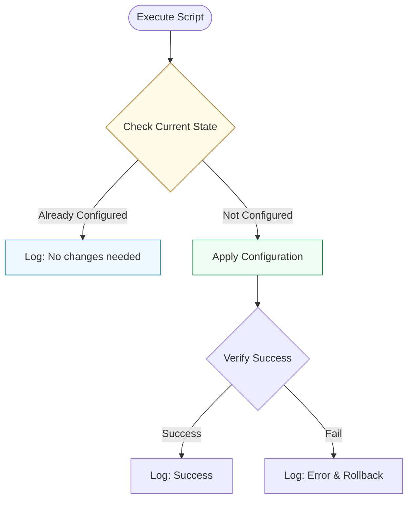

# 🧠 02: Intermediate Logic & Idempotency

> **"A good script does the job. A great script only does the job if it hasn't been done yet."**

---

## 🏛️ The Idempotency Workflow

Idempotency is the cardinal rule of professional DevOps. It means your script can be run 100 times, but the side effects on the system only happen once.

### Logic Flow

---

## 🌟 Overview

This module covers the advanced control structures that move your scripts from "Basic if/else" into "Systematic Intelligence." We focus on managing lists (Arrays), handling complex decisions (Case statements), and ensuring your scripts are **Idempotent**.

### Key Intermediate Concepts:
1. **Advanced Conditionals**: Regex matching inside `[[ ]]`.
2. **Associative Arrays**: Using key-value pairs (`declare -A`) to manage complex data like server roles or port mappings.
3. **The Case Statement**: Handling multiple known states without nested `if` blocks.
4. **Boolean Flag Logic**: Managing script behavior via environment variables and flags.

---

## 🛠️ Real-World Scenario: Day in the Life

### Automated Backup Audit & Repository Idempotency

**The Challenge**: You have a script that creates a backup directory: `mkdir /mnt/backups`. If the directory already exists, the script throws an error and stops. If you use `mkdir -p`, it succeeds but doesn't tell you if it actually created anything.
**The Solution**: An intermediate script that **audits before it acts**:
1.  **Checks for the directory**: `[[ -d "$DIR" ]]`.
2.  **Verify Permissions**: Uses `[[ -w "$DIR" ]]` to ensure it can actually write to it.
3.  **Conditional Action**: Only performs the `mkdir` if missing, and only performs the `backup` if the storage threshold hasn't been met.

---

## ❓ Interview Preparation (Logic & State)

1.  **Q: What does 'Idempotent' mean in the context of a Shell script?**
    *A: It means the script can be run multiple times on a system without changing the result beyond the initial application. For example, a script that adds a user should first check if the user exists.*

2.  **Q: How do you perform a Case-Insensitive string comparison in Bash?**
    *A: You can convert the string to lowercase using `${VAR,,}` or use regex matching with the `nocasematch` shell option: `shopt -s nocasematch; [[ "$VAR" == "success" ]]`.*

3.  **Q: Why are Associative Arrays useful for DevOps tasks?**
    *A: They allow you to map keys to values. For example, you can map hostname to IP address: `declare -A HOSTS=( ["web01"]="10.0.1.5" ["db01"]="10.0.1.10" )`. This is much cleaner than multiple `if` statements.*

---

## 📝 Knowledge Check

1.  **Which command defines an Associative Array?**
    - [ ] a) `declare -a`
    - [x] b) `declare -A`
    - [ ] c) `array_create()`

2.  **Which pattern matches a string against a Regular Expression?**
    - [ ] a) `[[ $VAR == regex ]]`
    - [x] b) `[[ $VAR =~ regex ]]`
    - [ ] c) `[ $VAR -re regex ]`

---

## 🔗 Next Steps
Proceed to: **[Advanced Functions & Modularity](../03-Advanced-Functions-and-Modularity/README.md)** →
