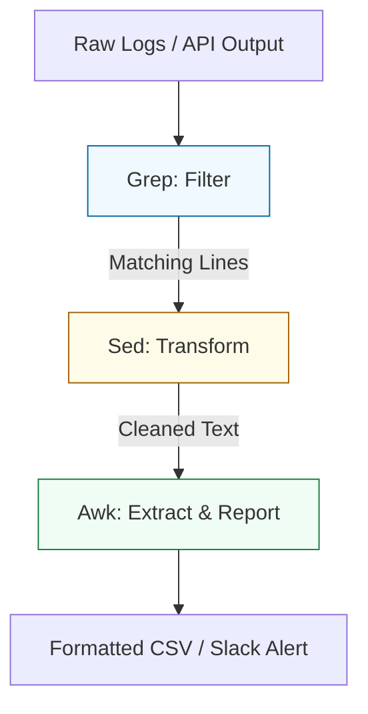

# 🔍 06: Regex & Data Parsing (The Triple Threat)

> **"If a computer can see a pattern, you can automate it."**

---

## 🏛️ Architecture: The Extraction Pipeline

In the world of DevOps, log files and configuration outputs are your "Raw Ore." Shell tools are the "Refinery" that turns that ore into actionable data.

### The Parsing Stack



---

## 🌟 Overview

This module is about **Data Mastery**. You will learn to use the most powerful trio in the Unix world: `grep`, `sed`, and `awk`. These tools are designed to process massive log files at hardware speed, something a heavy Python script can rarely match.

### Key Tools:
1. **Grep (Extended)**: Using `-E` for complex pattern matching (OR, groups).
2. **Sed (Stream Editor)**: Non-interactive text transformation and multi-line substitution.
3. **Awk (Text Processor)**: A full-featured language for extracting specific columns, performing math, and generating reports.
4. **Regex Foundations**: Mastering anchors (`^`, `$`), quantifiers (`*`, `+`), and classes (`[a-z]`).

---

## 🛠️ Real-World Scenario: Day in the Life

### Automated Vulnerability Log Analysis

**The Challenge**: You have a 1GB security log. You need to identify every unique IP address that has tried to log in as "root" more than 5 times in the last hour.
**The Solution**: A multi-stage parsing pipeline:
1.  **Grep**: Filter lines containing "failed" and "root".
2.  **Sed**: Extract just the IP address from the middle of the log line.
3.  **Sort & Uniq**: Group the IPs and count them.
4.  **Awk**: Only report the IPs where the count > 5.
```bash
grep "failed password for root" auth.log | sed -E 's/.*from ([0-9.]+) port.*/\1/' | sort | uniq -c | awk '$1 > 5 {print $2}'
```

---

## ❓ Interview Preparation (Parsing & Extraction)

1.  **Q: What is the difference between Basic Regex (BRE) and Extended Regex (ERE)?**
    *A: BRE requires backslashes to escape special characters like `+`, `?`, `|`, and `( )`. ERE (triggered by `grep -E` or `-r` in sed) allows you to use these characters directly, making complex patterns much more readable.*

2.  **Q: How do you use `awk` to print the second to last column of a file?**
    *A: Use the `$(NF-1)` variable. `NF` stands for Number of Fields. `print $(NF-1)` reliably grabs the second to last element regardless of how many columns are in the row.*

3.  **Q: Explain the difference between `sed 's/old/new/'` and `sed 's/old/new/g'`?**
    *A: The first one only replaces the **first** occurrence on each line. The `g` flag stands for "global" and ensures that **every** occurrence on the line is substituted.*

---

## 📝 Knowledge Check

1.  **Which tool is a complete programming language for text reporting?**
    - [ ] a) grep
    - [ ] b) sed
    - [x] c) awk

2.  **What does the regex anchor `^` represent?**
    - [x] a) Start of the line
    - [ ] b) End of the line
    - [ ] c) Any single character

3.  **True or False: `grep -v` is used to search for lines that do NOT match the pattern.**
    - [x] True
    - [ ] False

---

## 🔗 Next Steps
Proceed to: **[Assessments](../07-Assessments/README.md)** →
