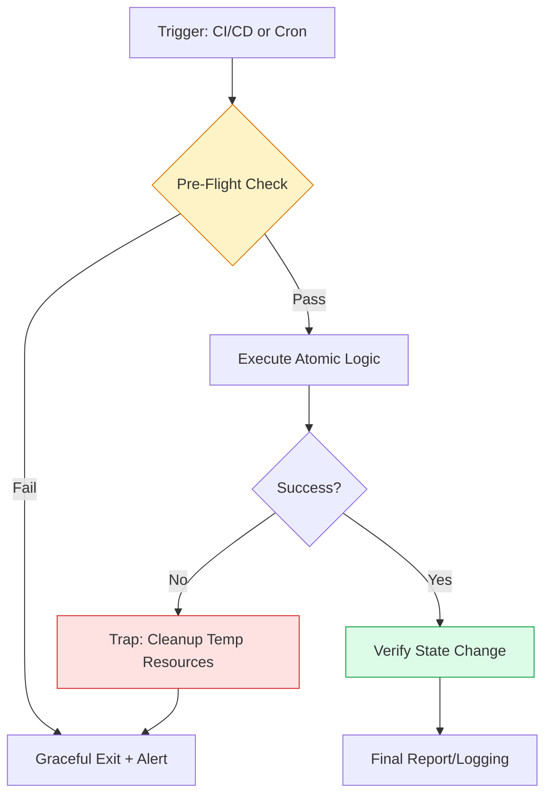

# 🐚 Intermediate Shell Scripting: The Architect's Toolkit

> **"A junior engineer writes a script that works once. A staff engineer writes a script that works always, fails safely, and cleans up its own mess."**

Welcome to the **Intermediate Shell Scripting** mastery module. In the production world, shell scripts are the "glue" that binds multi-cloud architectures. This module moves beyond `echo "hello world"` into the realm of **Robust Automation Engineering**.

---

## 🏗️ The Engineering Architecture

Intermediate scripting is about building **Resilient Pipelines**. We focus on the "Triple-Crown" of Shell Reliability: **Error Handling**, **Modularity**, and **State Awareness**.



---

## 🎭 Real-World DevOps Scenarios

### 🛡️ Scenario 1: The Shell Nightmare
**The Incident:** A cleanup script was designed to clear old build artifacts using `rm -rf /tmp/build/$TARGET_DIR`. Due to a network failure, `$TARGET_DIR` was empty.
**The Catastrophe:** The execution became `rm -rf /tmp/build/`. While not `/`, it deleted 50GB of shared build cache for the entire engineering team, halting production deployments for 6 hours.
**The Fix:** Using `set -u` (to treat unset variables as errors) and Guard Clauses to verify the variable isn't empty before execution.

---

## 💻 DevOps Logic Snippets: "The Guard Clause"

Stop using nested `if` statements. Use **Guard Clauses** to fail fast and keep your logic "flat" and readable.

```bash
#!/usr/bin/env bash
# Professional Standard: Fail-Fast Header
set -euo pipefail

deploy_to_cloud() {
    local provider=${1:?"Provider (aws|gcp|azure) is required"}
    local env=${2:-"dev"}

    # 🛑 Guard Clause: Multi-Cloud Validation
    case "$provider" in
        aws) echo "☁️ Fetching Boto3 session for $env..." ;;
        gcp) echo "☁️ Authenticating via gcloud for $env..." ;;
        azure) echo "☁️ Setting AZ subscription to $env..." ;;
        *) echo "❌ Error: Unsupported provider $provider"; return 1 ;;
    esac

    echo "🚀 Deploying 'Cleanup Daemon' to $provider..."
    # Logic for deploying a self-healing cleanup daemon
}
```

---

## 🗺️ Curriculum Path

### 1. [Logic & Associative Arrays](./02-Intermediate-Logic/README.md)
Move beyond simple loops. Learn to use Key-Value pairs in Bash to manage multi-region configurations.

### 2. [Advanced Functions](./03-Advanced-Functions-and-Modularity/README.md)
Building "Libraries" instead of scripts. Scope management (`local`) and the `source` command.

### 3. [Signal Handling & Traps](./05-Signal-Handling-and-Traps/README.md)
**The Reliability Engine**. Using `trap` to ensure temporary files are deleted even if a script is killed by the user.

### 4. [Regex & High-Performance Parsing](./06-Regex-and-Data-Parsing/README.md)
Mastering `awk` and `sed` for log analysis on scales where Python is too slow.

### 5. [📚 Reference Samples](./REFERENCE/README.md)
A collection of production-grade script samples covering logic, functions, traps, and parsing.

---

## 🎙️ Interview Preparation (Failure Modes)

1.  **"How do you ensure a remote SSH script doesn't hang indefinitely if the network drops?"**
    *   *Answer:* Use the `ConnectTimeout` and `ServerAliveInterval` options in SSH, combined with a wrapper like `timeout` to enforce a hard deadline on execution.
2.  **"What is the risk of using `rm -rf /tmp/$VAR` in a script?"**
    *   *Answer:* If `$VAR` is unset or empty, the script may delete the entire `/tmp` directory. Always use `${VAR:?error message}` or a guard clause to ensure the variable has a value.
3.  **"Why use `set -o pipefail`?"**
    *   *Answer:* By default, a pipeline returns the exit code of the *last* command. If `grep` fails but `wc -l` succeeds, the script thinks it passed. `pipefail` ensures the whole pipeline fails if *any* command in it fails.
4.  **"How do you handle a script that needs to be killed but must close a database connection first?"**
    *   *Answer:* Implement a `trap 'close_connection' SIGINT SIGTERM` to catch interruption signals and execute a cleanup function before exiting.
5.  **"What is the difference between `sh` and `bash` in an automation context?"**
    *   *Answer:* `bash` supports "bashisms" like arrays, `[[ ]]` for better testing, and pipefail. Using `#!/bin/sh` (POSIX) limits portability-specific features but ensures compatibility on tiny systems (like Alpine).

---

## 🧠 Knowledge Check

1.  **Which command ensures that a script exits immediately if any command returns a non-zero exit code?**
    *   [ ] `set -u`
    *   [x] `set -e`
    *   [ ] `set -x`
2.  **What does `trap 'rm -f $TMP_FILE' EXIT` do?**
    *   [x] Deletes the file when the script finishes, regardless of success or failure.
    *   [ ] Deletes the file only if the script fails.
    *   [ ] Deletes the file only if the user presses Ctrl+C.
3.  **True or False: In Bash, variables are global by default unless declared with `local` inside a function.**
    *   [x] True
    *   [ ] False
4.  **What is the "Guard Clause" pattern?**
    *   [ ] A way to encrypt shell scripts.
    *   [x] A coding pattern that exits a function early if certain conditions aren't met.
    *   [ ] A method for monitoring server health.
5.  **Which tool is best for extracting the 3rd column of a space-delimited file?**
    *   [ ] `sed`
    *   [x] `awk`
    *   [ ] `grep`

---

[⬅️ Back to Infrastructure Automation](../README.md)
