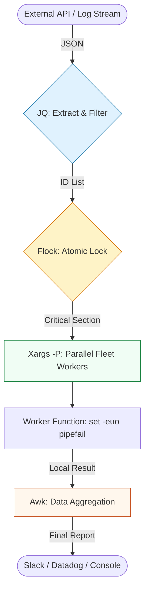

# 🚀 Advanced Bash Automation: Industrial-Scale Scripting

> **"If your bash script is longer than 100 lines and doesn't have a help menu, a lockfile, and signal traps, it's not a tool—it's a liability."**

Welcome to the **Advanced Bash Automation** module. Here, we transition from writing "commands in a file" to building robust, self-healing, and high-concurrency unix tools. At this level, we treat Bash as a first-class citizen of the production environment.

---

## 🏗️ The Advanced Tooling Architecture

Advanced automation is about **Composition**. We use specialized tools (**JQ**, **Awk**, **Xargs**) and bind them with resilient shell logic to process massive data streams.

---

## 🎭 Real-World DevOps Scenarios (Deep-Dive)

### 🛡️ Scenario 1: The "Clean Up" Disaster (Unset Variables)
**The Incident:** A junior engineer wrote a cleanup cron job: `rm -rf /var/log/app/$ENV/*`.
**The Failure:** The environment variable `$ENV` failed to load in the cron context. The command executed as `rm -rf /var/log/app//*`. It wiped the entire logging directory, including the persistent logs required for a security audit the following week.
**The Fix:** Mandatory use of `set -u` and the parameter expansion guard `${ENV:?Environment not set}`.

### ⚡ Scenario 2: The "Slow Crawl" (Serial Execution)
**The Incident:** A log rotation script processed 5,000 files sequentially on a busy API gateway.
**The Failure:** As traffic grew, the script took 55 minutes to run. Since the cron ran every hour, the second instance started while the first was still deleting files, causing file-handle exhaustion and system instability.
**The Fix:** Implementing **Parallelism** with `xargs -P 8` and **Mutual Exclusion** with `flock` to prevent overlapping runs.

---

## 🗺️ Advanced Module Roadmap

### 1. [🛡️ Robust Execution](./01-Robust-Execution-and-Traps/README.md)
Fail-fast protocols, Signal Trapping (`trap`), and Kernel-level lockfiles (`flock`).

### 2. [📟 Argument Parsing](./02-Advanced-Argument-Parsing-Getopts/README.md)
Building professional CLI interfaces that support flags (`-e`, `-p`) and help menus.

### 3. [🔍 JSON with JQ](./03-JSON-Processing-with-JQ/README.md)
The industry standard for cloud automation. Mastering filters, map-reduce, and raw output.

### 4. [🧶 Sed & Awk Mastery](./04-Data-Wrangling-with-Sed-and-Awk/README.md)
Stream editing and columnar reporting for large-scale log analysis.

### 5. [⚡ Parallelism & Scaling](./05-Scaling-Bash-Multiplexing-Parallelism/README.md)
Using `xargs -P` and background subshells to manage entire server fleets simultaneously.

### 6. [📚 Keyword Encyclopedia](./REFERENCE/README.md)
The technical manual for every advanced Bash keyword and architectural pattern.

---

## 🎙️ Interview Preparation (Architectural Focus)

1.  **"How do you handle a race condition between two instances of the same script?"**
    *   *Answer:* Use `flock` (File Lock). It uses an advisory lock on a file descriptor that the kernel automatically releases if the process crashes, unlike manual `mkdir` locks which leave "stale" files.
2.  **"What is 'Output Interleaving' in parallel scripts, and how do you prevent it?"**
    *   *Answer:* It's when multiple workers write to stdout at the same time, scrambling the text. Fix it by giving each worker a unique log file (`worker-${ID}.log`) or using `stdbuf` for line-buffered output.
3.  **"Why use `getopts` instead of manually shifting `$1` and `$2`?"**
    *   *Answer:* `getopts` handles flag grouping (e.g., `-af`), supports arguments with spaces, and provides a standardized way to handle errors and missing arguments.
4.  **"Explain the 'Pipefail' property and why it's critical for CI/CD."**
    *   *Answer:* Normally, a chain like `curl site | jq .` returns the exit code of `jq`. If `curl` fails with a 404, the pipeline might still "pass" in Jenkins. `set -o pipefail` ensures the whole pipeline fails if *any* part fails.
5.  **"When is Bash the WRONG tool for automation?"**
    *   *Answer:* When you need complex data structures (nested maps/objects), heavy mathematical computation, or cross-platform compatibility beyond POSIX-compliant systems. At that point, pivot to Python or Go.

---

## 🧠 Knowledge Check

1.  **Which keyword allows a script to catch a user's Ctrl+C and run a cleanup function?**
    *   [ ] `catch`
    *   [x] `trap`
    *   [ ] `kill`
2.  **To run 10 tasks in parallel using xargs, which flag do you use?**
    *   [ ] `-j 10`
    *   [x] `-P 10`
    *   [ ] `-c 10`
3.  **What does `jq -r` do?**
    *   [ ] Recursive search.
    *   [x] Raw output (removes quotes from strings).
    *   [ ] Read-only mode.
4.  **True or False: `awk` is generally faster than a Bash `while read` loop for processing 1GB files.**
    *   [x] True
    *   [ ] False
5.  **What is the purpose of `$OPTIND` in a `getopts` loop?**
    *   [x] It stores the index of the next argument to be processed.
    *   [ ] It stores the value of the current flag.
    *   [ ] It stands for "Option Indicator".

---

[⬅️ Back to Scripting Automation](../README.md)
