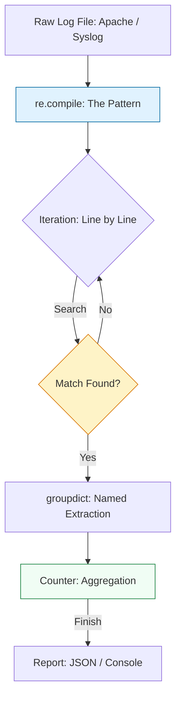

# 🔍 Log Parsing & Regex: Extracting Truth from Chaos

> **"A log file is just a novel where the protagonist is a server having a very bad day. Your job as a DevOps engineer is to find the villain."**

Welcome to the **Log Parsing & Regex** module. In large-scale systems, truth is hidden in millions of lines of unstructured text. Regular Expressions (Regex) are the "scalpel" you use to slice through this chaos and extract structured metrics. Mastering Python's `re` module and the `collections` library allows you to build high-performance analysis tools that reveal infrastructure trends in real-time.

**Why This Matters for Junior DevOps Engineers:**
- 🛡️ **Observability**: When Kibana is down, can you analyze logs on the server?
- ⚡ **Performance**: How to parse a 50GB log file with 512MB RAM (Generators).
- 🎯 **Interview**: "Write a script to find the top 10 IP addresses in this Nginx log."
- 🔧 **Automation**: Extracting a specific Error ID to trigger a remediation workflow.

---

## 📚 Table of Contents

1. [The Analysis Architecture](#-the-analysis-architecture)
2. [Python's Regex Engine (`re`)](#-pythons-regex-engine-re)
3. [Performance Patterns (Generators)](#-performance-patterns-generators)
4. [Real-World DevOps Scenarios](#-real-world-devops-scenarios)
5. [Security Best Practices](#-security-best-practices)
6. [Common Pitfalls & Solutions](#-common-pitfalls--solutions)
7. [Hands-On Exercises](#-hands-on-exercises)
8. [Interview Preparation](#-interview-preparation)
9. [Knowledge Check](#-knowledge-check)

---
## 🏗️ The Analysis Architecture

Log analysis is about the **Compile-Filter-Count** strategy. We move from raw text to structured **Group Objects**.



### 🔍 Lifecycle Breakdown

**Stage 1: Compilation**
- **What**: Compile the regex string into a C-optimized pattern.
- **Why**: 100x faster than interpreting the string every loop iteration.
- **How**: `re.compile(r'...')`.

**Stage 2: Streaming (Generators)**
- **What**: Reading file line-by-line (`yield`).
- **Why**: Keeps RAM usage constant (O(1)) regardless of file size.
- **How**: `for line in file:`.

**Stage 3: Extraction**
- **What**: Pulling specific fields (IP, Date, Status).
- **Why**: Convert unstructured noise into structured data.
- **How**: `match.group('ip')`.

---
## 🐍 Python's Regex Engine (`re`)

### The "Verbose" Pattern (Best Practice)
Regex is notoriously hard to read. Use `re.VERBOSE` (or `re.X`) to allow comments and whitespace inside the pattern.
```python
import re

# ❌ BAD: Unreadable
PATTERN = r'^(\d+\.\d+\.\d+\.\d+) - - \[(.*?)\] "(.*?)" (\d+) (\d+)'

# ✅ HIGH QUALITY: Documented Pattern
LOG_PATTERN = re.compile(r"""
    ^
    (?P<ip>\d+\.\d+\.\d+\.\d+)      # Capture Group: IP Address
    \s-\s-\s                        # Ignore: - - 
    \[(?P<timestamp>.*?)\]          # Capture Group: Timestamp
    \s
    "(?P<request>.*?)"              # Capture Group: HTTP Request
    \s
    (?P<status>\d+)                 # Capture Group: Status Code
    \s
    (?P<size>\d+)                   # Capture Group: Response Size
""", re.VERBOSE)
```
### Accessing Named Groups
Named groups `(?P<name>...)` prevent "Index Error" confusion.
```python
match = LOG_PATTERN.search(log_line)
if match:
    data = match.groupdict()
    print(f"IP: {data['ip']}, Status: {data['status']}")
```

---
## ⚡ Performance Patterns (Generators)

When analyzing a 20GB log file, `f.read()` will crash your laptop. Use Generators.
```python
def log_reader(file_path):
    """Yields one line at a time. Low Memory Footprint."""
    with open(file_path, 'r') as f:
        for line in f:
            yield line

def parse_logs(file_path):
    lines = log_reader(file_path) # Generator
    for line in lines:
        match = LOG_PATTERN.search(line)
        if match:
            yield match.groupdict() # Data Generator

# Usage
for record in parse_logs("huge.log"):
    if record['status'] == '500':
        print(f"Alert: 500 Error from {record['ip']}")
```

---

## 🎭 Real-World DevOps Scenarios

### 🛡️ Scenario 1: The "Kibana is Down" Crisis

**The Incident:** During a Black Friday sale, the logging cluster (ELK) crashed. Engineers couldn't see error rates.
**The Task:** "Find out if the site is throwing 500 errors RIGHT NOW."
**The Solution:** A Python script utilizing `collections.Counter` on the live Nginx log.

```python
from collections import Counter
import re
import time

def monitor_live(file_path):
    f = open(file_path, 'r')
    f.seek(0, 2) # Go to end of file (tail -f)
    
    counter = Counter()
    
    # Simple pattern for status code
    pattern = re.compile(r'HTTP/1.1" (\d{3})')
    
    while True:
        line = f.readline()
        if not line:
            time.sleep(0.1)
            continue
            
        match = pattern.search(line)
        if match:
            status = match.group(1)
            counter[status] += 1
            
        # Print summary every 100 requests
        if sum(counter.values()) % 100 == 0:
            print(f"Latest 100 Stats: {counter}")
            counter.clear()
```

### 🔥 Scenario 2: The Data Warehouse ETL

**The Task:** Convert unstructured application logs into a CSV for the Data Team.
**Challenge:** Log format is inconsistent.
**Solution:** `re.match` returns `None` on failure. Use this as a filter.
```python
import csv

def export_clean_logs(input_log, output_csv):
    with open(output_csv, 'w') as out_f:
        writer = csv.DictWriter(out_f, fieldnames=['timestamp', 'level', 'msg'])
        writer.writeheader()
        
        for record in parse_logs(input_log):
             # Only export high priority logs to save space
            if record['level'] in ['ERROR', 'CRITICAL']:
                writer.writerow(record)
```

---

## 🔒 Security Best Practices

### 1. ReDoS (Regex Denial of Service)
**The Risk**: A malicious user input can cause a poorly written regex engine to backtrack infinitely, freezing the CPU.
**Bad Pattern**: `(a+)+`
**Fix**:
1. Avoid nested quantifiers.
2. Set a timeout on regex execution (Python 3.11+ offers timeout flags in some modules, or use `signal`).
### 2. Sanitize Outputs
Logs often contain PII (Email, IP). Redact them before sharing.
```python
# Redact Email
cleaned = re.sub(r'[\w\.-]+@[\w\.-]+', '[REDACTED]', log_line)
```

---

## ⚠️ Common Pitfalls

### Pitfall 1: Using `re.match` vs `re.search`
- `re.match()` checks ONLY the start of string.
- `re.search()` checks ANYWHERE in string.
**Issue**: Using `match` on a line that starts with a timestamp when your pattern starts with "ERROR" will fail.
**Fix**: Default to `search()`.
### Pitfall 2: Forgetting to Compile
Checking regex inside a loop without compiling is 100x slower.
**Bad**:
```python
for line in logs:
    re.search(r'\d+', line) # Re-compiles 1 million times
```
**Good**:
```python
pat = re.compile(r'\d+')
for line in logs:
    pat.search(line)
```

---
## 🎯 Hands-On Exercises

### Exercise 1: The Access Log Parser
**Objective**: Parse a standard Apache Combined Log format.
**Requirements**:
1. Use `re.VERBOSE` to define the pattern.
2. Extract: IP, Timestamp, Method (GET/POST), URL, Status.
3. Print the Top 5 IPs hitting the server.

**Starter Code**:
```python
import re
from collections import Counter

# TODO: Define Pattern
PATTERN = re.compile(r'...') 

def analyze(log_file):
    # TODO: Read file, count IPs
    pass
```
### Exercise 2: Error Extractor
**Objective**: Find all error messages in a multi-line Java stack trace.
**Hint**: Use `re.DOTALL` or `re.MULTILINE` flags.
**Task**: Extract the Exception type (e.g., `NullPointerException`) and the line number.

---

## 🎙️ Interview Preparation

### Foundation Questions

**1. "Difference between `re.match` and `re.search`?"**
- **Answer**: `match` anchors to the beginning of the string. `search` scans the whole string for the first match.

**2. "What are Greedy vs Non-Greedy quantifiers?"**
- **Answer**: `*` is greedy (eats as much as possible). `*?` is non-greedy (stops at the first match).
- Example: `<div>text</div>` -> `<.*>` matches the whole string. `<.*?>` matches `<div>`.

### Advanced Scenario Questions

**3. "How do you parse a log file larger than RAM?"**
- **Answer**: Use a **Generator Function** to `yield` lines one by one, ensuring O(1) memory usage. Never use `readlines()`.

---

## 🧠 Knowledge Check

**1. Which flag allows comments in Regex?**
- [ ] `re.DEBUG`
- [x] `re.VERBOSE`
- [ ] `re.COMMENT`

**2. Which method finds ALL matches in a string?**
- [ ] `re.search()`
- [x] `re.findall()`
- [ ] `re.match()`

**3. How do you create a Named Group?**
- [ ] `(name=...)`
- [x] `(?P<name>...)`
- [ ] `(<name>...)`

---

## 🎓 Self-Assessment Checklist

Before moving to the next module, ensure you can:
- [ ] Write a `re.VERBOSE` pattern.
- [ ] Use Named Groups (`?P<name>`).
- [ ] Write a Generator function to read a file.
- [ ] Use `collections.Counter` to summarize data.
- [ ] Explain the difference between Greedy and Non-Greedy.

**Score yourself**: 5+/5 = Ready to advance | <5 = Review exercises

[⬅️ Back to Pytest](../07-Testing-Automation-with-Pytest/README.md) | [Next: Remote Execution](../09-Remote-Execution-and-SSH/README.md) ➡️
