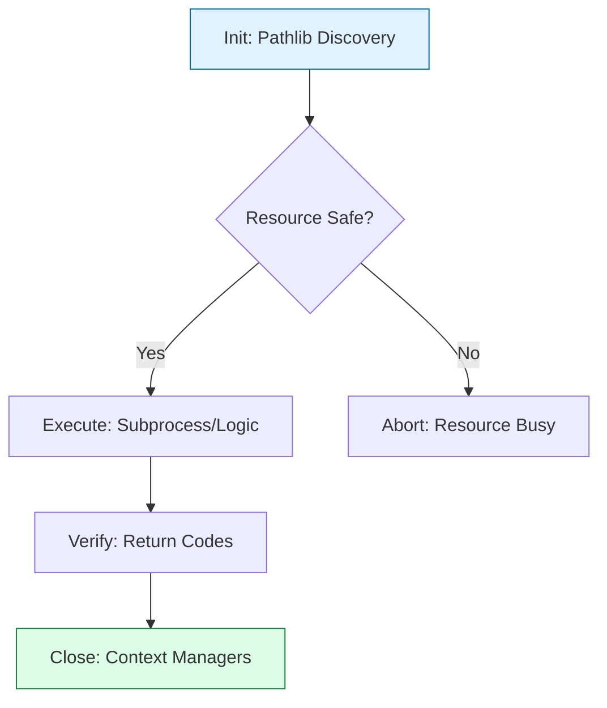

# 🛠️ 01. Core Automation: The Python Engine Room

> **"Scripts break. Software endures. The difference is structure. In the world of high-availability infrastructure, your core automation must be cross-platform, resource-safe, and self-documenting."**

This reference covers the fundamental building blocks of robust Python automation. Moving beyond "Hello World," these patterns ensure your tools are safe, readable, and architecturally distinct from fragile bash scripts.

---

## 🏗️ The Automation Lifecycle

Modern automation follows the **Initialize → Execute → Close** pattern, ensuring system resources are never leaked.



---

## 📂 1. Path & File Operations (`pathlib`)

Stop using strings for file paths. Strings lead to slash errors (`\` vs `/`) and "Path Injection" vulnerabilities. Use `pathlib` for object-oriented filesystem handling.

| Keyword | Use Case | Staff Pattern |
|:---|:---|:---|
| `Path.home()` | Get User Directory. | `Path.home() / ".aws" / "config"` |
| `.exists()` | Safety Check. | `if not p.exists(): raise FileNotFoundError` |
| `.mkdir()` | Setup Workspace. | `p.mkdir(parents=True, exist_ok=True)` |
| `.stat()` | Metadata check. | `if p.stat().st_size > 1024: ...` |
| `.read_text()` | Quick extraction. | `raw = Path('config.ini').read_text()` |

### 🚀 Staff Pattern: The Atomic Write
```python
from pathlib import Path
import tempfile

def atomic_write(dest: Path, content: str):
    """Writes to a temp file then moves into place to prevent corruption."""
    with tempfile.NamedTemporaryFile('w', delete=False, dir=dest.parent) as tf:
        tf.write(content)
        temp_path = Path(tf.name)
    temp_path.replace(dest)
```

---

## ⚡ 2. Subprocess Management (`subprocess`)

The bridge to the OS. **Never use `os.system`**—it is vulnerable to shell injection and offers zero capture logic.

| Keyword | Use Case | Example |
|:---|:---|:---|
| `subprocess.run` | Standard execution. | `subprocess.run(['ls', '-l'], check=True)` |
| `capture_output` | Read stdout/stderr. | `res = subprocess.run(..., capture_output=True)` |
| `text=True` | String decoding. | `output = res.stdout # No .decode() needed` |
| `timeout` | Prevent hangs. | `subprocess.run(..., timeout=30)` |

### 🚀 Staff Pattern: Secure Command Execution
```python
import subprocess

def run_git_status():
    try:
        # Use a list of arguments, NOT a single string with shell=True
        res = subprocess.run(
            ["git", "status", "--porcelain"], 
            capture_output=True, 
            text=True, 
            check=True,
            timeout=5
        )
        return res.stdout.strip()
    except subprocess.CalledProcessError as e:
        print(f"Git failed: {e.stderr}")
    except subprocess.TimeoutExpired:
        print("Git timed out!")
```

---

## 🛡️ 3. Safety & Structure

Patterns that prevent bugs before they happen.

### Context Managers (`with`)
Ensures resources (files, sockets, DB connections) are closed even if errors occur.
```python
# The "File Handle" is automatically closed after the block
with open("deploy.lock", "w") as f:
    f.write("LOCKED")
```

### Type Hints (`typing`)
Documentation that checks itself. Staff engineers never write untyped functions.
```python
from typing import List, Dict, Optional

def get_config(env: str = "dev") -> Optional[Dict[str, str]]:
    """Returns a dict of config or None if env is invalid."""
    return {"endpoint": "https://api.internal"} if env == "dev" else None
```

---

## 🚀 4. Advanced Operational Flow

### Generators (`yield`) - Memory Efficiency
Process 100GB logs with only 10MB of RAM.
```python
def stream_logs(path: Path):
    with path.open() as f:
        for line in f:
            if "CRITICAL" in line:
                yield line.strip()

for error in stream_logs(Path("/var/log/app.log")):
    alert_on_call(error)
```

### Decorators (`@`) - Non-Destructive Scaling
Add logging or retries cleanly across your whole platform.
```python
import time
from functools import wraps

def audit_log(func):
    @wraps(func)
    def wrapper(*args, **kwargs):
        print(f"Auditing call to: {func.__name__}")
        return func(*args, **kwargs)
    return wrapper

@audit_log
def deploy_stack():
    time.sleep(2)
```

---

## 🎭 Real-World DevOps Scenarios

### 🛡️ Scenario: The "Windows-Linux" Path Crisis

**The Incident**: A developer wrote a cleanup script using string concatenation: `"/var/logs/" + filename`. 

**The Crisis**: When the script was run on a Windows-based CI/CD build agent, it failed with `FileNotFoundError` because the slashes were reversed.

**The Fix**: Rewrote everything using `pathlib`.
```python
# BEFORE (Fragile)
path = "/var/log/" + "app.log" 

# AFTER (Staff Standard)
from pathlib import Path
path = Path("/var/log") / "app.log" # Works on EVERYTHING.
```
**The Lesson**: The filesystem is an abstraction. Treat it like an object, not a string.

---

## 🎙️ Interview Preparation

### Foundation Questions
1. **"Why is `subprocess.run` preferred over `os.system`?"**
   - **Answer**: `subprocess.run` is safer because it doesn't invoke a shell by default (preventing shell injection), it allows for precise capturing of stdout and stderr, and it supports timeouts and rigorous error checking via `check=True`.

2. **"What does `with open(...)` do exactly?"**
   - **Answer**: It implements the Context Manager protocol. It ensures the file is closed as soon as the block completes, even if an exception is raised inside. This prevents "File Descriptor exhaustion," which can crash long-running automation.

### Advanced Scenario Questions
3. **"How would you process a file that is too large to fit in memory?"**
   - **Answer**: I would use a **Generator** function with the `yield` keyword. By iterating over the file object line-by-line, Python only keeps a small buffer in memory at any given time, allowing us to process gigabyte-scale logs with megabyte-scale RAM.

---

## 🧠 Knowledge Check

1. **How do you make a directory and its parents if they don't exist?**
   - [ ] `os.makedirs(path)`
   - [x] `Path(path).mkdir(parents=True, exist_ok=True)`
   - [ ] `subprocess.run(['mkdir', '-p', path])`

2. **What happens if a subprocess fails when `check=True` is not set?**
   - [x] The script continues silently, potentially leading to cascading failures.
   - [ ] The script crashes immediately.

---
## 🎓 Self-Assessment Checklist
- [ ] I can join paths without using string `+` or `f""`.
- [ ] I always use `check=True` in subprocess calls.
- [ ] I understand why `yield` is critical for large log files.
- [ ] I use type hints for all function arguments and returns.

---
**Status**: ✅ Staff-Enhanced (2026-02-03)
