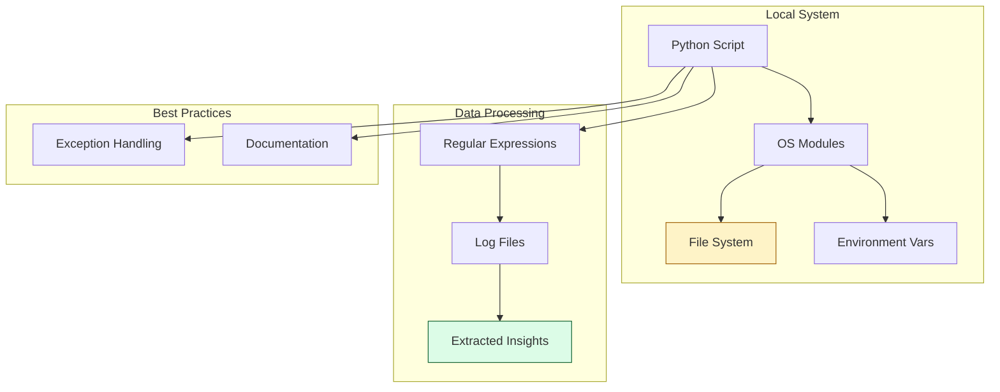

# 📐 Part 1: The Blueprint (Foundations)

> **"If you can automate it in Bash, you can engineer it in Python. Stop writing fragile scripts; start building robust foundations."**

Welcome to **The Blueprint**. In this section, we lay the groundwork for infrastructure automation. We move from the manual, error-prone world of CLI commands to the structured, repeatable world of Python engineering.

---

## 🧠 The Mental Model: The Architect's Desk

Before building a skyscraper, you need a blueprint. In the world of DevOps, **Part 1** is your architect's desk. You aren't building "The Cloud" yet; you're mastering the tools that allow you to describe and manipulate the physical reality of servers and files.

- **Environment**: Your workshop and its tools.
- **Syntax**: Your shared language for logic.
- **File Ops**: Your ability to move "materials" (data).
- **Regex**: Your precision scanner for finding exactly what you need in a mountain of logs.

---

## 🎯 Why This Part Matters for Juniors

**Before this section**, you might:
- Rely on long `sed` and `awk` commands that are hard to read and debug.
- Manual edit configuration files.
- Struggle with system-level tasks that require complex branching logic.

**After this section**, you'll understand:
- **Clean Code Syntax**: How to write Python that your future self (and your team) can actually read.
- **Robust IO**: How to read, write, and safely manipulate files without corrupting data.
- **Pattern Matching**: Using Regular Expressions (Regex) to parse complex log files and extract critical data.
- **System Automation**: Interacting with the OS using the `pathlib` and `shutil` modules.

**The Difference**: Your scripts stop being "magic spells" and start being **designed software**.

---

## 🎯 Learning Objectives

By the end of Part 1, you will:

- ✅ **Setup the Shop**: Configure a professional Python development environment.
- ✅ **Master the Basics**: Use core HCL concepts (Lists, Dicts, Logic) for automation.
- ✅ **Manipulate the System**: Automate file movement, renaming, and auditing.
- ✅ **Parse Reality**: Use Regex to extract IDs and IPs from legacy log files.
- ✅ **Standardize Docs**: Learn to write Docstrings and Markdown that engineers actually value.

---

## 🏗️ Architecture: The Core Foundation

---

## 📂 What's Covered in Part 1

### 📖 Table of Contents

1. **[Environment and Syntax](./01-Environment-and-Syntax/)**: Setting up for success and mastering the basics.
2. **[OS and File Ops](./02-OS-and-File-Ops/)**: Taking control of the file system.
3. **[Log Parsing and Regex](./03-Log-Parsing-and-Regex/)**: Extracting signal from noise.
4. **[Resources](./04-Resources/)**: Helper scripts and boilerplates.
5. **[Reference](./05-Reference/)**: Cheat sheets and syntax cards.

---

## 🎓 Junior's Reality Check

### "Why not just use Bash?"
**The Reality**: Bash is great for one-liners. But as soon as you need to handle JSON, talk to an API, or perform complex error handling, Bash becomes a maintenance nightmare. Python is **readable**, **maintainable**, and **portable**. If your script is more than 50 lines, it belongs in Python.

### The "Golden Rule" of Regex
**Pro-Tip**: Regex is powerful, but "with great power comes great incomprehensibility." Use the `re.VERBOSE` flag and comment your patterns. If your colleague can't read your regex, your automation is a liability.

---

## ❓ Interview Preparation (Part 1)

### 🎯 Screening Questions

1. **Q: How does `pathlib` improve upon the older `os.path` for file operations?**
   * **Answer**: `pathlib` provides an object-oriented approach to paths. It handles cross-platform differences (slashes) automatically and makes operations like joining paths or checking existence much safer and more readable.

2. **Q: What is the difference between a `List` and a `Dictionary` in an automation context?**
   * **Answer**: `Lists` are for sequences (e.g., a list of server IPs). `Dictionaries` are for mapping (e.g., mapping a server IP to its status or its region).

3. **Q: When would you use a `Raw String` (e.g., `r"pattern"`) in Python?**
   * **Answer**: Primarily for Regular Expressions. It tells Python not to interpret backslashes as escape characters, which is essential for regex syntax.

---

## 📝 Knowledge Check

1. **Which module is the modern standard for interacting with the file system?**
   - [ ] `sys`
   - [x] `pathlib`
   - [ ] `regex`
   - [ ] `file_ops`

2. **True or False: A `Tuple` in Python is mutable (can be changed).**
   - [ ] True
   - [x] False (Tuples are immutable).

3. **What does the `.group()` method do in a Regex match object?**
   - [ ] Groups files together.
   - [ ] Creates a list of all matches.
   - [x] Returns the part of the string that matched the pattern.
   - [ ] Deletes the match.

---

## 🔗 Next Steps

Once you can control your local files and parse data, it's time to connect to other systems.

**Proceed to**: [Part 2: The Engine (Connectivity) →](../02-Part-2-The-Engine/README.md)
