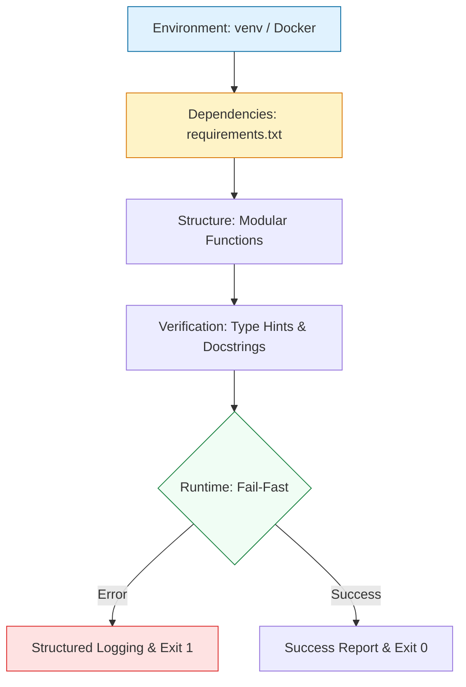

# 🛠️ Python Environment & DevOps Foundations

> **"A production-ready environment is the first line of defense against infrastructure drift. If you can't reproduce your logic's environment, you haven't automated anything."**

Welcome to the foundation of **Python for DevOps**. Before writing a single line of Boto3 or Requests logic, we must master the **Engineering Environment**. This module covers the standards of isolation, package management, and robust coding principles that separate "scripts" from "tools."

---

## 🏗️ The Engineering Lifecycle

Production Python follows a strict lifecycle of Isolation, Dependency Management, and Structured Execution.



---

## 🎭 Real-World DevOps Scenarios

### 🛡️ Scenario: The "Sudo Pip" Disaster
**The Incident:** A senior SRE needed to fix a logging script on a production Jumpbox and ran `sudo pip install requests --upgrade` to get the latest feature.
**The Failure:** The OS (RHEL) used an older version of `requests` for its internal package manager (yum/dnf). The upgrade broke the system's ability to pull new OS updates, essentially partitioning the server from security patches.
**The Fix:** Mandatory transition to **Virtual Environments (`venv`)**. Never install dependencies at the system level.

---

## 💻 DevOps Logic Snippets: "The Robust Boilerplate"

Always start with isolation and explicit error handling.

```python
import sys
import logging
from pathlib import Path

# Professional Standard: Structured Logging
logging.basicConfig(level=logging.INFO, format='%(levelname)s: %(message)s')

def main() -> None:
    """Entry point for building a production tool."""
    try:
        # Guard Clause: Check for required environment
        if not Path(".venv").exists():
            logging.error("Virtual environment not found. Run 'python -m venv .venv'")
            sys.exit(1)
            
        logging.info("🚀 System initialized safely.")
        
    except Exception as e:
        logging.critical(f"💥 Fatal initialization error: {e}")
        sys.exit(1)

if __name__ == "__main__":
    main()
```

---

## 🎙️ Interview Preparation (Foundations)

1.  **"Why should you never use `sudo pip install` on a Linux server?"**
    *   *Answer:* It ignores the system's package manager and can overwrite libraries critical to the OS itself. Always use isolated environments like `venv` or Docker.
2.  **"What is the difference between `requirements.txt` and a Lock file?"**
    *   *Answer:* `requirements.txt` usually specifies ranges (e.g., `requests>=2.0.0`). A Lock file (like `poetry.lock` or `pip-compile`) specifies the exact hash and version, ensuring the environment is identical across every developer's machine and every server.
3.  **"Explain the 'Fail-Fast' principle in the context of Python script headers."**
    *   *Answer:* It means performing all critical checks (checking for API keys, verifying file paths, testing DB connectivity) at the very beginning of the `main()` function, exiting immediately if they fail before any destructive logic occurs.
4.  **"What is the benefit of Type Hinting in long-term infrastructure projects?"**
    *   *Answer:* It serves as living documentation. When a teammate comes in 6 months later, they know exactly what data types a function expects, preventing "NoneType" errors in production.
5.  **"How does `sys.exit(1)` impact a CI/CD pipeline?"**
    *   *Answer:* CI/CD runners (like GitHub Actions or GitLab CI) monitor the exit code of every command. A non-zero code (like 1) triggers a pipeline failure, preventing broken automation from proceeding.

---

## 🧠 Knowledge Check

1.  **Which command creates a virtual environment?**
    *   [ ] `python -m pip install venv`
    *   [x] `python -m venv .venv`
    *   [ ] `pip init env`
2.  **True or False: Using `pathlib` is preferred over `os.path` for modern DevOps scripts.**
    *   [x] True
    *   [ ] False
3.  **What does the `if __name__ == "__main__":` block do?**
    *   [ ] It runs the script as a background service.
    *   [x] It ensures the code only runs if the script is executed directly, not imported.
    *   [ ] It initializes the CPU.
4.  **Which logging level is used for "Serious problems where the script may be unable to continue"?**
    *   [ ] `WARNING`
    *   [ ] `ERROR`
    *   [x] `CRITICAL`
5.  **What is the purpose of a `.gitignore` file in a Python project?**
    *   [x] To prevent sensitive files and local environments (`.venv`) from being committed to Git.
    *   [ ] To speed up script execution.
    *   [ ] To document dependencies.

---

[⬅️ Back to Python for DevOps](../README.md) | [Next: System Operations](../02-System-and-File-Operations/README.md) ➡️