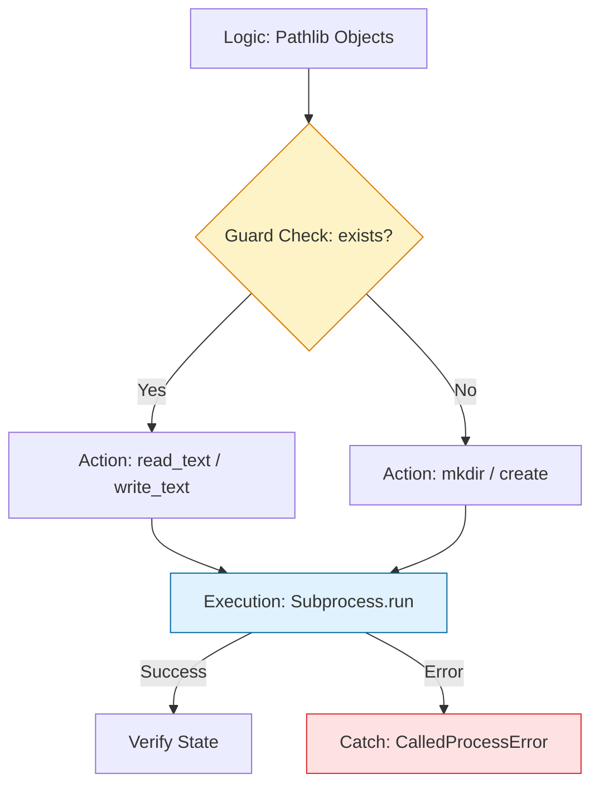

# 📂 System & File Operations: The Modern Orchestrator

> **"Shell commands are a language of the past. Python's `pathlib` and `subprocess` are the language of the future—safer, cross-platform, and object-oriented."**

Welcome to the **System Operations** module. While Bash is great for one-liners, Python is where you build resilient "Industrial Tools." This module focuses on the transition from brittle string-based pathing to robust, object-oriented system management.

---

## 🏗️ The System Interaction Lifecycle

Interacting with the OS requires **Strict Boundaries**. We move from raw shell execution to **Isolated Processes** and **Atomic File Operations**.



---

## 🎭 Real-World DevOps Scenarios

### 🛡️ Scenario: The "Space-in-Path" Catastrophe
**The Incident:** An engineer used a shell script to clean up user directories: `rm -rf /data/users/$USERNAME`.
**The Failure:** A new user was created with the name `john doe`. The shell expanded the command to `rm -rf /data/users/john doe`, causing it to try and delete `/data/users/john` (which failed) and then `doe` (which was a critical system directory in the root).
**The Fix:** Mandatory use of **`pathlib`**. Python treats the entire path as a single object, meaning spaces in filenames are handled safely and automatically without complex shell quoting.

---

## 💻 DevOps Logic Snippets: "The Secure Executor"

Always use lists for arguments to prevent shell injection.

```python
import subprocess
from pathlib import Path
import logging

def clean_temp_artifacts(target_dir: str):
    # 🛡️ Guard Clause: Use Path objects
    path = Path(target_dir)
    
    if not path.is_dir():
        logging.error(f"❌ Target {target_dir} is not a valid directory.")
        return

    try:
        # 🚀 Act: Run a command safely (No shell=True!)
        # Passing arguments as a list prevents shell injection
        subprocess.run(["rm", "-rf", str(path / "*.tmp")], check=True)
        logging.info(f"✅ Successfully cleaned artifacts in {path}")
        
    except subprocess.CalledProcessError as e:
        logging.error(f"💥 Command failed with exit code {e.returncode}")

if __name__ == "__main__":
    clean_temp_artifacts("/tmp/build_cache")
```

---

## 🎙️ Interview Preparation (System Ops)

1.  **"Why is `pathlib` preferred over the legacy `os.path` module?"**
    *   *Answer:* `pathlib` provides an object-oriented interface. Instead of passing strings to functions, you call methods on the Path object itself (`path.exists()`, `path.read_text()`). It also handles slash differences (`/` vs `\`) between Linux and Windows automatically.
2.  **"What is the danger of setting `shell=True` in `subprocess.run()`?"**
    *   *Answer:* It opens a security hole known as **Shell Injection**. If any part of the command comes from user input, an attacker can append `; rm -rf /` or other malicious commands which the shell will then execute.
3.  **"How does `subprocess.run(check=True)` change your error handling?"**
    *   *Answer:* It forces the script to fail-fast. Without `check=True`, a command could fail, the script would continue silently, and you might accidentally perform operations on corrupt or missing data.
4.  **"What is the difference between `shutil.copy()` and `shutil.copy2()`?"**
    *   *Answer:* `copy()` copies the file data and permissions. `copy2()` copies the data **plus** the metadata (like timestamps and original creation dates), which is critical for maintaining audit trails during migrations.
5.  **"When should you use `os.environ` instead of hardcoding paths?"**
    *   *Answer:* To ensure **Environment Parity**. Hardcoded paths like `/home/user/config` fail in CI/CD or Docker. Using `os.getenv('CONFIG_PATH')` allows the same script to run in Dev, Staging, and Production by simply changing the environment variable.

---

## 🧠 Knowledge Check

1.  **Which library is the modern standard for filesystem paths?**
    *   [ ] `os.path`
    *   [ ] `sys`
    *   [x] `pathlib`
2.  **To run an external command and capture its output, which function do you use?**
    *   [ ] `os.system()`
    *   [x] `subprocess.run()`
    *   [ ] `shutil.exec()`
3.  **True or False: Using `/` as a join operator in pathlib (e.g., `p / "subdir"`) works on Windows.**
    *   [x] True
    *   [ ] False
4.  **What does the `check=True` argument do in a subprocess call?**
    *   [ ] It checks if the command exists before running.
    *   [x] It raises an exception if the command returns a non-zero exit code.
    *   [ ] It validates the user's permissions.
5.  **Which method is used to create a directory including all its missing parent folders?**
    *   [x] `path.mkdir(parents=True)`
    *   [ ] `path.create_all()`
    *   [ ] `os.makedirs_only()`

---

[⬅️ Back to Start](../README.md) | [Next: Data Manipulation](../03-Working-with-Data-JSON-YAML/README.md) ➡️