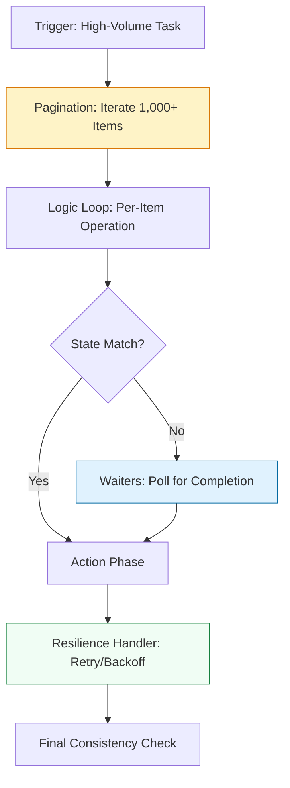

# 📊 Scale & Resilience: Mastering Cloud State

> **"In the cloud, 1,000 resources is a small environment. If your script stops working after the 1,001st item, it isn't a tool—it's a ticking time bomb. Reliability is not a feature; it is an architectural requirement."**

Welcome to **Advanced Boto3 Operations**. In this module, we move beyond "Happy Path" scripting into the world of **Production Resilience**. You will learn how to handle the AWS API "1,000 Item Trap", synchronize with asynchronous cloud states using Waiters, and build scripts that survive throttling and network jitter.

**Why This Matters for Junior DevOps Engineers:**
- 🚨 **Silent Failure**: Without Paginators, your scripts will miss resources in large accounts without ever throwing an error.
- ⏳ **Race Conditions**: `time.sleep()` is the #1 cause of flaky automation. Waiters ensure optimal, reliable execution.
- 🛡️ **Self-Healing**: Robust retry logic prevents transient API errors from crashing your mission-critical pipelines.

---

## 📚 Table of Contents

1. [The Scalability Lifecycle](#-the-scalability-lifecycle)
2. [Mastering Paginators](#-mastering-paginators)
3. [The "Wait-for-State" Pattern](#-the-wait-for-state-pattern)
4. [The Resilience Layer: Retries & Throttling](#-the-resilience-layer-retries--throttling)
5. [Real-World DevOps Scenarios](#-real-world-devops-scenarios)
6. [Advanced Resilience Code Structure](#-advanced-resilience-code-structure)
7. [Common Pitfalls & Solutions](#-common-pitfalls--solutions)
8. [Hands-On Exercises](#-hands-on-exercises)
9. [Interview Preparation](#-interview-preparation)
10. [Knowledge Check](#-knowledge-check)

---

## 🏗️ The Scalability Lifecycle
Handling cloud scale requires a shift from "Request-Response" to "Stream-Sync" logic.



### 🔍 Lifecycle Breakdown

**Stage 1: Paged Discovery**
- **Goal**: Find every resource regardless of count.
- **Why**: AWS limits most API responses to 1,000 items. Paginators pass the `Marker` or `NextToken` for you.

**Stage 2: State Synchronization**
- **Goal**: Ensure the resource is ready for the next action.
- **Why**: Launching a server is instant in code, but takes minutes in reality.

**Stage 3: Error Resilience**
- **Goal**: Survive API throttling (`429 Too Many Requests`).
- **Why**: AWS limits "Burst" API calls to protect their platform.
---
## 📉 Mastering Paginators: The "1,000 Item" Trap
In a system like S3 or EC2, you will eventually have more than 1,000 objects or instances. 
### ❌ The Junior Mistake
```python
# BROKEN AT SCALE: Stops at 1,000 items
resp = s3.list_objects_v2(Bucket='prod-logs')
for obj in resp['Contents']:
    print(obj['Key'])
```
### ✅ The Staff Pattern: Paginators
```python
client = boto3.client('s3')
paginator = client.get_paginator('list_objects_v2')

# Automatically loops and retrieves tokens
for page in paginator.paginate(Bucket='prod-logs'):
    if 'Contents' in page:
        for obj in page['Contents']:
            print(f"Auditing object: {obj['Key']}")
```
---
## ⏳ The "Wait-for-State" Pattern
Cloud resources are eventually consistent. Waiters provide absolute certainty.
### ❌ The Fragile Code
```python
ec2.start_instances(InstanceIds=['i-123'])
time.sleep(30) # This is a "Guess"
# SSH attempt... (Fails if boot takes 31 seconds)
```
### ✅ The Robust Code: Waiters
```python
ec2.start_instances(InstanceIds=['i-123'])
waiter = ec2.get_waiter('instance_running')

# Polls every 15s for up to 40 attempts
waiter.wait(InstanceIds=['i-123'])
print("Resource is strictly ready.")
```
---
## 🎭 Real-World DevOps Scenarios

### 🛡️ Scenario 1: The "Invisible" Security Leak
**The Incident**: A script audited security groups for port 22 exposure. It reported all was safe.
**The Failure**: The account had 1,200 security groups. The script didn't use a Paginator and stopped at 1,000. Group 1,105 was wide open to the internet.
**The Fix**: Implemented `describe_security_groups` Paginator.
**The Lesson**: For security tools, **Incomplete = Fatal.**
### 🔥 Scenario 2: The "Throttling Storm"
**The Incident**: A Lambda function triggered on S3 uploads attempted to tag 5,000 images simultaneously.
**The Crash**: AWS throttled the Lambda with a `429` error. Half the images were tagged, half were not. The data was "corrupted" by state mismatch.
**The Fix**: Configured the Boto3 `retries` mode to `standard`, giving the script 10 attempts with exponential backoff.
**The Lesson**: The cloud will push back if you move too fast. **Retries are the air-brakes of automation.**

---
## 💻 Advanced Resilience Code Structure
This boilerplate handles massive scale with backoff and data integrity.
```python
import boto3
import logging
from botocore.config import Config
from botocore.exceptions import ClientError, WaiterError

# Standard resilience configuration
RETRY_CONFIG = Config(
    retries = {
        'max_attempts': 10,
        'mode': 'standard' # Handles Throttling and Jitter automatically
    }
)

logger = logging.getLogger(__name__)

def scalable_resource_cleanup(region: str, bucket_name: str):
    """Clean up S3 objects with high resilience."""
    s3 = boto3.client('s3', region_name=region, config=RETRY_CONFIG)
    
    try:
        # 1. Paginator for Scale
        paginator = s3.get_paginator('list_objects_v2')
        
        for page in paginator.paginate(Bucket=bucket_name):
            if 'Contents' not in page:
                continue
            
            # 2. Batch Deletion
            delete_keys = [{'Key': obj['Key']} for obj in page['Contents']]
            s3.delete_objects(
                Bucket=bucket_name,
                Delete={'Objects': delete_keys}
            )
            logger.info(f"Purged {len(delete_keys)} objects...")
            
    except ClientError as e:
        logger.error(f"API Failure: {e}")
        raise
```

---

## 🎙️ Interview Preparation

### Foundation Questions
1. **"What is the default limit for most AWS List APIs?"**
   - *Answer*: 1,000 items. This is why Paginators are a mandatory standard for production scripts.
2. **"How does a Waiter differ from a loop with a sleep?"**
   - *Answer*: A Waiter is a pre-built poller with optimized timing and error handling. It understands the "Resource Success" conditions of the cloud provider, making it faster and more reliable than a manual guess with `time.sleep()`.
### Advanced Scenario Questions
3. **"Your script fails with 'RequestLimitExceeded'. How do you fix this without changing the script logic?"**
   - *Answer*: I adjust the Boto3 `Config` to use `mode='standard'`. This tells the SDK to automatically retry the request with an exponential backoff and jitter, allowing the script to survive temporary burst limits.

---

## 🧠 Knowledge Check

1. **Which Boto3 feature manages the 'NextToken' for you?**
   - [ ] Waiter.
   - [x] Paginator.
   - [ ] Collection.

2. **True or False: Using the `standard` retry mode helps handle network jitter.**
   - [x] True.
   - [ ] False.

3. **What happens if a Waiter reaches its maximum retry count?**
   - [ ] It starts over.
   - [x] It throws a `WaiterError`.
   - [ ] It prints a warning and continues.

---
## 🎓 Self-Assessment Checklist

- [ ] I can describe the "1,000 Item Trap" to a junior colleague.
- [ ] I can implement an S3 Paginator in Python.
- [ ] I have used a Waiter to check the state of an RDS or EC2 instance.
- [ ] I understand how exponential backoff prevents "Retry Storms."
- [ ] I can configure a Boto3 client with a custom `Config` object.

**Ready to move to Production Readiness?**

[⬅️ Back to Boto3 Foundations](./README.md) | [Next: Production Patterns →](Production%20Patterns.md)
