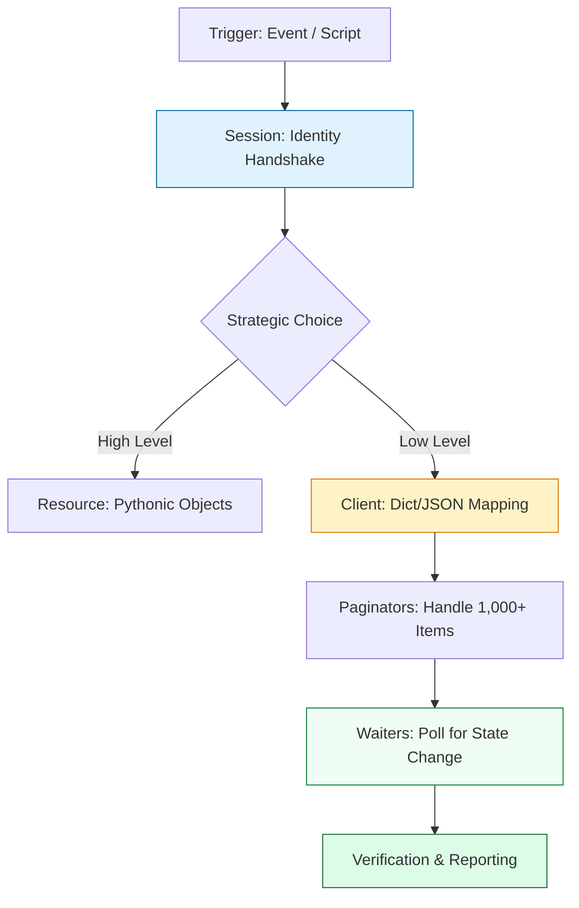

# ☁️ Cloud Automation: Boto3 Mastery (The AWS Controller)

> **"If you are clicking buttons in the AWS Console, you are a guest. If you are using Boto3, you are the architect. In the world of cloud automation, identity is the first perimeter, and logic is the engine of scale."**

Welcome to **Boto3 Mastery**. Boto3 is the official AWS SDK for Python and the central nervous system of modern Cloud Engineering. Whether you are building self-healing infrastructure, auditing security drift, or managing multi-region server fleets, Boto3 is the tool that transforms Python code into cloud reality.

**Why This Matters for Junior DevOps Engineers:**
- 🚨 **Scale**: You cannot manually restart 5,000 servers or tag 10,000 buckets. You write a Boto3 script.
- 💰 **FinOps**: You will write scripts to find and delete orphaned resources to save thousands in monthly costs.
- 🛡️ **Security**: You'll automate the detection of public S3 buckets and insecure Security Groups.
- 🎯 **Interview Weight**: "Write a Python script to find all unencrypted EBS volumes" is a core DevOps interview question.

---

## 📚 Table of Contents

1. [The Cloud Automation Lifecycle](#-the-cloud-automation-lifecycle)
2. [Identity & Authentication (Sessions)](#-identity--authentication-sessions)
3. [Client vs Resource: The Strategic Choice](#-client-vs-resource-the-strategic-choice)
4. [Handling Scale: Paginators](#-handling-scale-paginators)
5. [Handling State: Waiters](#-handling-state-waiters)
6. [Real-World DevOps Scenarios](#-real-world-devops-scenarios)
7. [The Professional Boto3 Boilerplate](#-the-professional-boto3-boilerplate)
8. [Common Pitfalls & Solutions](#-common-pitfalls--solutions)
9. [Hands-On Exercises](#-hands-on-exercises)
10. [Interview Preparation](#-interview-preparation)
11. [Knowledge Check](#-knowledge-check)

---

## 🏗️ The Cloud Automation Lifecycle
Building for the cloud requires **State Awareness** and **Scalability**. We move beyond simple API calls to a structured lifecycle of identity, connection, and synchronization.



### 🔍 Lifecycle Breakdown
**Stage 1: Identity Handshake (The Session)**
- **What**: Establishing "Who" is making the call and to "Which" region.
- **Why**: AWS is Zero Trust. No session means no access.
- **How**: `session = boto3.Session(profile_name='prod')`.

**Stage 2: Connection (Client vs Resource)**
- **What**: Creating the service-specific interface (S3, EC2, IAM).
- **How**: `ec2 = session.client('ec2')`.

**Stage 3: Operation (Pagination)**
- **What**: Iterating through massive lists of resources.
- **Why**: Default APIs limit results (the "1,000 Item Trap").
- **How**: `paginator = client.get_paginator('list_objects_v2')`.

**Stage 4: Synchronization (Waiters)**
- **What**: Blocking the script until the cloud catches up.
- **Why**: Cloud actions are asynchronous (VM start takes 60s).
- **How**: `waiter.wait(InstanceIds=[id])`.

---

## 🔐 Identity & Authentication (Sessions)
The `Session` object is the "Command Center" for your script. It manages credentials, configuration, and defaults.
### The "Zero-Key" Principle (Staff Standard)
**Never hardcode credentials.** Boto3 looks for credentials in this order:
1. Environment Variables (`AWS_ACCESS_KEY_ID`)
2. Configuration Files (`~/.aws/credentials`)
3. **IAM Roles** (EC2 Instance Profiles / Lambda Roles) — **The Production Standard.**

```python
import boto3

# ✅ STAFF STANDARD: No keys in code
# Boto3 finds the identity automatically
session = boto3.Session(region_name='us-east-1')
s3 = session.client('s3')
```

---

## ⚔️ Client vs Resource: The Strategic Choice

Boto3 provides two ways to interact with AWS. Knowing which to use determines the speed and reliability of your tool.

| Feature          | The Client (Low-Level)      | The Resource (High-Level)     |
| :--------------- | :-------------------------- | :---------------------------- |
| **Response**     | 📖 Dictionaries (Dict/JSON) | 📦 Python Objects (`obj.id`)  |
| **Coverage**     | 100% (Every AWS feature)    | ~60% (Simple services only)   |
| **Performance**  | ⚡ Fastest                   | 🐢 Slower (Object overhead)   |
| **Staff Choice** | **Primary Choice for Prod** | Use for quick Lab/CLI scripts |
### 🔍 The Client Pattern (Production Standard)
```python
client = boto3.client('s3')
resp = client.list_buckets()
for b in resp['Buckets']:
    print(b['Name']) # Dictionary lookup
```
### 🔍 The Resource Pattern (Simplicity)
```python
s3 = boto3.resource('s3')
for b in s3.buckets.all():
    print(b.name) # Object attribute lookup
```
---
## 📈 Handling Scale: Paginators

### The "1,000 Item" Trap
Most AWS `list_` or `describe_` APIs return a maximum of 1,000 items. If you have 1,001 buckets and don't use a Paginator, your script will **silently fail** to report the last bucket.
```python
# ✅ THE ROBUST WAY: Paginators
client = boto3.client('s3')
paginator = client.get_paginator('list_objects_v2')

# Automates the "NextToken" dance behind the scenes
for page in paginator.paginate(Bucket='data-lake-prod'):
    if 'Contents' in page:
        for obj in page['Contents']:
            print(f"Auditing: {obj['Key']}")
```
---
## ⏳ Handling State: Waiters
Cloud operations take time. You cannot start an EC2 instance and immediately try to SSH into it.
```python
# ❌ THE JUNIOR WAY: Hardcoded Sleeps
ec2.start_instances(InstanceIds=[id])
time.sleep(30) # "Hope" it's ready. Dangerous.

# ✅ THE STAFF WAY: Waiters
ec2.start_instances(InstanceIds=[id])
waiter = ec2.get_waiter('instance_running')

print("Waiting for instance to reach 'Running' state...")
waiter.wait(InstanceIds=[id]) # Blocks until strictly ready
print("Instance IP is now reachable!")
```

---
## 🎭 Real-World DevOps Scenarios

### 🛡️ Scenario 1: The "Orphaned Snapshot" Reaper
**The Incident**: A production AWS bill jumped by $5,000. Analysis showed 20,000 EBS snapshots accumulating from deleted instances.
**The Task**: Build a script that deletes every snapshot older than 30 days that is not "in use."
**The Lesson**: Paginators are mandatory here. A simple `describe_snapshots` would fail at the 1,001st snapshot, leaving $4,000 of waste behind.
### 🔥 Scenario 2: The $12,000 Credential Leak
**The Incident**: A developer pushed a Boto3 script to a public GitHub repo with their `ACCESS_KEY` hardcoded.
**The Crisis**: Within 12 minutes, attackers launched 500 crypto-mining instances in 10 different regions (Multi-Region attack). 
**The Fix**:Revoked the keys and migrated all developers to **IAM Identity Center (SSO)** where Boto3 uses short-lived temporary tokens.
**The Lesson**: Hardcoded keys are a "Career-Ending Event." Always use **Sessions** and **Roles**.

---

## 💻 The Professional Boto3 Boilerplate
This structure handles identity, scale, and cross-account errors like a Senior Engineer.
```python
#!/usr/bin/env python3
import sys
import boto3
import logging
from botocore.exceptions import ClientError

# 1. Structured Logging
logging.basicConfig(level=logging.INFO, format='%(levelname)s: %(message)s')
logger = logging.getLogger(__name__)

def get_session(profile: str = "default") -> boto3.Session:
    """Safely establish a session."""
    try:
        return boto3.Session(profile_name=profile)
    except Exception as e:
        logger.error(f"Failed to find AWS profile '{profile}': {e}")
        sys.exit(1)

def audit_s3_compliance(session: boto3.Session):
    """Production-grade audit logic."""
    s3 = session.client('s3')
    
    try:
        # Paginator handles lists of any size
        paginator = s3.get_paginator('list_buckets')
        for page in paginator.paginate():
            for bucket in page['Buckets']:
                name = bucket['Name']
                # Sub-API call: Check public access
                try:
                    conf = s3.get_public_access_block(Bucket=name)
                    logger.info(f"✅ Bucket {name}: Secure")
                except ClientError as e:
                    if e.response['Error']['Code'] == 'NoSuchPublicAccessBlockConfiguration':
                        logger.warning(f"🚨 Bucket {name}: NO PUBLIC BLOCK - High Risk")
                    else:
                        logger.error(f"Could not audit {name}: {e}")
                        
    except ClientError as e:
        logger.error(f"API Error during audit: {e}")

def main():
    session = get_session("prod-admin")
    audit_s3_compliance(session)

if __name__ == "__main__":
    main()
```

---

## ⚠️ Common Pitfalls & Solutions

### Pitfall 1: Clock Skew
- **Symptom**: `SignatureDoesNotMatch` or `RequestTimeTooSkewed` error.
- **Cause**: Your system clock is >5 minutes off from AWS.
- **Fix**: Run `ntpdate` or check your VM's time synchronization.
### Pitfall 2: Rate Limiting (Throttling)
- **Symptom**: `RequestLimitExceeded` (403/429).
- **Solution**: Use **Exponential Backoff**. Boto3 has a built-in retry engine.
```python
from botocore.config import Config
# Force Boto3 to retry up to 10 times automatically
config = Config(retries={'max_attempts': 10, 'mode': 'standard'})
client = boto3.client('s3', config=config)
```
---
## 🎯 Hands-On Exercises

### Exercise 1: Multi-Region EC2 Inventory
**Goal**: Query ALL AWS regions and list every running instance.
**Skills**: `client.describe_regions()`, `boto3.client(region_name=...)`.

### Exercise 2: The "Ghost Resource" Hunter
**Goal**: Identify any Elastic IP (EIP) that is NOT attached to an instance (these cost money!).
**Skills**: `ec2.describe_addresses()`, filtering results.

---

## 🎙️ Interview Preparation

### Foundation Questions
1. **"What is the difference between a Client and a Resource?"**
   - *Answer*: Client is a low-level API mapping (Dicts), while Resource is a high-level Pythonic abstraction (Objects). Client is preferred for performance and 100% feature coverage.
2. **"Why use a Paginator instead of a simple `list_objects` call?"**
   - *Answer*: AWS APIs limit responses to 1,000 items. Paginators handle the "Marker" or "ContinuationToken" automatically to ensure we capture 100% of the resources at scale.
### Advanced Scenario Questions
3. **"A Boto3 script running on EC2 fails with '403 Forbidden', but the same script works on your laptop. Why?"**
   - *Answer*: The **IAM Role** attached to the EC2 instance likely lacks the necessary permissions. I would check the instance's IAM Policy and verify that the script is not accidentally trying to use a hard-coded local profile that doesn't exist on the server.

---

## 🧠 Knowledge Check

1. **Which Boto3 concept blocks your script until a resource is 'Running'?**
   - [ ] Paginator
   - [x] Waiter
   - [ ] Session

2. **True or False: A Boto3 `Resource` always supports the latest AWS features on day one.**
   - [ ] True
   - [x] False (Resources often lag behind the Client).

3. **What is the default limit of items returned by `list_objects_v2`?**
   - [x] 1,000
   - [ ] 500
   - [ ] Unlimited

---
## 🎓 Self-Assessment Checklist

- [ ] I can explain the "1,000 Item Trap" and use a Paginator.
- [ ] I can describe the difference between a Session, a Client, and a Resource.
- [ ] I have executed a script that uses a Waiter to check state.
- [ ] I understand how to configure Boto3 to retry on Throttling errors.
- [ ] I know how to use `botocore.exceptions.ClientError` for precise error handling.

**Score yourself**: 8+/10 = Ready for Serverless | <8 = Review "Production Patterns."

---

[⬅️ Back to Python for Infrastructure](../README.md) | [Next: Serverless Lambda Automation →](../02-Serverless-and-Lambda/README.md)