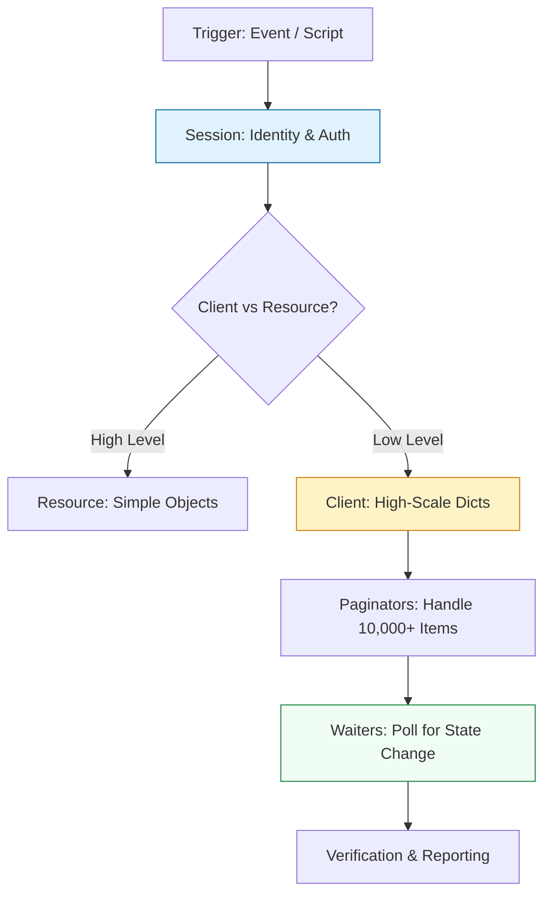

# ☁️ Cloud Automation: Boto3 Deep Dive

> **"If you are clicking buttons in the AWS Console, you are a guest. If you are using Boto3, you are the architect."**

Welcome to the **Boto3 Mastery** module. Boto3 is the official AWS SDK for Python and the heartbeat of modern Cloud Engineering. Whether you are building self-healing infrastructure, auditing security drift, or managing multi-region server fleets, Boto3 is the tool that transforms Python code into cloud actions.

**Why This Matters for Junior DevOps Engineers:**
- 🚨 **Scale**: You cannot manually restart 5,000 servers. You write a Boto3 script.
- 💰 **FinOps**: You will write scripts to find and delete unused resources (saving $$$).
- 🎯 **Interview**: "Write a python script to list all S3 buckets" is the Classic DevOps Question.
- 🔧 **Automation**: CI/CD pipelines use Boto3 to invalidate CloudFront and deploy Lambdas.

---

## 📚 Table of Contents

1. [The Cloud Automation Lifecycle](#-the-cloud-automation-lifecycle)
2. [Client vs Resource: The Great Debate](#-client-vs-resource-the-great-debate)
3. [Handling Scale: Paginators](#-handling-scale-paginators)
4. [Handling State: Waiters](#-handling-state-waiters)
5. [Real-World DevOps Scenarios](#-real-world-devops-scenarios)
6. [Security Best Practices](#-security-best-practices)
7. [Common Pitfalls & Solutions](#-common-pitfalls--solutions)
8. [Hands-On Exercises](#-hands-on-exercises)
9. [Interview Preparation](#-interview-preparation)
10. [Knowledge Check](#-knowledge-check)

---

## 🏗️ The Cloud Automation Lifecycle

Building for the cloud requires **State Awareness** and **Scalability**. We move beyond simple API calls to **Resource Paginators** and **State Waiters**.



### 🔍 Lifecycle Breakdown

**Stage 1: Authentication**
- **What**: Establishing Identity (Who are you?).
- **Why**: AWS is Zero Trust.
- **How**: `boto3.Session(profile_name='prod')`.

**Stage 2: Connection**
- **What**: Creating a Client or Resource.
- **Why**: To access specific service APIs (S3, EC2).
- **How**: `s3 = session.client('s3')`.

**Stage 3: Operation (Pagination)**
- **What**: Iterating through massive lists of resources.
- **Why**: APIs limit results (e.g., S3 returns max 1000 items).
- **How**: `paginator = client.get_paginator('list_objects_v2')`.

**Stage 4: Synchronization (Waiters)**
- **What**: Blocking until an operation completes.
- **Why**: Cloud actions are asynchronous (VM start takes time).
- **How**: `waiter.wait(InstanceIds=[id])`.

---

## ⚔️ Client vs Resource: The Great Debate

Boto3 has two interfaces. Knowing which to use is critical.

### 1. The Client (Low-Level)
Maps 1:1 with the AWS HTTP API. Returns **Dictionaries**.
- **Pros**: 100% Service Coverage, Fast, Supports Paginators/Waiters.
- **Cons**: Verbose, ugly JSON parsing.
- **Use Case**: production scripts, Lambda functions, high performance.

```python
# Client Style
s3 = boto3.client('s3')
response = s3.list_buckets()
for bucket in response['Buckets']:
    print(bucket['Name'])
```

### 2. The Resource (High-Level)
Object-Oriented abstraction. Returns **Python Objects**.
- **Pros**: Clean code, Pythonic (`bucket.delete()`).
- **Cons**: Slower, doesn't support all new features, hides complexity.
- **Use Case**: Quick ad-hoc scripts, interactive shell.

```python
# Resource Style
s3 = boto3.resource('s3')
for bucket in s3.buckets.all():
    print(bucket.name)
```

**Verdict**: As a DevOps Engineer, **Master the Client**. It is the standard for robust automation.

---

## 📈 Handling Scale: Paginators

### The "1,000 Item" Trap
Most AWS `list_` APIs return a maximum of 1,000 items. If you have 2,000 files and don't paginate, your script is **SILENTLY BROKEN**.

**The Wrong Way**:
```python
# ❌ DANGEROUS: Only gets first 1000 items
resp = s3.list_objects_v2(Bucket='my-data')
print(len(resp['Contents'])) # Prints 1000, even if 500k exist!
```

**The Right Way (Paginators)**:
```python
# ✅ ROBUST: Gets EVERYTHING
paginator = s3.get_paginator('list_objects_v2')
page_iterator = paginator.paginate(Bucket='my-data')

total_files = 0
for page in page_iterator:
    if 'Contents' in page:
        total_files += len(page['Contents'])
        for obj in page['Contents']:
            print(obj['Key'])
```

---

## ⏳ Handling State: Waiters

Cloud operations take time. You cannot start an instance and immediately try to SSH into it.

**The Wrong Way**:
```python
# ❌ FLAKY: Guessing time
ec2.start_instances(InstanceIds=[id])
time.sleep(30) # Maybe it's ready? Maybe not.
```

**The Right Way (Waiters)**:
```python
# ✅ ROBUST: Polling status
ec2.start_instances(InstanceIds=[id])
waiter = ec2.get_waiter('instance_running')

print("Waiting for instance...")
waiter.wait(InstanceIds=[id]) # Blocks until strictly ready
print("Instance Running!")
```

---

## 🎭 Real-World DevOps Scenarios

### 🛡️ Scenario 1: The "Orphaned Snapshot" Cleanup

**The Incident:** AWS Bill jumped by $5k. Analysis showed 10,000 EBS snapshots accumulating for years.

**The Task:** Delete all snapshots older than 30 days.

**The Solution:**
```python
import boto3
from datetime import datetime, timezone, timedelta

def clean_snapshots():
    ec2 = boto3.client('ec2')
    cutoff = datetime.now(timezone.utc) - timedelta(days=30)
    
    # 1. Use Paginator for scale
    paginator = ec2.get_paginator('describe_snapshots')
    
    for page in paginator.paginate(OwnerIds=['self']):
        for snap in page['Snapshots']:
            # 2. Check Age
            if snap['StartTime'] < cutoff:
                try:
                    print(f"Deleting {snap['SnapshotId']}...")
                    ec2.delete_snapshot(SnapshotId=snap['SnapshotId'])
                except Exception as e:
                    print(f"Skipping {snap['SnapshotId']}: {e}")

# This script safely saved $5k/month
```

### 🔥 Scenario 2: The Multi-Region Deployment

**The Challenge:** You need to enable a security rule on Security Groups across ALL 20 AWS regions.

**The Solution:** Iterate regions dynamically.

```python
ec2 = boto3.client('ec2', region_name='us-east-1')
# Get all active regions
regions = [r['RegionName'] for r in ec2.describe_regions()['Regions']]

for region in regions:
    print(f"Processing {region}...")
    regional_client = boto3.client('ec2', region_name=region)
    # Apply logic...
```

---

## 🔒 Security Best Practices

### 1. Credentials Management
**Never** hardcode keys. Boto3 looks for credentials in this order:
1. Environment Variables (`AWS_ACCESS_KEY_ID`)
2. Configuration Files (`~/.aws/credentials`)
3. IAM Roles (EC2/Lambda) - **Preferred for Production**

### 2. Session Token Handling
When using MFA (Multi-Factor Auth), you must create a session with the temporary token.

```python
# ✅ Using Temporary Credentials
session = boto3.Session(
    aws_access_key_id='...',
    aws_secret_access_key='...',
    aws_session_token='...' # Critical for MFA/Roles
)
```

---

## ⚠️ Common Pitfalls & Solutions

### Pitfall 1: Clock Skew Errors
**Symptom**: "SignatureDoesNotMatch" error on a valid key.
**Cause**: The VM's system time is drifted >5 mins from AWS time.
**Fix**: Install `chrony` or `ntp` on the server to sync time.

### Pitfall 2: Throttling (Rate Limit)
**Symptom**: `RequestLimitExceeded` error.
**Solution**: Boto3 has built-in retries, but for massive scale, configure `Config`:

```python
from botocore.config import Config

# Retry up to 10 times with exponential backoff
my_config = Config(
    retries = {
        'max_attempts': 10,
        'mode': 'standard'
    }
)
s3 = boto3.client('s3', config=my_config)
```

---

## 🎯 Hands-On Exercises

### Exercise 1: S3 Bucket Auditor
**Objective**: List all S3 buckets and flag any that are **publicly accessible**.

**Starter Code**:
```python
import boto3

def audit_buckets():
    s3 = boto3.client('s3')
    # TODO: List buckets
    # TODO: For each bucket, call get_public_access_block()
    # TODO: Report if BlockPublicAcls is False
    pass
```

### Exercise 2: Instance Tagger
**Objective**: Find all EC2 instances without a "Owner" tag and stop them.

**Idea**:
1. Paginate `describe_instances`.
2. Check `Tags` list.
3. If "Owner" missing -> Collect ID.
4. `stop_instances(InstanceIds=list)`.

---

## 🎙️ Interview Preparation

### Foundation Questions

**1. "What is the difference between a Client and a Resource?"**
- **Answer**: Client is a low-level 1:1 API mapping (Dicts). Resource is a high-level OO abstraction (Objects). Client is preferred for performance and coverage.

**2. "How does Boto3 find credentials?"**
- **Answer**: It checks (in order): Env Vars, Config Files (~/.aws), and finally the IAM Role of the instance (Metadata Service).

**3. "Why use a Waiter?"**
- **Answer**: To block execution until a resource reaches a stable state (e.g. `instance_running`), avoiding race conditions without hardcoded sleeps.

### Advanced Scenario Questions

**4. "How do you securely give a script access to S3 without using keys?"**
- **Answer**: Attach an **IAM Role** to the EC2 instance or Lambda function. Boto3 automatically retrieves the temporary credentials from the metadata service. Zero key management required.

---

## 🧠 Knowledge Check

**1. Which Boto3 concept handles lists larger than 1,000 items?**
- [ ] Waiter
- [x] Paginator
- [ ] Collection

**2. Which is the preferred authentication method for EC2?**
- [ ] Hardcoded Keys
- [ ] .env file
- [x] IAM Role

**3. What does `client.list_buckets()` return?**
- [ ] List of strings
- [x] Dictionary with 'Buckets' key
- [ ] Bucket Objects

---

## 🎓 Self-Assessment Checklist

Before moving to the next module, ensure you can:
- [ ] Create a Boto3 Session and Client
- [ ] Use Paginators for S3/EC2 lists
- [ ] Use Waiters for resource state changes
- [ ] Explain why IAM Roles are safer than Keys
- [ ] Check for Tags on resources

**Score yourself**: 5+/5 = Ready to advance | <5 = Review exercises

[⬅️ Back to API Mastery](../04-API-Mastery-with-Requests/README.md) | [Next: Serverless Lambda](../06-Serverless-Boto3-Lambda/README.md) ➡️