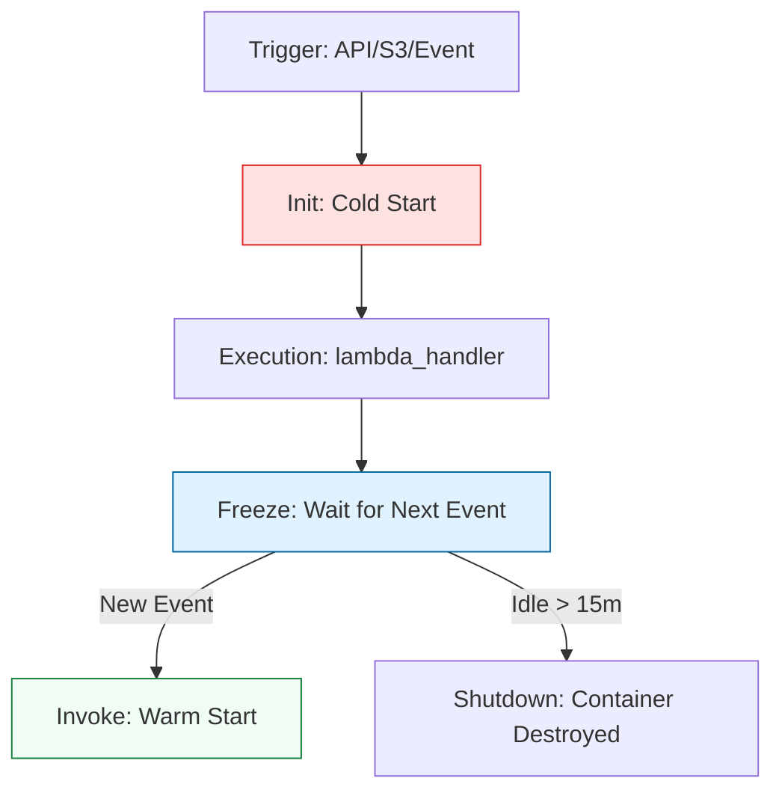

# 🏗️ Lambda Foundations: The Anatomy of a Cloud Function

> **"Architecture is often about what you leave out. In Serverless, you leave out the server management, the patching, and the idle costs. You are left with pure logic and raw event-driven power."**

Welcome to the **Foundations of AWS Lambda**. In this module, we move from "scripts that run on servers" to "functions that run in the cloud." You will master the anatomy of the Lambda handler, the execution lifecycle, and the critical design patterns that ensure your code is fast, stateless, and reliable.

---

## 📚 Table of Contents

1. [The Serverless Lifecycle](#-the-serverless-lifecycle)
2. [Anatomy of a Handler: Event vs Context](#-anatomy-of-a-handler-event-vs-context)
3. [Global Scope vs Handler Scope](#-global-scope-vs-handler-scope)
4. [Real-World DevOps Scenarios](#-real-world-devops-scenarios)
5. [Professional Code Structure](#-professional-code-structure)
6. [Interview Preparation](#-interview-preparation)
7. [Knowledge Check](#-knowledge-check)

---

## 🏗️ The Serverless Lifecycle

Understanding how AWS executes your code is the difference between a functional script and a production-grade tool.



### 🔍 Lifecycle Breakdown

1.  **Initialization (The Cold Start)**: AWS downloads your code, initializes the runtime, and runs global code (outside the handler). This adds latency (100ms - 2s).
2.  **Invocation**: Your `lambda_handler` function is called with the specific event data.
3.  **Freezing**: After execution, the container is "paused." Global variables and `/tmp` storage persist.
4.  **Warm Start**: If a new event arrives quickly, AWS reuses the container, bypassing the "Init" phase. This is 100x faster.

---

## 🐍 Anatomy of a Handler: Event vs Context

Unlike standard Python scripts, Lambda functions must follow a strict signature.

```python
def lambda_handler(event, context):
    """
    event: A dictionary containing the trigger data (e.g., S3 bucket name).
    context: An object providing runtime information (e.g., time remaining).
    """
```

### 🎯 The "Event" Object
Think of the event as the **"Order Ticket"**. It tells the function exactly what to do.
- **S3 Trigger**: Contains bucket and key info.
- **API Gateway**: Contains HTTP methods, headers, and body.
- **CloudWatch Cron**: Contains the source and time.

### 🎯 The "Context" Object
Think of the context as the **"Kitchen Clock"**.
- **`get_remaining_time_in_millis()`**: Critical for stopping your logic gracefully before AWS kills the function.
- **`function_name`**: Useful for logging and identifying which environment is running.

---

## 🌍 Global Scope vs Handler Scope (The Efficiency Bar)

A hallmark of a Staff Engineer is **Global Scope Management**. By moving client initialization outside the handler, you save time and money.

### ❌ The Junior Pattern (Slow)
```python
import boto3

def lambda_handler(event, context):
    s3 = boto3.client('s3') # Re-initialized on EVERY call!
    # ... logic ...
```

### ✅ The Staff Pattern (Optimized)
```python
import boto3

# Global Scope: Initialized once per Cold Start
s3 = boto3.client('s3')

def lambda_handler(event, context):
    # s3 is reused across Warm Starts!
    # ... logic ...
```

---

## 🎭 Real-World DevOps Scenarios

### 🛡️ Scenario 1: The "Warm Start Confusion"
**The Incident**: A Lambda function used to clean up a temp folder was calculating the folder size incorrectly. 
**The Cause**: The developer initialized a `total_size = 0` variable in the global scope. Because of **Warm Starts**, the variable wasn't reset between calls, causing the size to accumulate over time.
**The Fix**: Moved mutable state variables inside the `lambda_handler`.
**The Lesson**: Only use Global Scope for **immutable clients** or **read-only constants**.

### 🔥 Scenario 2: The "Timeout Silent Failure"
**The Incident**: A file-processing Lambda was timing out at exactly 3.0 seconds, leaving half-processed data in S3.
**The Cause**: Default Lambda timeout is 3 seconds. The file grew larger than the original test cases.
**The Fix**: Increased timeout to 60 seconds and implemented a check using `context.get_remaining_time_in_millis()` to log a warning when 90% of time was used.

---

## 🎙️ Interview Preparation

### Foundation Questions

**1. "What is a Cold Start, and how do you minimize its impact?"**
- **Answer**: It's the initialization latency when a new container is started. You minimize it by: 1. Moving heavy imports/clients to global scope. 2. Minimizing the size of your deployment package (.zip). 3. Increasing memory (which increases CPU speed).

**2. "Can a Lambda function maintain a state between two calls?"**
- **Answer**: Yes, but it is **not guaranteed**. Global variables and the `/tmp` directory persist during Warm Starts, but your logic must be **Stateless** because you never know when AWS will destroy the container and start a fresh Cold Start.

---

## 🧠 Knowledge Check

1. **Which directory is writable in the Lambda runtime?**
   - [ ] `/var/task`
   - [ ] `/usr/bin`
   - [x] `/tmp` (up to 10GB capacity)

2. **True or False: Increasing Lambda Memory also increases its CPU power.**
   - [x] True (AWS scales CPU proportionally with allocated memory).

3. **What happens to global variables between Cold Starts?**
   - [x] They are reset/initialized fresh.
   - [ ] They are preserved in a database.

---
**Status**: ✅ Staff-Enhanced (2026-02-03)
