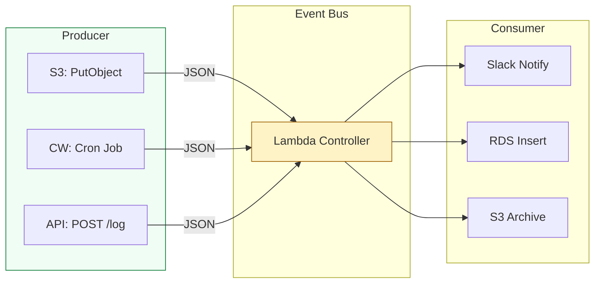

# ⚡ Event Architecture: Reactive Cloud Design

> **"In the world of Serverless, your code is a reactant. It waits for the spark of an event to trigger a chain reaction. Mastery of Events is the transition from 'running scripts' to 'orchestrating systems'."**

Welcome to **Event-Driven Architecture (EDA)**. In this module, we explore the "Reactive" side of DevOps. You will learn how to build systems that respond automatically to file uploads, database changes, and scheduled maintenance windows. We focus on the JSON structure of different event sources and how to build **Idempotent** logic that survives duplicate triggers.

---

## 📚 Table of Contents

1. [The Reactive Mindset](#-the-reactive-mindset)
2. [Decoding JSON Triggers (S3, SNS, EventBridge)](#-decoding-json-triggers-s3-sns-eventbridge)
3. [Idempotency: The #1 Rule of Events](#-idempotency-the-1-rule-of-events)
4. [The "Sourcing" Disaster: Real-World Scenarios](#-the-sourcing-disaster-real-world-scenarios)
5. [Interview Preparation](#-interview-preparation)
6. [Knowledge Check](#-knowledge-check)

---

## 🏗️ The Reactive Mindset

In traditional architecture, you "Poll" for changes. In Serverless, you are "Pushed" data.



---

## 🔍 Decoding JSON Triggers

Every AWS service sends a different "Flavor" of JSON. Your handler must be a professional at parsing these structures.

### 1. S3 Event (The Batch Record)
**Key Insight**: S3 events always arrive as a **List** (`Records`), even if only one file was uploaded.
```python
# Extracting the target file
bucket = event['Records'][0]['s3']['bucket']['name']
key = event['Records'][0]['s3']['object']['key']
```

### 2. EventBridge (The Structured Alert)
Used for scheduled maintenance or security alerts.
```python
# EventBridge structure
source = event['source'] # e.g. "aws.ec2"
detail_type = event['detail-type'] # e.g. "EC2 Instance State-change Notification"
```

---

## 🛡️ Idempotency: The #1 Rule of Events

AWS Lambda guarantees **At-Least-Once Delivery**. This means, on rare occasions, your function may be triggered twice for the same file upload or event.

### The Question: What happens if your bill-payment script runs twice?
- **Non-Idempotent**: The customer pays double. ❌
- **Idempotent**: The script checks if the payment ID already exists in the database and skips the second execution. ✅

### 🛠️ The Idempotency Pattern
```python
def lambda_handler(event, context):
    request_id = event['Records'][0]['messageId']
    
    # 1. Check if we've already done this
    if db.check_if_processed(request_id):
        return "Already processed. Skipping."
    
    # 2. Perform logic...
```

---

## 🎭 Real-World DevOps Scenarios

### 🛡️ Scenario 1: The "Recursive Loop" Bill Shock
**The Incident**: A developer created a Lambda to watermark images. The trigger was "All Object Creates" on `bucket-A`. The Lambda saved the watermarked image **back to `bucket-A`**.
**The Crisis**: An infinite loop started. One upload triggered 10,000 executions in minutes, costing $2,000 before it was shut down.
**The Fix**: Implemented a "Pre-processor" check or used two separate buckets (Input vs. Output).
**The Lesson**: Never trigger a function from the same action it performs (Recursive Trigger).

### 🔥 Scenario 2: The "Overloaded Downstream"
**The Incident**: A Lambda was triggered by an S3 upload to process 5,000 user records and insert them into a small RDS database.
**The Failure**: When 100 files were uploaded at once, 100 Lambdas fired, opening 100 DB connections and crashing the RDS instance.
**The Fix**: Introduced **SQS (Simple Queue Service)** between S3 and Lambda to "smooth out" the traffic spikes.

---

## 🎙️ Interview Preparation

### Foundation Questions

**1. "How do you ensure a script doesn't process the same S3 file twice if AWS sends a duplicate trigger?"**
- **Answer**: I implement **Idempotency**. I would store the S3 `object_key` or the Lambda `request_id` in a database (like DynamoDB). If the script runs again and the ID is already present, it exits gracefully without re-performing the action.

**2. "What is an 'Event Source' in Lambda?"**
- **Answer**: It is the AWS service that sends the JSON payload to trigger the function. Common sources include S3, SNS, SQS, API Gateway, and EventBridge (for scheduled tasks).

---

## 🧠 Knowledge Check

1. **Which property of the S3 JSON event contains the filename?**
   - [ ] `key`
   - [ ] `object.name`
   - [x] `Records[0]['s3']['object']['key']`

2. **Waiters are to Boto3 what _____ are to Lambda.**
   - [ ] Clients.
   - [x] Triggers (or Event Sources).
   - [ ] Sessions.

3. **What is 'At-Least-Once Delivery'?**
   - [x] A guarantee that an event will be delivered one or more times, requiring your code to handle duplicates.

---
**Status**: ✅ Staff-Enhanced (2026-02-03)
