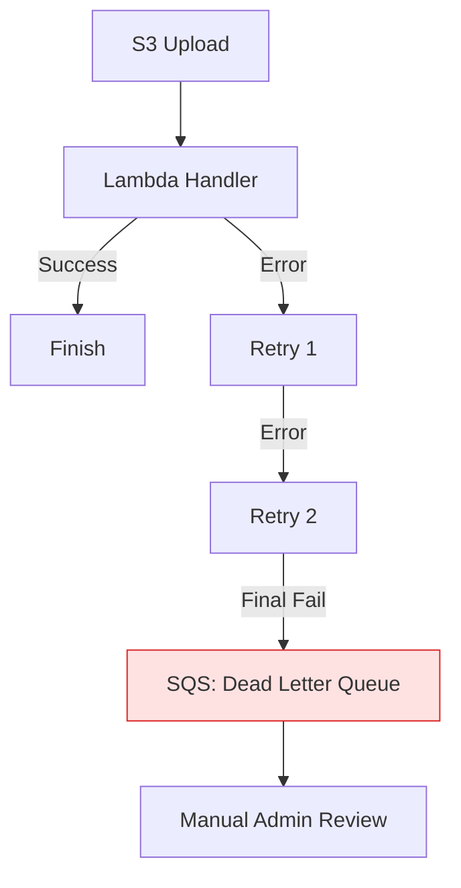

# 🏆 Production Reliability: Deployment & Compliance

> **"A Lambda function is only as safe as its IAM role and only as reliable as its error handling. Production-grade Serverless requires transitioning from 'writing handlers' to 'governing environments'."**

Welcome to the **Endgame of Serverless Mastery**. In this module, we focus on the "Day 2" operations of AWS Lambda. You will learn how to secure your functions with **Minimal IAM Roles**, manage multi-version dependencies with **Layers**, and navigate complex network topologies with **Lambda in VPC**. We also explore the critical "Staff Level" patterns for error handling and dead-letter queues.

---

## 📚 Table of Contents

1. [Securing Identity: The Execution Role](#-securing-identity-the-execution-role)
2. [Managing Complexity: Lambda Layers](#-managing-complexity-lambda-layers)
3. [Networking: Lambda in a VPC](#-networking-lambda-in-a-vpc)
4. [Resilience: Retries & Dead Letter Queues (DLQ)](#-resilience-retries--dead-letter-queues-dlq)
5. [Real-World DevOps Scenarios](#-real-world-devops-scenarios)
6. [Interview Preparation (Staff Level)](#-interview-preparation-staff-level)
7. [Knowledge Check](#-knowledge-check)

---

## 🔐 Securing Identity: The Execution Role

In production, your Lambda function MUST NOT have administrative access.

### The Staff Standard: Least Privilege
- **No**: Giving `S3:*` to your function.
- **Yes**: Giving `s3:GetObject` on `arn:aws:s3:::my-prod-bucket/*` ONLY.

```python
# Check your permissions programmatically
import boto3
sts = boto3.client('sts')
print(sts.get_caller_identity()) # Verify the ROLE name, not a USER
```

---

## 📦 Managing Complexity: Lambda Layers

Standard Python scripts use `pip install`. Lambda handles dependencies using **Layers**. A Layer is a separate .zip file containing your third-party libraries (like `requests` or `pandas`).

### Why use Layers?
1. **Reduce Deployment Size**: Your function code stays tiny (KBs), while libraries sit in the Layer (MBs).
2. **Reusability**: One Layer can be shared across 50 different Lambda functions.
3. **Consistency**: Ensure the same version of `boto3` or `requests` is used across the entire company.

---

## 🌐 Networking: Lambda in a VPC

By default, Lambda runs in an AWS-managed network. If your function needs to talk to a private RDS database or a local data center via VPN, you must put it **inside your VPC**.

### The Staff Choice: NAT Gateways
When a Lambda is in a private VPC subnet, it **loses its ability to talk to the Public Internet**. To reach S3 or an external API from a VPC-Lambda, you must implement a **NAT Gateway** or **VPC Endpoints**.

---

## 🛡️ Resilience: Retries & Dead Letter Queues (DLQ)

What happens if your Lambda fails?
1. **Synchronous (API Gateway)**: Returns an error immediately to the user.
2. **Asynchronous (S3/EventBridge)**: AWS retries the function **twice**.

### 🛠️ The Staff Pattern: DLQ
If all retries fail, the event is lost. To prevent data loss, we configure a **Dead Letter Queue (SQS)**. Failed events are sent to this queue for manual investigation.



---

## 🎭 Real-World DevOps Scenarios

### 🛡️ Scenario 1: The "VPC Outbound" Crisis
**The Incident**: A developer moved a Lambda into a VPC to access a SQL database. Immediately, the Lambda stopped being able to send Slack notifications.
**The Cause**: Private VPC subnets don't have internet access. The Slack API call failed.
**The Fix**: Implemented a **NAT Gateway** to provide the VPC subnets with outbound internet access.
**The Lesson**: Lambda networking is "Opt-In" for different perimeters.

### 🔥 Scenario 2: The "Version Drift" Disaster
**The Incident**: A critical security script worked in the Test account but failed in Production.
**The Cause**: The developer's machine had `requests v2.30`, but the Production Lambda was using an old `requests v2.0` layer.
**The Fix**: Standardized all environments using a shared **Lambda Layer** versioned in CI/CD.

---

## 🎙️ Interview Preparation (Staff Level)

### Advanced Scenario Questions

**1. "How do you handle secrets (like database passwords) in a Lambda function?"**
- **Answer**: I use **AWS Secrets Manager** or **Systems Manager Parameter Store (SSM)**. I never use environment variables for raw secrets. I initialize the Secrets client in the global scope and fetch the secret during the Cold Start.

**2. "Explain why you might NOT want a Lambda in a VPC unless necessary."**
- **Answer**: VPC initialization adds "Cold Start" latency (though this has improved with AWS Hyperplane). More importantly, VPC-Lambda requires meticulous networking management (NAT Gateways, Security Groups) and can consume private IP addresses in your subnet. If the function only talks to Public AWS APIs, avoid the VPC.

---

## 🧠 Knowledge Check

1. **How many retries does AWS perform for Asynchronous Lambda errors by default?**
   - [ ] 0.
   - [ ] 1.
   - [x] 2.

2. **Which tool is used to share Python libraries across multiple functions?**
   - [ ] venv.
   - [x] Lambda Layers.
   - [ ] Docker Compose.

3. **True or False: A Lambda in a private VPC subnet can talk to the public internet by default.**
   - [ ] True.
   - [x] False (Needs a NAT Gateway or similar).

---
**Status**: 🏆 Staff-Enhanced (2026-02-03)
