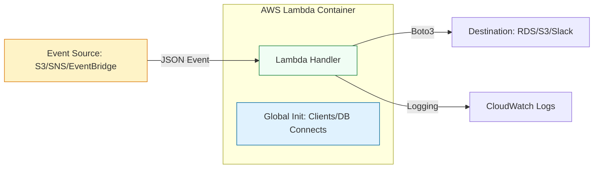

# ⚡ Serverless Projects: Python & AWS Lambda

> **"Infrastructure is a cost. Servers are a burden. Code should only exist when it's solving a problem. That is the philosophy of Serverless."**

Welcome to the **Serverless Automation** module. In modern DevOps, we move away from "Management Servers" toward event-driven logic. AWS Lambda allows your Python code to react instantly to system events—a file upload, a cloudtrail alert, or a scheduled cron—without a single server to patch.

**Why This Matters for Junior DevOps Engineers:**
- 🚨 **Ops Burden**: Why patch an EC2 server just to run a cron job once a day?
- 💰 **Cost**: Lambda is free for the first 400,000 seconds/month. EC2 costs money even when idle.
- 🎯 **Scalability**: Lambda scales from 0 to 1,000 concurrent executions instantly.
- 🔧 **Modern Architectures**: "Gluing" services together (e.g., S3 -> Lambda -> DynamoDB) is the standard patterns.

---

## 📚 Table of Contents

1. [The Serverless Lifecycle](#-the-serverless-lifecycle)
2. [Anatomy of a Lambda Function](#-anatomy-of-a-lambda-function)
3. [Event Sources & Triggers](#-event-sources--triggers)
4. [Advanced Patterns (Layers & VPCs)](#-advanced-patterns-layers--vpcs)
5. [Real-World DevOps Scenarios](#-real-world-devops-scenarios)
6. [Security Best Practices](#-security-best-practices)
7. [Common Pitfalls & Solutions](#-common-pitfalls--solutions)
8. [Hands-On Exercises](#-hands-on-exercises)
9. [Interview Preparation](#-interview-preparation)
10. [Knowledge Check](#-knowledge-check)

---

## 🏗️ The Serverless Lifecycle

Serverless engineering is about building **Reactive Systems**. We focus on the "Gold Standard" of Lambda design: The Stateless Handler.



### 🔍 Lifecycle Breakdown

**Stage 1: Initialization (Cold Start)**
- **What**: AWS downloads your code and starts the container.
- **When**: The first time a request comes in (or after ~15 mins idle).
- **Optimization**: Move imports and client creation OUTSIDE the handler.

**Stage 2: Invocation (Warm Start)**
- **What**: AWS reuses the frozen container for the next event.
- **Why**: 100x faster than Cold Start.
- **Note**: Global variables persist!

**Stage 3: Shutdown**
- **What**: Container is destroyed.
- **Risk**: Any data saved to `/tmp` or global variables is LOST.

---

## 🐍 Anatomy of a Lambda Function

### The `lambda_handler`
This is your entry point. It must accept two arguments: `event` and `context`.

```python
import json
import logging

logger = logging.getLogger()
logger.setLevel(logging.INFO)

def lambda_handler(event, context):
    """
    event: Dictionary containing the JSON payload from the trigger.
    context: Object containing runtime info (memory limit, time remaining).
    """
    logger.info(f"Received event: {json.dumps(event)}")
    
    # Logic goes here
    
    return {
        'statusCode': 200,
        'body': json.dumps('Hello from Lambda!')
    }
```

### The Best Practice Structure
Separate your "Business Logic" from your "Handler Logic". This makes code testable locally.

```python
import boto3

# Global Scope: Runs once per Cold Start
s3 = boto3.client('s3')

def process_file(bucket, key):
    """Pure logic, easy to test locally."""
    print(f"I am processing {bucket}/{key}")

def lambda_handler(event, context):
    """AWS Interface, parses event."""
    # Extract data from S3 Event structure
    bucket = event['Records'][0]['s3']['bucket']['name']
    key = event['Records'][0]['s3']['object']['key']
    
    process_file(bucket, key)
```

---

## ⚡ Event Sources & Triggers

Lambdas don't run in a vacuum. They are triggered by JSON payloads from other services.

### 1. S3 Event (File Upload)
```json
{
  "Records": [
    {
      "s3": {
        "bucket": { "name": "my-bucket" },
        "object": { "key": "images/cat.jpg" }
      }
    }
  ]
}
```

### 2. EventBridge (Scheduled Cron)
```json
{
  "source": "aws.events",
  "detail-type": "Scheduled Event"
}
```

### 3. API Gateway (Web Request)
```json
{
  "httpMethod": "POST",
  "body": "{\"username\": \"gsmash\"}",
  "headers": { "Content-Type": "application/json" }
}
```

---

## 🎭 Real-World DevOps Scenarios

### 🛡️ Scenario 1: The "Recursive Loop" Bill Shock

**The Incident:** An engineer created a Lambda to watermark images. The trigger was "All Object Creates" on `bucket-A`. The Lambda saved the watermarked image **back to `bucket-A`**.

**The Failure:** 
1. User uploads `img.jpg`.
2. Lambda fires, saves `img-watermarked.jpg`.
3. S3 sees new file, Lambda fires again.
4. Lambda saves `img-watermarked-watermarked.jpg`.
5. Infinite Loop. 💸

**The Impact:** $5,000 bill in 2 hours. S3 throttling.

**The Fix:**
1. **Validation**: Check if filename starts with `watermarked-`.
2. **Architecture**: Separate Source Bucket and Destination Bucket.

```python
# ✅ Guard Clause
key = event['Records'][0]['s3']['object']['key']
if key.startswith("processed/"):
    print("Skipping already processed file.")
    return
```

### 🔥 Scenario 2: The Database Connection Exhaustion

**The Incident:** A Lambda connected to RDS MySQL to log user activity. It was triggered by API Gateway (high traffic). code:
```python
def handler(event, context):
    conn = mysql.connect(...) # Inside handler!
    conn.cursor().execute(...)
```

**The Failure:** Traffic spiked to 1,000 concurrent updates. Lambda opened 1,000 separate DB connections. RDS ran out of connections and crashed.

**The Fix:** Move connection logic to **Global Scope** (Warm Start) or use **RDS Proxy**.

```python
# ✅ Global Scope Reuse
conn = None

def get_db_connection():
    global conn
    if not conn:
        conn = mysql.connect(...)
    return conn

def handler(event, context):
    c = get_db_connection() # Reuses connection across invocations
```

---

## ⚠️ Common Pitfalls & Solutions

### Pitfall 1: Timing Out
**Default timeout is 3 seconds**. If your task takes 10s (e.g. video processing), it will fail silently.
**Fix**: Increase timeout to max 15 mins (900s).

### Pitfall 2: Memory OOM
**Default memory is 128MB**. Processing a large CSV with Pandas will crash.
**Fix**: Increase memory (up to 10GB). Note: CPU scales with memory!

### Pitfall 3: "Where is my file?"
Lambda has a Read-Only filesystem, EXCEPT for `/tmp`.
**Fix**: Only write to `/tmp` (512MB-10GB space).
```python
# ✅ Correct
with open('/tmp/downloaded_file.txt', 'w') as f:
    f.write(data)
```

---

## 🔒 Security Best Practices

### 1. Minimal IAM Roles
The #1 security risk in Serverless.
**Bad**: Giving `S3:*` or `AdministratorAccess` to the Lambda Execution Role.
**Good**: `s3:GetObject` on `bucket-A` ONLY.

### 2. Environment Variables
Never hardcode API Keys.
**Bad**: `API_KEY = "1234"` in code.
**Good**: Use Lambda Environment Variables (encrypted via KMS).
```python
import os
API_KEY = os.environ['API_KEY']
```

---

## 🎯 Hands-On Exercises

### Exercise 1: The "S3 Greeter"
**Objective**: Create a script that mimics a Lambda triggered by S3.
**Requirements**:
1. Define a sample S3 JSON event.
2. Write a `lambda_handler` that parses the bucket and key.
3. Print: "Processing file X from bucket Y".

**Starter Code**:
```python
def lambda_handler(event, context):
    # TODO: Print bucket and key
    pass

# Test locally
test_event = {
    "Records": [{"s3": {"bucket": {"name": "test-b"}, "object": {"key": "data.csv"}}}]
}
lambda_handler(test_event, None)
```

### Exercise 2: Stop EC2 Instances at Night
**Objective**: A function meant for EventBridge (Cron).
**Requirements**:
1. Initialize Boto3 EC2 client globally.
2. Filter for instances with tag `Env=Dev`.
3. Stop them.

---

## 🎙️ Interview Preparation

### Foundation Questions

**1. "What is a Cold Start?"**
- **Answer**: The latency (100ms - 2s) added when AWS initializes a new container environment for your function. Occurs on first request or scaling up.

**2. "How long can a Lambda run?"**
- **Answer**: Max 15 minutes. For longer tasks, use AWS Batch or Step Functions.

**3. "How do you handle dependencies (like Pandas)?"**
- **Answer**: 
    1. **Lambda Layers**: Zip libraries and attach them to functions (reusable).
    2. **Docker Images**: Deploy Lambda as a container image (up to 10GB).

### Advanced Scenario Questions

**4. "How do you ensure exactly-once processing?"**
- **Answer**: Lambda guarantees **At-Least-Once**. Retries can cause duplicates. Your code must be **Idempotent** (handling the same event twice results in the same outcome).
- *Example*: Use the `request_id` as a primary key in DynamoDB. If insert fails (key exists), you know it's a duplicate.

---

## 🧠 Knowledge Check

**1. Where should you initialize a database client?**
- [ ] Inside `lambda_handler`
- [x] In Global Scope (Outside handler)
- [ ] In `__init__.py`

**2. Which directory is writable in Lambda?**
- [ ] `/var/task`
- [ ] `/usr/bin`
- [x] `/tmp`

**3. What happens if an Async Lambda throws an error?**
- [ ] It stops.
- [x] AWS retries (2 times) then sends to Dead Letter Queue (DLQ).
- [ ] It emails you.

---

## 🎓 Self-Assessment Checklist

Before moving to the next module, ensure you can:
- [ ] Explain the difference between Cold and Warm starts.
- [ ] Parse an S3 Event JSON.
- [ ] Write a Boto3 function using Global Scope optimization.
- [ ] Use Environment Variables for config.
- [ ] Explain why Idempotency is critical.

**Score yourself**: 5+/5 = Ready for Architect role | <5 = Review exercises

[⬅️ Back to Boto3](../05-Cloud-Automation-Boto3-Deep-Dive/README.md) | [Next: Automating Tests](../07-Testing-Automation-with-Pytest/README.md) ➡️
