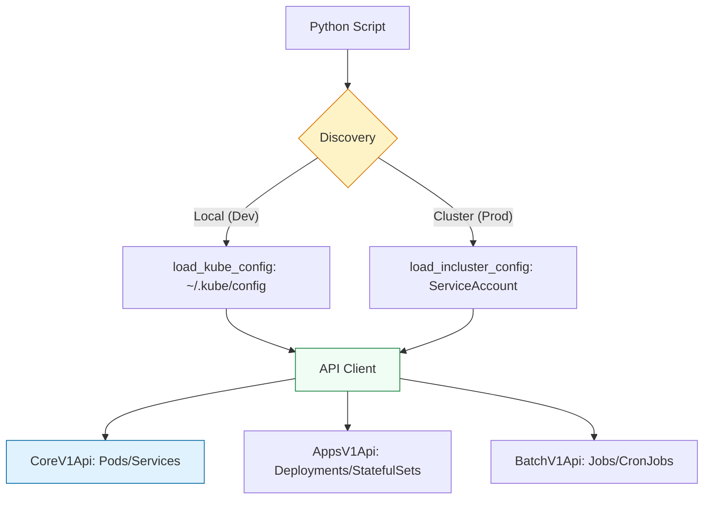

# 🎡 Orchestration: Docker & Kubernetes SDKs

> **"YAML is a static declaration of intent. Python is a dynamic execution of will. When your architecture needs to make decisions—wait for a DB, check a port, then scale—you need the SDK."**

Welcome to the **Container Orchestration** module. While YAML manifests (`kubectl apply -f`) are standard for deployment, Python is the "Brain" of the control plane. Using the official Docker and Kubernetes SDKs, you can build custom controllers, automated image pruners, and self-healing infrastructure that reacts to real-time cluster state.

**Why This Matters for Junior DevOps Engineers:**
- 🤖 **Custom Controllers**: "If a Pod fails 3 times, send a Slack message and scale down."
- ⚡ **CI/CD Plumbing**: Building scripts that wait for a "Deployment" to be ready before running E2E tests.
- 🎯 **Interview**: "How do you run a Python script *inside* a cluster that talks to the API server?"
- 🔧 **Automation**: Cleaning up evicted pods or "OOMKilled" artifacts automatically.

---

## 📚 Table of Contents

1. [Architecture: The Control Plane](#-architecture-the-control-plane)
2. [The Docker SDK (`docker-py`)](#-the-docker-sdk-docker-py)
3. [The Kubernetes SDK (`kubernetes`)](#-the-kubernetes-sdk-kubernetes)
4. [Real-World DevOps Scenarios](#-real-world-devops-scenarios)
5. [Security Best Practices](#-security-best-practices)
6. [Common Pitfalls & Solutions](#-common-pitfalls--solutions)
7. [Hands-On Exercises](#-hands-on-exercises)
8. [Interview Preparation](#-interview-preparation)
9. [Knowledge Check](#-knowledge-check)

---

## 🏗️ Architecture: The Control Plane

Scripts don't just "run commands". They talk to the API Server via REST-over-HTTP.



### 🔍 Concept Breakdown
1.  **Config**: Credentials to talk to the cluster.
2.  **Client**: The authenticated session.
3.  **API Groups**: K8s APIs are split (Core = Pods, Apps = Deployments, Batch = Jobs).

---

## 🐋 The Docker SDK (`docker-py`)

Excellent for local development automation and CI runners.

### Managing Containers
```python
import docker

client = docker.from_env()

# 🏃 Run a container (like `docker run`)
container = client.containers.run(
    "nginx:alpine",
    detach=True,
    ports={'80/tcp': 8080},
    name="my-python-nginx"
)

print(f"Started {container.short_id}: {container.status}")

# 🛑 Stop and Remove
container.stop()
container.remove()
```

---

## ☸️ The Kubernetes SDK (`kubernetes`)

The standard for production orchestration.

### Initializing the Client
You must handle both Dev (local) and Prod (cluster) environments.

```python
from kubernetes import client, config
import os

def get_k8s_client():
    if os.getenv('KUBERNETES_SERVICE_HOST'):
        # We are INSIDE the cluster
        config.load_incluster_config()
    else:
        # We are LOCAL (using kubectl context)
        config.load_kube_config()
        
    return client.CoreV1Api()
```

### Listing Pods
```python
v1 = get_k8s_client()
pods = v1.list_pod_for_all_namespaces(watch=False)

for pod in pods.items:
    print(f"{pod.metadata.namespace} / {pod.metadata.name} : {pod.status.phase}")
```

---

## 🎭 Real-World DevOps Scenarios

### 🛡️ Scenario 1: The "Zombie" Pod Reaper

**The Incident:** Pods in "Evicted" or "Failed" state were piling up (10,000+), slowing down the API server.
**The Fix:** A Python script running as a CronJob to delete non-running pods.

```python
def reap_zombies():
    v1 = get_k8s_client()
    # Field Selector allows server-side filtering (Efficient)
    pods = v1.list_pod_for_all_namespaces(
        field_selector='status.phase=Failed'
    )
    
    for pod in pods.items:
        logging.info(f"Reaping {pod.metadata.name}")
        v1.delete_namespaced_pod(
            name=pod.metadata.name,
            namespace=pod.metadata.namespace
        )
```

### 🔥 Scenario 2: The "Deployment Waiter"

**The Incident:** CI/CD pipeline ran tests immediately after `kubectl apply`. Tests failed because Pods were still "Pending".
**The Fix:** A script that **Watches** the deployment status until it matches `Ready`.

```python
from kubernetes import watch

def wait_for_ready(namespace='default'):
    v1 = get_k8s_client()
    w = watch.Watch()
    
    # Stream events instead of polling
    for event in w.stream(v1.list_namespaced_pod, namespace):
        pod = event['object']
        phase = pod.status.phase
        
        if phase == 'Running' and all(c.ready for c in pod.status.container_statuses):
            print(f"✅ {pod.metadata.name} is Ready!")
            w.stop() # Exit loop
```

### ☁️ Scenario 3: Triggering a Job from API

**The Task:** A web admin panel needs to trigger a heavy video processing task.
**Solution:** Use Python BatchV1Api to create a K8s Job on demand.
- Web App -> Python -> K8s API -> Job Pod.

---

## 🔒 Security Best Practices

### 1. RBAC (Role Based Access Control)
Your script runs as a **ServiceAccount**.
- **Bad**: Giving that ServiceAccount `cluster-admin`.
- **Good**: `Role` allowing only `get`, `list`, `delete` on `pods` in `default` namespace.

### 2. Secrets Management
Never hardcode tokens.
- **In-Cluster**: `load_incluster_config()` handles token rotation automatically (mounted at `/var/run/secrets/...`).
- **Local**: `load_kube_config()` relies on your user context.

---

## ⚠️ Common Pitfalls

### Pitfall 1: Resource Leaks (Watches)
**Issue**: Using `watch.stream()` without a timeout or stop condition.
**Impact**: Script hangs forever if the condition is never met.
**Fix**: Always implement a `timeout_seconds` in the Watch or a counter.

### Pitfall 2: Too Many API Calls
**Issue**: `while True: list_pods()`
**Impact**: Throttling by API Server (429 Too Many Requests).
**Fix**: Use **Informers** or **Watches** (Event-driven), not Polling.

---

## 🎯 Hands-On Exercises

### Exercise 1: The Hello World Runner (Docker)
**Objective**: Start a container, verify it's running, print logs, then kill it.
**Requirements**:
1. Use `docker.from_env()`.
2. Run `hello-world`.
3. Capture logs.

### Exercise 2: The Namespace Auditor (K8s)
**Objective**: List all namespaces and count pods in each.
**Requirements**:
1. Use `CoreV1Api`.
2. Iterate Namespaces.
3. Filter Pods by Namespace via `list_namespaced_pod`.

---

## 🎙️ Interview Preparation

### Foundation Questions

**1. "What is `manifest` vs `imperative`?"**
- **Answer**: `manifest` (YAML) declares "I want 3 replicas". `imperative` (Python/CLI) says "Scale to 3 now". Controllers bridge the gap.

**2. "How do you Authenticate locally vs in-cluster?"**
- **Answer**: Locally uses `~/.kube/config`. In-cluster uses the ServiceAccount Token mounted at `/var/run/secrets/kubernetes.io/serviceaccount/token`.

### Advanced Scenario Questions

**3. "How would you implement a Custom Autoscaler using Python?"**
- **Answer**:
    1. Loop/Watch Metrics (e.g., from Prometheus or RabbitMQ Queue depth).
    2. Calc desired replicas.
    3. Use `AppsV1Api.patch_namespaced_deployment_scale()` to update the replica count.

---

## 🧠 Knowledge Check

**1. Which API object handles Pods?**
- [ ] `AppsV1Api`
- [x] `CoreV1Api`
- [ ] `BatchV1Api`

**2. How does `load_incluster_config()` authenticate?**
- [ ] SSH Keys
- [x] Service Account Token
- [ ] AWS IAM

**3. What is the preferred way to detect changes?**
- [ ] Polling (`while True`)
- [x] Watch (`stream()`)
- [ ] Rebooting

---

## 🎓 Self-Assessment Checklist

Before moving to the next module, ensure you can:
- [ ] Connect to Docker using Python.
- [ ] List K8s Pods using `CoreV1Api`.
- [ ] Explain the difference between `list` and `watch`.
- [ ] Describe how a Pod authenticates to the Master logic.

**Score yourself**: 5+/5 = Ready to advance | <5 = Review exercises

[⬅️ Back to DB Ops](../10-Database-Operations/README.md) | [Next: Web Scraping](../12-Web-Scraping-for-Monitoring/README.md) ➡️
