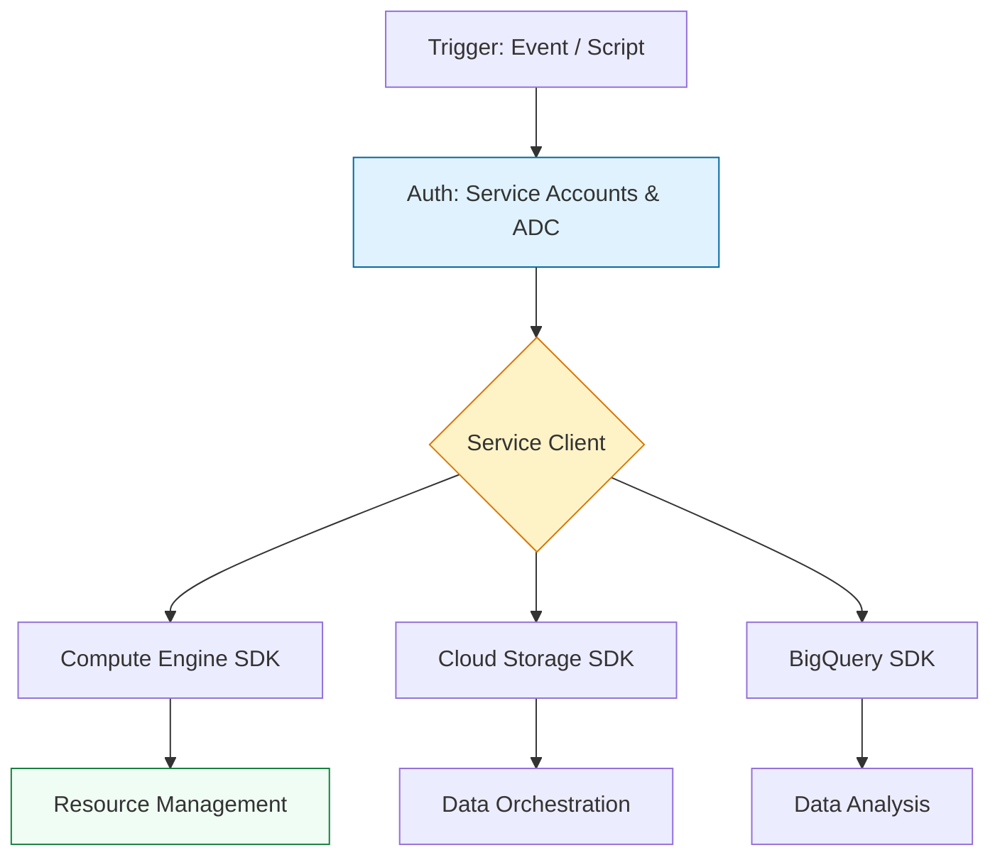

# ☁️ GCP Automation: Google Cloud SDK for Python

> **"In the Google Cloud ecosystem, automation isn't just about managing resources; it's about orchestrating a global, data-centric infrastructure. Mastering the `google-cloud-python` client libraries is the key to unlocking the power of BigQuery, GKE, and Compute Engine at scale."**

Welcome to the **GCP Python Automation** module. While AWS has Boto3, Google Cloud takes a more modular approach with specific client libraries for each service. This module will teach you how to navigate the Google Cloud SDK, handle service account authentication, and build resilient automation for the Google Cloud Platform (GCP).

---

## 🏗️ The GCP Automation Architecture

Google Cloud's Python SDK is built on high-performance gRPC and JSON APIs. Unlike the monolithic Boto3, GCP uses a "Module-per-Service" model.



---

## 🔐 Authentication: Application Default Credentials (ADC)

In GCP, identity management centers around Service Accounts. The SDK uses **Application Default Credentials (ADC)** to find credentials automatically.

### The Staff Standard: No Keys in Code
1. **Local Development**: Use `gcloud auth application-default login`.
2. **Production (GCE/GKE/Cloud Run)**: Use the Service Account attached to the resource. The SDK will automatically fetch tokens from the metadata server.

```python
from google.cloud import storage

# ✅ STAFF STANDARD: No explicit keys or JSON paths
# The client automatically finds credentials via ADC
storage_client = storage.Client()

buckets = list(storage_client.list_buckets())
for bucket in buckets:
    print(f"Bucket: {bucket.name}")
```

---

## 🚀 Key Service SDKs

### 1. Compute Engine (`google-cloud-compute`)
Managing VMs, Disks, and Snapshots.
```python
from google.cloud import compute_v1

client = compute_v1.InstancesClient()
project = "my-gcp-project"
zone = "us-central1-a"

def list_instances():
    instance_list = client.list(project=project, zone=zone)
    for instance in instance_list:
        print(f"Instance: {instance.name} - Status: {instance.status}")
```

### 2. Cloud Storage (`google-cloud-storage`)
The GCP equivalent of S3.
```python
bucket = storage_client.get_bucket("my-important-data")
blob = bucket.blob("report.pdf")
blob.upload_from_filename("local_report.pdf")
```

---

## 🎭 Real-World DevOps Scenarios

### 🛡️ Scenario 1: The "Zombie VM" Cleanup
**The Task**: Automatically terminate instances with a specific label (e.g., `temp=true`) that have been running for more than 24 hours.
**The Solution**: A Python script using `InstancesClient` to filter by labels and check `creation_timestamp`.

### 🔥 Scenario 2: Cross-Project Resource Audit
**The Task**: List all firewall rules across multiple projects to identify overly permissive `0.0.0.0/0` ingress rules.
**The Solution**: Iterating through a project list and using the `FirewallsClient` to audit security postures.

---

## 🎙️ Interview Preparation

**1. "What are Application Default Credentials (ADC)?"**
- **Answer**: ADC is a strategy used by the Google Cloud client libraries to automatically find credentials. It checks environment variables (`GOOGLE_APPLICATION_CREDENTIALS`), the `gcloud` CLI config, and finally the Metadata Server of the compute resource.

**2. "How does the GCP Python SDK handle long-running operations like creating a GKE cluster?"**
- **Answer**: Most GCP creation APIs return an `Operation` object. The SDK provides a `.result()` method on these objects that blocks until the operation is complete, similar to Boto3 Waiters but built into the response object itself.

---
**Status**: 🛠️ In Development (2026-02-03)
