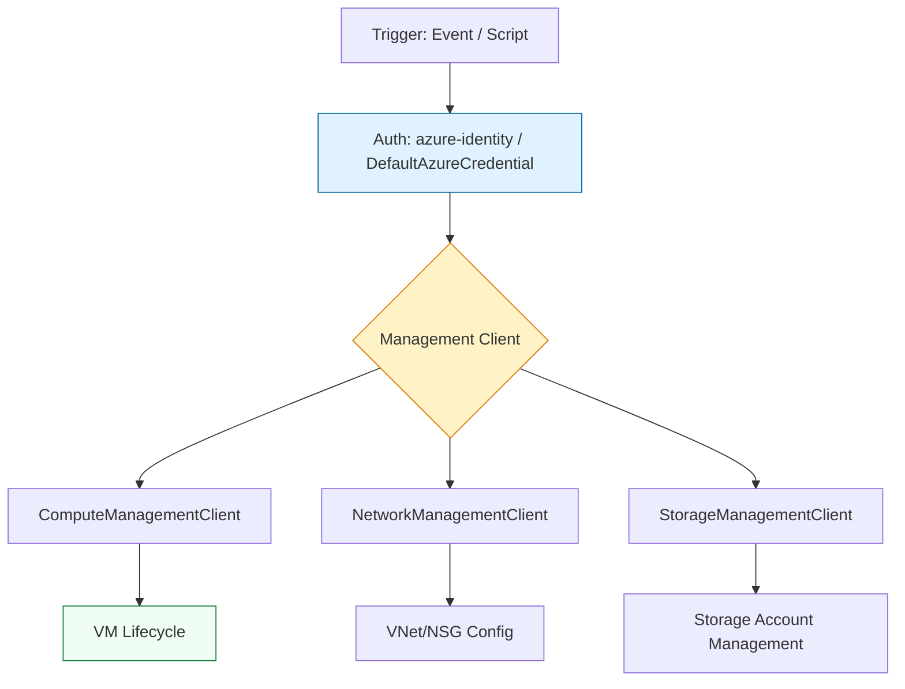

# ☁️ Azure Automation: Azure SDK for Python

> **"In the Azure world, automation is built on the foundation of Azure Resource Manager (ARM). The Azure SDK for Python provides a fluent, object-oriented way to manage everything from Virtual Machines to Azure Kubernetes Service (AKS), ensuring consistency across your hybrid cloud fleet."**

Welcome to the **Azure Python Automation** module. Azure's SDK is highly organized around the concept of **Management Clients** and **Credential Classes**. This module will teach you how to use the `azure-mgmt-*` libraries to orchestrate Azure resources, handle identity via `azure-identity`, and implement enterprise-grade automation patterns.

---

## 🏗️ The Azure SDK Architecture

Azure uses a modular SDK approach where each resource group type has its own management library.



---

## 🔐 Identity & Authentication

The `azure-identity` library is the modern standard for authenticating Python scripts with Azure.

### The Staff Standard: `DefaultAzureCredential`
This class provides a "zero-config" experience by trying multiple authentication methods in order:
1. Environment Variables (Service Principal)
2. Managed Identity (App Service, VM, AKS)
3. Azure CLI credentials (local development)

```python
from azure.identity import DefaultAzureCredential
from azure.mgmt.compute import ComputeManagementClient

# ✅ STAFF STANDARD: One credential class to rule them all
credential = DefaultAzureCredential()
subscription_id = "your-sub-id"

compute_client = ComputeManagementClient(credential, subscription_id)

for vm in compute_client.virtual_machines.list_all():
    print(f"VM: {vm.name} in {vm.location}")
```

---

## 🚀 Key Management Libraries

### 1. Compute (`azure-mgmt-compute`)
Managing Virtual Machines and Scale Sets.
```python
# Stopping a VM
async_stop = compute_client.virtual_machines.begin_power_off(
    resource_group_name="prod-rg",
    vm_name="web-srv-01"
)
async_stop.result() # Wait for completion
```

### 2. Resource (`azure-mgmt-resource`)
The backbone for managing Resource Groups and Deployments.
```python
from azure.mgmt.resource import ResourceManagementClient
resource_client = ResourceManagementClient(credential, subscription_id)

# Create a Resource Group
resource_client.resource_groups.create_or_update(
    "automation-rg",
    {"location": "eastus"}
)
```

---

## 🎭 Real-World DevOps Scenarios

### 🛡️ Scenario 1: The "Unmanaged Disk" Reaper
**The Task**: Find and delete all OS disks that are no longer attached to any Virtual Machine to save storage costs.
**The Solution**: Iterating through all disks and checking the `managed_by` property.

### 🔥 Scenario 2: Automated NSG Lockdown
**The Task**: Audit all Network Security Groups (NSGs) and automatically remove any rules that allow SSH (port 22) from the entire internet (`*`).
**The Solution**: Using `NetworkManagementClient` to inspect and update security rules across all resource groups.

---

## 🎙️ Interview Preparation

**1. "What is `DefaultAzureCredential` and why should you use it?"**
- **Answer**: It is a library that orchestrates multiple authentication methods. It allows the same code to work locally (using Azure CLI credentials) and in production (using Managed Identity) without changing a single line of code or managing API keys.

**2. "How do you handle long-running operations in the Azure SDK?"**
- **Answer**: Operations that take time (like creating a VM) return a LRO (Long Running Operation) poller. You can use methods like `.result()` to block until complete, or `.status()` to check progress without blocking.

---
**Status**: 🛠️ In Development (2026-02-03)
